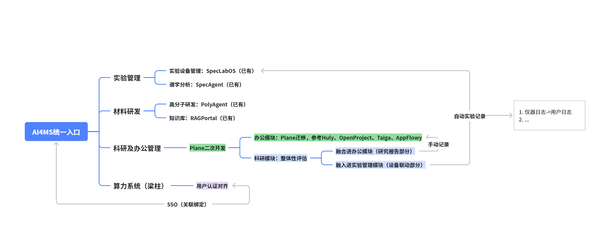

# Plane for AI4MS

> 面向高校科研与新型研发机构的科研及办公管理模块

**Plane for AI4MS** 是 [SynlysAI](https://github.com/SynlysAI) 基于开源项目 [Plane](https://github.com/makeplane/plane) 进行的二次开发仓库，目标是成为 [AI4MS](https://ai4ms.xmuzc.com/) 统一研发门户下的科研及办公管理模块。它把课题、任务、里程碑、实验协同、研究报告和日常办公协作放在同一个可追溯的工作空间中，帮助高校院系、重点实验室、新型研发机构和研发团队减少工具割裂与信息断层。

| 入口                 | 链接                                 |
| -------------------- | ------------------------------------ |
| SynlysAI 官网        | <https://synlysai.xmuzc.com/>        |
| AI4MS 统一门户       | <https://ai4ms.xmuzc.com/>           |
| SynlysAI GitHub 组织 | <https://github.com/SynlysAI>        |
| 本仓库               | <https://github.com/SynlysAI/plane>  |
| 上游 Plane 项目      | <https://github.com/makeplane/plane> |

## 项目定位

AI4MS 已经围绕材料研发形成“统一入口、智能分析、材料研发、实验执行、知识沉淀”的产品矩阵。Plane for AI4MS 在这条链路中承担管理与协同层：

- **研发管理**：以工作空间、项目、模块和周期组织课题、子课题、工作包、里程碑、实验任务、采购事项和论文专利进度。
- **办公协同**：将安全审查、设备维护、会议决议、审批待办、行政事务和跨部门协作转化为可分配、可跟踪、可复盘的工作项。
- **知识沉淀**：以页面和评论承载研究报告、会议纪要、实验注意事项和项目决策，并保留与任务之间的关联。
- **平台融合**：作为 AI4MS 的办公模块，与 SpecLabOS、SpecAgent、PolyAgent 和 RAGPortal 互补，而不是替代这些专业科研系统。

办公模块选型采用 **Plane 迁移与二次开发** 路线，并参考 Huly、OpenProject、Taiga、AppFlowy 等项目在任务、知识库和团队协作上的产品形态。选择 Plane 的原因是它已经提供成熟的工作项、周期、模块、视图、页面、权限和 API 基础，适合在其上叠加科研管理场景。

## 当前状态与能力边界

当前仓库仍以 Plane `1.4.x` 的能力为基线，尚未包含 AI4MS 专用集成代码。README 中的平台融合内容代表目标架构和实施路线，不表示相关能力已经上线。

### 当前可用的 Plane 基础能力

| 能力   | 科研与办公场景映射                                         |
| ------ | ---------------------------------------------------------- |
| 工作项 | 需求、实验准备事项、设备维护、安全审查、采购、论文专利任务 |
| 周期   | 课题阶段、月度计划、里程碑、考核周期                       |
| 模块   | 子课题、工作包、平台建设专项、跨部门协作包                 |
| 视图   | 负责人、实验室、优先级、课题来源、状态等自定义过滤         |
| 页面   | 研究报告、实验记录、会议纪要、制度说明和项目文档           |
| 分析   | 任务负载、进度、阻塞、周期完成率和团队协作概览             |

### 待实现的 AI4MS 集成能力

- AI4MS 统一登录、用户认证对齐与账号关联绑定。
- SpecLabOS 设备、工作流和运行状态与 Plane 工作项联动。
- 仪器日志归档为用户可读的实验日志，自动实验记录与手动记录并行保留。
- SpecAgent、PolyAgent 与 RAGPortal 的分析结果、研究报告和知识证据回流到项目上下文。
- 面向科研管理的报告模板、审计留痕和跨系统追溯视图。

在上述集成完成前，本仓库可以独立部署和使用 Plane 原有项目管理能力。

## AI4MS 集成架构



上图展示的目标架构是：AI4MS 作为统一入口连接材料研发、实验管理和科研及办公管理；Plane 通过二次开发承接科研与办公协同，并与已有专业模块保持清晰边界。

| 模块            | 当前定位                                       | 与 Plane 的目标关系                                           |
| --------------- | ---------------------------------------------- | ------------------------------------------------------------- |
| AI4MS           | 统一入口、用户管理、权限治理和应用导航         | 提供统一登录入口，并与 Plane 完成用户认证对齐和账号关联绑定   |
| SpecLabOS       | 实验设备、工作流编排、任务运行、日志和数据资产 | 实验任务、设备状态、仪器日志和自动实验记录与 Plane 工作项关联 |
| SpecAgent       | GPC、NMR、IR、Raman、LCMS 等谱学智能分析       | 解析结果和报告作为研究任务的证据与交付物回流                  |
| PolyAgent       | 高分子材料研发、计算任务、垂类算法与证据链     | 材料研发问题、计算运行和结论进入课题与报告上下文              |
| RAGPortal       | 知识库文档上传与检索门户                       | 文献、制度和研究资料作为报告写作与任务决策的知识来源          |
| Plane for AI4MS | 科研及办公管理模块                             | 承接任务、周期、模块、页面、审批、协同、报告和复盘            |
| 算力系统        | 平台基础支撑能力                               | 为智能分析、材料计算和后续自动化任务提供运行支撑              |

## 科研与办公场景

### 课题与项目全生命周期

- 以工作空间对应学院、实验室、研究中心或课题组。
- 以项目对应纵向课题、横向项目、平台建设专项或内部改进项目。
- 以模块拆分子课题、工作包和交付专题。
- 以周期管理开题、实验、中期检查、结题、验收和成果转化节点。
- 通过视图跟踪负责人、优先级、截止时间、状态和风险事项。

### 实验与设备协同

- 在 Plane 中创建实验需求、样品准备、设备预约、安全确认和结果复盘任务。
- 目标集成 SpecLabOS 后，将设备工作流运行状态回写到相关任务。
- 同时保留自动实验记录和人工补充记录，避免设备日志与研究语义脱节。
- 将仪器日志转换为用户可读、可检索的实验日志，并关联负责人、课题和样本上下文。
- 为设备维护、耗材采购、异常处理和安全整改建立独立工作流。

### 研究报告与知识证据

- 用页面组织开题报告、实验方案、阶段总结、结题报告和成果转化材料。
- 目标集成 SpecAgent、PolyAgent 和 RAGPortal 后，将分析结论、计算结果、文献证据和知识库引用带入报告上下文。
- 保留报告与任务、负责人、时间和来源证据的关联，支持复盘与审计。
- 将重复出现的经验沉淀为实验室规范、操作手册和项目模板。

### 日常办公协作

- 管理会议决议、待办事项、责任人和完成时间。
- 跟踪采购申请、合同评审、报销材料、行政审批和材料交付。
- 建立设备维护、安全检查、实验室巡检和隐患整改任务。
- 管理论文投稿、专利申请、成果报奖、数据归档和知识转移。

## 实施路线图

| 阶段 | 目标                                                          | 当前状态                   |
| ---- | ------------------------------------------------------------- | -------------------------- |
| P0   | 完成品牌、信息架构、场景口径和模块边界重定位                  | 已启动，本 README 是第一步 |
| P1   | 打通 AI4MS 统一认证、用户认证对齐与账号关联绑定               | 规划中                     |
| P2   | 打通 SpecLabOS 设备、实验运行、仪器日志和工作项联动           | 规划中                     |
| P3   | 打通 SpecAgent、PolyAgent、RAGPortal 与研究报告、知识证据闭环 | 规划中                     |

路线图遵循“先保留 Plane 稳定基础，再叠加科研场景，最后完成跨系统证据链”的原则，避免一次性重构带来的部署风险。

## 快速开始与本地开发

### 环境要求

- Docker Engine 已启动。
- Node.js `>= 22.22.0`。
- pnpm `11.10.0`，可通过 Corepack 启用。
- PostgreSQL 14+ 和 Redis 6.2.7+，本地开发可由 Docker Compose 提供。
- 建议至少 12 GB 可用内存。

### 初始化并启动

```bash
./setup.sh
docker compose -f docker-compose-local.yml up -d
pnpm dev
```

启动后访问：

- Web 应用：<http://localhost:3000>
- 实例管理端：<http://localhost:3001/god-mode/>

### 常用命令

| 命令               | 说明                      |
| ------------------ | ------------------------- |
| `pnpm dev`         | 启动所有开发服务          |
| `pnpm build`       | 构建所有应用和包          |
| `pnpm check`       | 运行格式、Lint 和类型检查 |
| `pnpm check:lint`  | 运行 OxLint               |
| `pnpm check:types` | 运行 TypeScript 类型检查  |
| `pnpm fix`         | 自动修复格式和 Lint 问题  |

后端测试在独立 Docker 测试栈中运行：

```bash
docker compose -f docker-compose-test.yml up --build --abort-on-container-exit --exit-code-from api-tests
```

更多测试约定见 [`apps/api/tests/RUNNING_TESTS.md`](apps/api/tests/RUNNING_TESTS.md)。

## 生态与文档

| 资源             | 链接                                      |
| ---------------- | ----------------------------------------- |
| SpecLabOS        | <https://github.com/SynlysAI/SpecLabOS>   |
| SpecAgent        | <https://github.com/SynlysAI/Spec_Agent>  |
| PolyAgent        | <https://github.com/SynlysAI/Poly_Agent>  |
| RAGPortal        | <https://github.com/SynlysAI/RAGPortal>   |
| SmartAccess      | <https://github.com/SynlysAI/SmartAccess> |
| Plane 用户文档   | <https://docs.plane.so/>                  |
| Plane 开发者文档 | <https://developers.plane.so/>            |
| 贡献指南         | [`CONTRIBUTING.md`](CONTRIBUTING.md)      |

## 许可证与上游致谢

本仓库基于 [makeplane/plane](https://github.com/makeplane/plane) 二次开发，继续遵循 [GNU Affero General Public License v3.0](LICENSE.txt)。二次开发和对外部署应保留上游版权声明、许可证声明和来源信息，并遵守 AGPL-3.0 对应的源代码提供义务。

感谢 Plane 上游团队和所有贡献者提供了成熟的开源项目管理基础。
