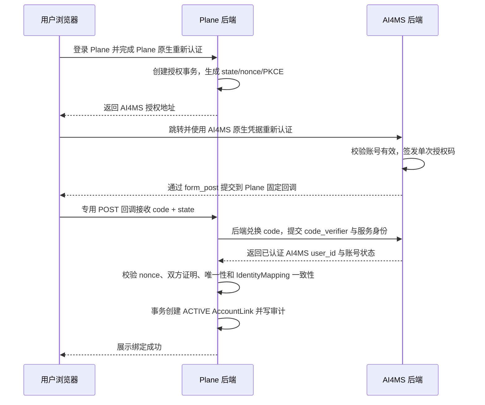

# AI4MS ↔ Plane 账号绑定开发计划

| 项目       | 内容                                           |
| ---------- | ---------------------------------------------- |
| 文档状态   | 待实施                                         |
| 权威主身份 | Plane 用户                                     |
| 适用系统   | Plane、AI4MS 门户                              |
| 目标读者   | 产品、Plane/AI4MS 前后端、测试、安全与运维人员 |
| 编写日期   | 2026-10-08                                     |

## 1. 背景与目标

AI4MS 与 Plane 当前各自维护用户、登录方式和权限。后续平台以 Plane 用户体系为主，但不能通过迁移、合并或删除账号破坏已有用户的登录方式、历史数据和原生权限。

本计划建立 Plane 账号与 AI4MS 账号之间显式、可验证、可撤销的一对一绑定。绑定后，用户仍可分别使用原账号登录两个系统；跨系统访问由服务端基于绑定关系换取短期、限域凭据。未绑定、已解绑、已撤销或任一目标账号不可用时，跨系统访问必须失败关闭。

### 1.1 目标

1. 以 Plane 用户 ID 作为统一身份主键，Plane 保存权威绑定关系。
2. 支持已有 Plane 账号与已有 AI4MS 账号自助绑定，且必须分别证明双方账号所有权。
3. 保留两个原生账号各自的登录、角色、数据和功能，不自动合并或同步权限。
4. 支持 Plane → AI4MS 与 AI4MS → Plane 双向关联访问，浏览器不持有另一系统的长期凭据。
5. 支持用户解绑，以及 Plane Instance Admin、AI4MS admin 的安全撤销和审计。
6. 复用 Plane 已有 `AccountLink`、审计和短期交换能力，避免与 `IdentityMapping` 重复建设。

### 1.2 非目标

- 不在绑定流程中创建 Plane 或 AI4MS 账号。
- 不合并用户数据，不迁移对象所有权，不合并角色或权限集合。
- 不把 AI4MS 密码交给 Plane，也不把 Plane 密码交给 AI4MS。
- 不让 Workspace Admin 管理全局账号绑定。
- 不把 ACTIVE `AccountLink` 自动转换为 Plane `IdentityMapping`，反向亦然。
- 不用一个共享用户或服务账号代表全部用户访问另一系统。
- 不扩展 AI4MS 当前通过 URL fragment 向其他子应用传递浏览器 token 的机制；该机制的全面改造另行规划。

### 1.3 术语

| 术语               | 定义                                                                                                                  |
| ------------------ | --------------------------------------------------------------------------------------------------------------------- |
| Plane 原生重新认证 | 使用 Plane 密码、Plane 控制的邮箱验证码或后续接入的 Passkey/TOTP 完成 step-up；AI4MS OIDC 不属于独立的 Plane 账号证明 |
| AI4MS 原生重新认证 | 使用 AI4MS 用户名和密码完成 step-up；不得接受 Plane 会话或跨系统交换凭据替代                                          |
| 账号有效           | 账号存在、未禁用、未删除，并通过本系统登录策略允许交互式登录                                                          |
| 有效绑定           | AccountLink 为 ACTIVE，且 `authn_version=dual-reauth.v1`、双方验证时间存在、未被撤销，并通过当前 `link_version` 校验  |
| 绑定版本           | AccountLink 的单调递增 `link_version`；激活、解绑、撤销或安全失效时递增，用于使旧交换凭据失效                         |
| 状态投影           | AI4MS 为展示和快速拒绝保存的非权威绑定摘要；Plane 查询结果永远优先                                                    |
| 受信服务身份       | 双方后端使用独立 Ed25519 私钥签发、目标端按 JWKS 验证的短期服务断言，不是用户 token                                   |
| 短期交换凭据       | 目标系统签发的 EdDSA JWT，最长 5 分钟、不可刷新、仅供后端使用并绑定 scope、资源和 link version                        |

仅通过 AI4MS OIDC 登录且没有 Plane 独立验证方式的用户，必须先通过 Plane 账号恢复流程设置密码或验证 Plane 控制的邮箱，再发起绑定。管理员可以协助恢复验证方式，但不能代用户完成绑定。

## 2. 当前实现与差距

### 2.1 Plane

Plane 当前已有以下基础能力：

- `IdentityMapping` 将 AI4MS OIDC `subject` 映射到 Plane 用户，可支持 AI4MS 身份登录 Plane。
- `AccountLink` 保存 Plane 用户与外部系统 subject 的显式关系，状态包含 `PENDING`、`ACTIVE`、`REVOKED`、`UNLINKED`。
- Workspace 级 AccountLink API 支持创建、确认、解绑、撤销、冲突查询和审计。
- Synlora 集成已经使用 ACTIVE AccountLink 进行后端短期用户 token 交换。

现有能力不能直接作为本需求的完成状态：

| 差距     | 当前行为                                                         | 本计划要求                                                          |
| -------- | ---------------------------------------------------------------- | ------------------------------------------------------------------- |
| 作用域   | API 挂在 Workspace 下，并受 Workspace 开关控制                   | AI4MS 绑定是全局用户关系，不依附某个 Workspace                      |
| 绑定证明 | 调用方可提交外部 subject，服务端返回明文验证码                   | subject 只能来自 AI4MS 后端认证结果；不得向客户端返回服务端验证秘密 |
| 管理边界 | Workspace Admin 可替成员创建、确认和撤销                         | 仅用户本人自助绑定；全局系统管理员只能安全撤销                      |
| 一对一   | 外部 subject 唯一，但同一 Plane 用户仍可出现多个同 provider 绑定 | AI4MS 与 Plane 的有效关系严格一对一                                 |
| 临时数据 | 验证哈希和过期时间保存在长期 AccountLink 行                      | 授权事务与长期绑定分离                                              |
| 双向访问 | 已有 Synlora 单向交换范式                                        | 增加 AI4MS 双向交换、目标账号状态与资源 ACL 校验                    |

### 2.2 AI4MS

AI4MS 当前使用 MongoDB `users` 集合维护 `user_id`、用户名、密码哈希、角色、状态和组织信息；登录后签发自签名 HMAC 访问令牌。系统尚未提供以下能力：

- 面向账号绑定的重新认证和一次性授权码端点；
- 与 Plane 服务端之间的授权码兑换和服务身份认证；
- 基于 ACTIVE AccountLink 的短期身份交换；
- 账号绑定状态、解绑入口和管理员撤销入口；
- 绑定、交换与拒绝事件的统一审计存储。

### 2.3 `IdentityMapping` 与 `AccountLink` 的边界

两类关系必须长期并存，不得混用：

| 对象              | 职责                                    | 是否授予跨系统访问     | 创建方式                          |
| ----------------- | --------------------------------------- | ---------------------- | --------------------------------- |
| `IdentityMapping` | AI4MS OIDC 身份登录同一个 Plane 用户    | 否                     | OIDC 登录解析或现有管理员映射流程 |
| `AccountLink`     | Plane 用户与 AI4MS 原生账号的跨系统关联 | 是，但仍需目标资源 ACL | 双方账号重新认证后的绑定流程      |

现有 `IdentityMapping` 只能作为“可能属于同一人”的候选提示，不能自动生成或激活 AccountLink。OIDC `subject` 只在对应 `issuer` 范围内唯一，不能与 AI4MS `user_id` 直接比较。若某一 Plane 用户同时存在 AI4MS `IdentityMapping` 与 ACTIVE AccountLink，Plane 必须调用 AI4MS 受信身份解析接口，将已配置的 `(issuer, subject)` 解析为稳定 `user_id`，再与 AccountLink 的 `external_subject` 比较；无法解析或结果不一致时拒绝绑定或交换并产生冲突审计，但不得自动修改任一记录。

## 3. 产品规则与安全不变量

### 3.1 主身份和账号自治

1. Plane `User.id` 是平台统一身份主键；AI4MS `users.user_id` 是外部账号稳定主键。
2. 一个 Plane 用户最多绑定一个有效 AI4MS 账号，一个 AI4MS 账号最多绑定一个有效 Plane 用户。
3. 只有双方账号已经存在、处于可登录状态且分别完成重新认证时，才能建立 ACTIVE 绑定。
4. 绑定不修改任一账号的邮箱、用户名、密码、角色、状态、组织关系或历史数据。
5. 用户可继续使用 Plane 原生方式登录 Plane，也可继续使用 AI4MS 原生方式登录 AI4MS。
6. 现有 AI4MS OIDC 登录 Plane 的能力继续独立工作；AccountLink 不自动开通、关闭或修复该登录方式。

### 3.2 权限计算

跨系统请求的最终权限必须取以下条件的交集：

```text
源账号有效
∩ AccountLink 为 ACTIVE
∩ 目标账号有效
∩ 目标系统原生角色与资源 ACL
∩ 本次交换请求允许的 scope
∩ 令牌绑定的资源范围
```

任何一项不满足都拒绝访问。源系统传来的角色、管理员标识或资源列表只可作为审计上下文，不能替代目标系统自己的授权判断。

### 3.3 生命周期

AI4MS 自助绑定的新流程使用以下状态语义：

```text
授权事务：CREATED → LOCAL_VERIFIED → READY_TO_ACTIVATE → CONSUMED
             │              │                 │
             └──────────────┴─────────────────┴→ EXPIRED / FAILED / CANCELLED

长期绑定：ACTIVE → UNLINKED（用户主动解除）
               ↘ REVOKED（管理员或安全策略撤销）
```

- 临时授权事务未完成前不创建可用于访问的 AccountLink。
- `local_verified_at` 与 `external_verified_at` 是独立验证事实；只有两者都存在时状态才进入 `READY_TO_ACTIVATE`，不得仅凭状态名推断验证完成。
- 双方认证和唯一性检查全部通过后，在一个 Plane 数据库事务中直接创建 ACTIVE AccountLink。
- 现有 `PENDING` 状态继续兼容其他 provider 和历史记录，但新的 `provider=ai4ms` 自助流程不依赖可被客户端确认的 PENDING 行。
- UNLINKED/REVOKED 行作为历史保留；重新绑定创建新行，不复活旧行。

### 3.4 停用、解绑和撤销

- Plane 账号停用：立即阻断两个方向的新交换和后续目标请求，不自动停用 AI4MS 账号。
- AI4MS 账号停用：AI4MS 拒绝授权码和交换；Plane 定期状态校验或下一次交换时将关系视为不可用。
- 用户解绑：用户必须重新认证当前发起侧账号；解绑后撤销该关系签发的所有短期授权。
- 管理员撤销：Plane Instance Admin 或 AI4MS admin 可因安全事件发起撤销；Workspace Admin 无此权限。
- 已签发令牌：目标服务在每次受保护请求中执行在线状态检查，校验绑定版本、源账号状态与撤销状态，不能只等待 5 分钟自然过期。对端不可达时失败关闭并返回 503，不使用上一次“有效”结果继续放行。

## 4. 目标架构与数据流

### 4.1 数据所有权

| 数据                             | 权威系统                                                   | 说明                                     |
| -------------------------------- | ---------------------------------------------------------- | ---------------------------------------- |
| Plane 用户、Workspace 与资源 ACL | Plane                                                      | 不复制到 AI4MS 作为授权事实              |
| AI4MS 用户、角色与资源 ACL       | AI4MS                                                      | 不复制到 Plane 作为授权事实              |
| AccountLink 生命周期             | Plane                                                      | AI4MS 只保存最小状态投影或按需查询       |
| 绑定授权事务                     | Plane 协调；双方保存各自一次性凭据                         | 原始验证码、密码和 token 不跨系统持久化  |
| 审计                             | 双方各记本系统事件，以 `request_id`、`transaction_id` 关联 | 不记录密码、完整 token、授权码或敏感正文 |

### 4.2 从 Plane 发起绑定



Plane 所有权证明必须来自 Plane 原生凭据或 Plane 支持的非 AI4MS 身份方式。单独再次执行 AI4MS OIDC 登录不能同时充当两侧账号所有权证明。

Plane 为授权事务生成 `code_verifier` 后，将其使用密钥管理服务提供的专用密钥加密，保存到共享短时存储；数据库仅保存 PKCE challenge 和密文引用。密文有效期与授权事务相同，只能读取一次，消费或到期后立即清理，不能进入浏览器、state、日志或普通应用缓存。该存储必须支持 Plane 多实例和进程重启。

跨站 `form_post` 回调不得依赖 Plane Session Cookie：Plane 创建事务时已将 `plane_user_id`、重新认证时间和当前会话指纹哈希写入服务端事务，回调只使用高熵单次 state 定位事务，并通过 code、PKCE、nonce、固定 client ID/回调 URI和 AI4MS 服务响应完成校验。该专用回调可以免除常规 Cookie CSRF 校验，但必须执行上述协议校验；其他路由不得复用此豁免。Plane 全局会话 Cookie 保持 `HttpOnly + Secure + SameSite=Lax`，不为绑定流程降级为 `SameSite=None`。回调成功后 303 到干净的个人设置页，由正常 Plane 会话决定展示结果；会话不存在时只要求重新登录，不重复激活绑定。

### 4.3 从 AI4MS 发起绑定

1. 用户在 AI4MS 账号设置中选择“绑定 Plane 账号”；AI4MS 只把浏览器导航到 Plane 固定绑定入口，不签发可绑定账号的请求码。
2. 用户登录 Plane，并使用 Plane 原生方式重新认证。
3. Plane 创建绑定事务、生成 state/nonce/PKCE，并显示当前 Plane 账号的脱敏标识。
4. 浏览器跳转至 AI4MS 固定授权入口，用户使用 AI4MS 原生凭据重新认证。
5. AI4MS 显示双方脱敏账号标识和“将此 AI4MS 账号绑定到当前 Plane 账号”的显式确认，确认后签发 60 秒有效的一次性授权码。
6. AI4MS 通过 `form_post` 向 Plane 预注册的唯一回调 URI 提交 code 和 state；Plane 后端兑换授权码，取得稳定 `user_id` 和账号有效状态。
7. Plane 完成冲突、双方证明、一致性和事务激活逻辑；返回 AI4MS 时仅使用预注册的 AI4MS 账号设置地址。

Plane 始终先创建并绑定当前 Plane 会话的授权事务，也是最终协调者和 AccountLink 写入方。从哪一侧点击入口只影响最初和完成后的落点，不改变协议顺序或数据权威。这一约束防止攻击者把自己的 AI4MS 授权码诱导给另一名已登录 Plane 的用户，造成绑定 CSRF。

### 4.4 双向短期身份交换

#### Plane → AI4MS

1. Plane BFF 根据当前 Plane 会话定位 `provider=ai4ms` 的 ACTIVE AccountLink。
2. Plane 使用独立服务断言调用 AI4MS 内部交换端点，提交 Plane 用户、AI4MS `external_subject`、请求 scope、资源约束、绑定版本和 `request_id`。
3. AI4MS 校验服务身份、AccountLink 状态投影/回查、AI4MS 用户状态和 scope allowlist。
4. AI4MS 签发最长 5 分钟、`audience=ai4ms`、绑定用户与资源范围的短期凭据。
5. Plane BFF 在服务端内存中使用该凭据调用 AI4MS；不得返回浏览器或写入日志、缓存和数据库。AI4MS 每次处理该凭据都向 Plane introspection 端点确认 `account_link_id + link_version` 仍有效，并校验 AI4MS 用户当前状态。

#### AI4MS → Plane

1. AI4MS BFF 使用 AI4MS 当前用户 ID 请求 Plane 内部交换端点。
2. Plane 以 `provider=ai4ms + external_subject` 解析唯一 ACTIVE AccountLink，并确认 Plane 用户有效。
3. Plane 在线查询 AI4MS 源账号状态，根据目标 Workspace、对象和动作执行原生 ACL，签发最长 5 分钟的资源级短期授权。
4. AI4MS BFF 仅在服务端使用该授权调用 Plane；Plane 每次业务请求都重新校验 AccountLink 的当前 `link_version`、在线 AI4MS 源账号状态和最终资源授权。

交换凭据不建立目标系统的完整浏览器 Session，不包含源系统角色，不允许刷新。到期后必须重新交换。在线状态检查不得使用正向缓存；仅可对“已撤销/已停用”结果做 5 分钟负缓存。对端状态服务不可用时失败关闭，最大撤销传播目标为 30 秒，并以指标和告警持续验证。

## 5. 数据模型与契约

### 5.1 Plane `AccountLink`

沿用现有表和 `account-link.v1`，不创建并行的账号关系模型。AI4MS 绑定字段口径如下：

| 字段                          | 口径                                                                        |
| ----------------------------- | --------------------------------------------------------------------------- |
| `canonical_identity`          | `plane:<Plane User UUID>`，不得继续使用可变邮箱作为主身份                   |
| `provider`                    | 固定为小写 `ai4ms`                                                          |
| `external_subject`            | AI4MS 稳定 `user_id`，不得使用用户名或邮箱                                  |
| `local_user_id`               | Plane `User.id`                                                             |
| `status`                      | 复用 `ACTIVE / REVOKED / UNLINKED`；历史 `PENDING` 保持兼容，但不代表可交换 |
| `verified_at`                 | 双方证明均完成且绑定激活的时间                                              |
| `bound_by`                    | 自助绑定时等于 `local_user_id`                                              |
| `unlinked_at`                 | 用户解绑或管理员撤销时间                                                    |
| `request_id` / `payload_hash` | 保留幂等语义，不保存认证秘密                                                |

通过新增可选字段扩展 `account-link.v1`：

| 新字段                 | 类型                     | 说明                                                                       |
| ---------------------- | ------------------------ | -------------------------------------------------------------------------- |
| `initiated_from`       | `PLANE \| AI4MS`         | 绑定发起侧                                                                 |
| `local_verified_at`    | datetime                 | Plane 原生账号证明时间                                                     |
| `external_verified_at` | datetime                 | AI4MS 原生账号证明时间                                                     |
| `authn_version`        | string                   | 双重认证流程版本，首版为 `dual-reauth.v1`；为空时不得交换                  |
| `link_version`         | integer                  | 每次激活、解绑或撤销递增，用于令牌立即失效                                 |
| `status_reason`        | string/null              | 解绑、撤销或迁移原因的稳定代码；历史待重验证使用 `REVERIFICATION_REQUIRED` |
| `revoked_by_system`    | `PLANE \| AI4MS \| null` | 撤销来源                                                                   |

所有新增契约字段均为可选字段；消费者继续忽略未知字段。现有枚举不删除、不重命名。

### 5.2 唯一约束

迁移后由数据库保证：

1. 对满足 `deleted_at IS NULL AND status IN (PENDING, ACTIVE)` 的记录，`provider + external_subject` 唯一。
2. 对满足 `deleted_at IS NULL AND status IN (PENDING, ACTIVE)` 的记录，`provider + local_user_id` 唯一。
3. UNLINKED/REVOKED 历史记录不阻止完成重新认证后的新绑定。
4. 创建 ACTIVE 关系时，在同一事务内锁定当前 Plane 用户和目标 external subject 的候选行，再检查约束并落库。

### 5.3 Plane 授权事务

新增独立的 `AccountLinkAuthorization`，不再把 AI4MS 临时验证码存入 AccountLink：

| 字段                                         | 说明                                                                                     |
| -------------------------------------------- | ---------------------------------------------------------------------------------------- |
| `id`                                         | UUID，授权事务 ID                                                                        |
| `provider`                                   | 固定 `ai4ms`                                                                             |
| `initiated_from`                             | `PLANE` 或 `AI4MS`                                                                       |
| `plane_user_id`                              | 当前 Plane 用户；未完成 Plane 登录前可为空                                               |
| `external_subject`                           | AI4MS 授权码兑换成功后写入；此前为空                                                     |
| `state_hash` / `nonce_hash`                  | 只保存哈希，使用常量时间比较；两者绑定 Plane 会话和当前事务                              |
| `pkce_challenge` / `pkce_method`             | 仅允许 `S256`；verifier 以加密形式放在共享短时存储                                       |
| `return_path`                                | 只允许 Plane 站内相对路径 allowlist                                                      |
| `local_verified_at` / `external_verified_at` | 双方重新认证证明时间                                                                     |
| `status`                                     | `CREATED / LOCAL_VERIFIED / READY_TO_ACTIVATE / CONSUMED / EXPIRED / FAILED / CANCELLED` |
| `expires_at` / `consumed_at`                 | 整体有效期 10 分钟；只允许消费一次                                                       |
| `failure_code`                               | 稳定失败码，不保存敏感错误正文                                                           |
| `request_id` / `created_ip_hash`             | 幂等和风控关联字段                                                                       |

授权事务保留 30 天用于审计后清理；state、nonce、授权码和 token 原文不得落库。

### 5.4 AI4MS 一次性授权

AI4MS 新增 `account_link_authorizations` 集合，至少包含：

- 授权码哈希、AI4MS `user_id`、Plane `transaction_id`、固定 `client_id=plane-account-link`；
- `audience=plane-account-link`、固定回调 URI、PKCE challenge、nonce 哈希、AI4MS `auth_time`；
- 签发时间、60 秒过期时间、消费时间和失败码；
- 发起侧、请求 ID 和认证方法版本。

授权码只能由 Plane 后端使用受信服务身份兑换一次。兑换时 AI4MS 必须逐项匹配授权码、client ID、精确回调 URI、Plane transaction ID、PKCE verifier、nonce、有效期和未消费状态，并以原子操作标记已消费。AI4MS 返回稳定 `user_id`、账号状态、认证时间以及签名的 `(issuer, subject) → user_id` 解析结果，不返回密码哈希、角色权限集合或原生长期 token。

### 5.5 数据保护

- 数据库只保存稳定账号 ID、验证时间、状态、哈希和审计引用。
- 日志不得包含密码、完整 state/nonce、授权码、PKCE verifier、access token、服务密钥或完整 Cookie。
- 管理员列表默认只展示脱敏用户名/邮箱快照、稳定 ID 后四位、状态和时间。
- 服务断言与交换 JWT 使用独立 Ed25519 密钥，私钥进入部署密钥管理，公钥以受限 JWKS 发布；JWT 必须携带 `kid`、`iss`、`sub`、`aud`、`iat`、`exp`、`jti`。双方至少保留当前和上一把验证公钥，按季度及安全事件轮换，不复用浏览器 token 签名密钥。
- 授权回调使用 `form_post`，响应设置 `Referrer-Policy: no-referrer`、`Cache-Control: no-store`，页面不加载第三方资源；回调完成后立即 303 跳转到不含 code/state 的干净 URL。反向代理和应用访问日志必须对 code、state、nonce 和 token 字段脱敏。

## 6. API 设计

### 6.1 Plane 用户 API

用户级接口不再依赖 Workspace slug 或 `research_account_link_enabled`：

| 方法   | 路径                                                | 行为                                                                                      |
| ------ | --------------------------------------------------- | ----------------------------------------------------------------------------------------- |
| `GET`  | `/api/users/me/account-links/`                      | 返回当前用户可见的脱敏绑定状态                                                            |
| `POST` | `/api/users/me/account-links/ai4ms/authorizations/` | 在 Plane 重新认证后创建绑定事务，返回固定 AI4MS 授权地址                                  |
| `POST` | `/auth/account-links/ai4ms/callback/`               | 专用 `form_post` 回调；不依赖 Cookie，校验事务、state、code、PKCE 和 nonce 后原子激活绑定 |
| `POST` | `/api/users/me/account-links/{link_id}/unlink/`     | 重新认证后解绑并撤销关联授权                                                              |

开始和解绑接口使用 Plane 通用 step-up authentication 票据。票据必须绑定当前用户、动作、会话和 5 分钟有效期，且不能由 AI4MS OIDC 单独签发。

`provider=ai4ms` 时，用户 API 禁止接收客户端提交的 `external_subject`、`canonical_identity`、`local_user_id` 或手工验证码。这些字段只能从当前 Plane 会话和 AI4MS 后端兑换结果生成。

### 6.2 Plane 管理 API

| 方法   | 路径                                             | 权限与行为                                 |
| ------ | ------------------------------------------------ | ------------------------------------------ |
| `GET`  | `/api/instances/account-links/`                  | 仅 Instance Admin 分页、筛选和查看脱敏记录 |
| `POST` | `/api/instances/account-links/{link_id}/revoke/` | 仅 Instance Admin；要求原因并立即撤销      |

现有 Workspace AccountLink API 暂时保留给其他 provider 兼容使用；它不得创建、确认、解绑或撤销 `provider=ai4ms` 的关系。后续是否废弃另走独立迁移流程。

### 6.3 AI4MS API

| 方法   | 路径                                                     | 行为                                                                 |
| ------ | -------------------------------------------------------- | -------------------------------------------------------------------- |
| `GET`  | `/api/v1/account-links/me`                               | 通过 Plane 服务端查询或状态投影返回当前绑定状态                      |
| `POST` | `/api/v1/account-links/plane/authorizations`             | 接收 Plane 已创建的事务并在 AI4MS 重新认证、显式确认后签发单次授权码 |
| `POST` | `/api/v1/internal/account-links/authorizations/exchange` | Plane 服务端兑换一次性授权码                                         |
| `POST` | `/api/v1/account-links/{link_id}/unlink`                 | AI4MS 重新认证后请求 Plane 解除绑定                                  |
| `GET`  | `/api/v1/admin/account-links`                            | 仅 AI4MS admin 查看脱敏状态                                          |
| `POST` | `/api/v1/admin/account-links/{link_id}/revoke`           | 仅 AI4MS admin 请求 Plane 安全撤销                                   |

AI4MS 不是绑定权威库。用户解绑和管理员撤销只有收到 Plane 成功响应后才能展示为完成；Plane 不可用时显示可重试状态，不在 AI4MS 本地伪造成功。

### 6.4 服务端身份交换 API

| 调用方向      | 目标路径                                       |
| ------------- | ---------------------------------------------- |
| Plane → AI4MS | `POST /api/v1/internal/account-links/exchange` |
| AI4MS → Plane | `POST /api/internal/account-links/exchange/`   |

双方同时提供只允许对端服务身份调用的在线校验接口：

| 系统  | 路径                                           | 请求                                                             | 成功响应                                          |
| ----- | ---------------------------------------------- | ---------------------------------------------------------------- | ------------------------------------------------- |
| Plane | `POST /api/internal/account-links/introspect/` | `account_link_id`、`link_version`、AI4MS `user_id`、`request_id` | `active`、当前 `link_version`、Plane 用户有效状态 |
| AI4MS | `POST /api/v1/internal/accounts/introspect`    | AI4MS `user_id`、`request_id`                                    | `active`、账号状态版本、验证时间                  |
| AI4MS | `POST /api/v1/internal/identities/resolve`     | OIDC `issuer`、`subject`、`request_id`                           | 签名的稳定 `user_id`、当前账号状态和解析时间      |

introspection 与身份解析请求沿用本节的服务断言、防重放和 60 秒窗口。不存在、已停用、版本不一致统一返回 `active=false`，不得暴露账号归属；请求无效返回统一错误 envelope。业务请求必须在这类在线校验超时或 5xx 时失败关闭。

请求至少包含：

```json
{
  "schema_version": "account-exchange.v1",
  "request_id": "uuid",
  "account_link_id": "uuid",
  "link_version": 1,
  "subject": "source-user-id",
  "audience": "target-system",
  "scopes": ["resource:read"],
  "resource": {
    "workspace_id": "optional-id",
    "resource_type": "optional-type",
    "resource_id": "optional-id"
  },
  "issued_at": "RFC3339",
  "expires_at": "RFC3339",
  "nonce": "single-use-random-value"
}
```

交换请求要求 HTTPS、EdDSA 服务断言、请求体摘要、防重放 nonce 和不超过 60 秒的请求窗口。服务断言以 JWT `jti` 防重放，并额外包含 `method`、规范化 `path`、`body_sha256`；目标端逐项比较实际请求，允许最大 30 秒时钟偏差。目标系统的 `jti + nonce` 重放表至少保留 5 分钟，并以原子写入拒绝重复请求。JWKS 只从固定内网 HTTPS 地址获取，按 `Cache-Control` 缓存；未知 `kid` 可立即刷新一次，仍未知或 JWKS 不可用时失败关闭。密钥泄露时先从 allowlist 禁用受影响 `kid`，发布新密钥并撤销未过期服务断言，再恢复调用。

首期 scope 和资源矩阵固定如下，未登记的 scope、通配符和缺少必填资源字段的请求全部拒绝：

| 方向          | Scope                  | 必填资源                                       | 最大权限                                |
| ------------- | ---------------------- | ---------------------------------------------- | --------------------------------------- |
| Plane → AI4MS | `ai4ms:profile:read`   | 无                                             | 读取已绑定 AI4MS 用户的脱敏资料         |
| Plane → AI4MS | `ai4ms:content:read`   | `resource_type`、`resource_id`                 | 读取 AI4MS 原生 ACL 已授权的单个对象    |
| AI4MS → Plane | `plane:workspace:read` | `workspace_id`                                 | 读取当前 Plane 用户可见的工作区基本信息 |
| AI4MS → Plane | `plane:resource:read`  | `workspace_id`、`resource_type`、`resource_id` | 读取 Plane 原生 ACL 已授权的单个对象    |

首期不开放写、管理、导出和通配 scope。新增 scope 必须同时更新两侧 allowlist、资源校验、契约测试和安全评审。

响应只返回目标系统签发的最长 5 分钟 EdDSA JWT、到期时间和实际批准 scopes；目标系统可以收窄但不能扩大请求 scopes。JWT 必须包含 `account_link_id`、`link_version`、目标用户 ID、`aud`、批准 scopes、规范化资源约束、`iat`、`exp` 和唯一 `jti`，且不得包含源系统角色。每次使用时按第 4.4 节执行在线状态检查。

### 6.5 错误语义

所有新增接口沿用结构化错误 envelope，并至少支持：

| 错误码                                | HTTP | 含义                                                |
| ------------------------------------- | ---- | --------------------------------------------------- |
| `ACCOUNT_LINK_REQUIRED`               | 403  | 当前账号尚未绑定目标系统                            |
| `ACCOUNT_LINK_CONFLICT`               | 409  | 任一账号已与其他账号绑定，或 IdentityMapping 不一致 |
| `ACCOUNT_LINK_REAUTH_REQUIRED`        | 401  | 未完成当前系统重新认证                              |
| `ACCOUNT_LINK_AUTHORIZATION_EXPIRED`  | 410  | 授权事务或一次性授权码已过期                        |
| `ACCOUNT_LINK_AUTHORIZATION_REPLAYED` | 409  | 授权码、state 或 nonce 已被消费                     |
| `ACCOUNT_LINK_STATE_INVALID`          | 400  | state、nonce 或回调事务不匹配                       |
| `ACCOUNT_LINK_PKCE_INVALID`           | 400  | PKCE 校验失败                                       |
| `ACCOUNT_LINK_REVOKED`                | 403  | 绑定已解绑或撤销                                    |
| `ACCOUNT_LINK_TARGET_DISABLED`        | 403  | 目标原生账号不可用                                  |
| `ACCOUNT_LINK_SCOPE_DENIED`           | 403  | 请求 scope 或资源超出目标账号权限                   |
| `ACCOUNT_LINK_UPSTREAM_UNAVAILABLE`   | 503  | 对端暂时不可达，未改变绑定状态                      |

错误消息不得暴露“某个 AI4MS user_id 已绑定给哪个 Plane 用户”等可用于账号枚举的信息。

## 7. UI 与交互

### 7.1 Plane

在个人设置新增“关联账号”页，与“安全”“个人访问令牌”同级，不放在 Workspace 科研管理页面。页面包含：

- AI4MS 一行账号关系：未绑定、绑定中、已绑定、已解绑/已撤销、暂不可用；
- 已绑定时展示脱敏账号标识、绑定时间和“解除绑定”；
- 未绑定时仅提供一个主操作“绑定 AI4MS 账号”；
- 冲突、过期和上游不可用使用行内说明及明确重试入口；
- 解绑前说明只停止跨系统访问，不删除或停用任一原生账号。

Instance Admin 使用独立全局列表查看绑定状态、来源、时间、撤销原因和审计引用，不提供代用户建立或确认绑定的操作。

### 7.2 AI4MS

在用户菜单新增“账号设置”，页面结构与 Plane 保持语义一致。AI4MS admin 的用户管理增加只读绑定状态和“安全撤销”，不显示 Plane 资源权限，不允许编辑 Plane 用户信息。

### 7.3 视觉约束

两个系统都遵循学术编辑式界面规范：

- 复用现有设置页信息架构和组件，不创建独立仪表盘；
- 使用排版、留白、对齐、背景层次和细分隔线组织信息；
- 状态主要依赖文字和中性标签，不使用多彩卡片；
- 页面只保留一个主要操作，不添加渐变、发光、AI 徽章或装饰图形；
- 灰度显示时仍能区分状态，键盘操作和屏幕阅读器可完成整个流程。

## 8. 审计、风控与可观测性

### 8.1 审计事件

双方至少记录：

- `account.link.authorization.started`
- `account.link.local_verified`
- `account.link.external_verified`
- `account.link.activated`
- `account.link.failed`
- `account.link.unlinked`
- `account.link.revoked`
- `account.exchange.allowed`
- `account.exchange.denied`

事件包含 `request_id`、`transaction_id`、AccountLink ID、`link_version`、操作者类型、发起系统、结果码、时间和脱敏网络上下文。失败事件不记录用户输入的密码或授权秘密。

### 8.2 限流与告警

- 重新认证、授权发起、回调、授权码兑换和解绑分别按账号、会话与 IP 限流。
- 连续冲突或重放触发安全审计，但对客户端保持通用错误信息。
- 监控绑定成功率、冲突率、授权过期率、重放拒绝数、交换成功率、目标账号停用拒绝数、撤销传播延迟和对端 5xx。
- 撤销传播或 ACTIVE 状态校验异常必须告警；上游不可用时不得回退到共享账号或旧长期 token。

## 9. 存量迁移与发布

### 9.1 迁移分类

先提供只读 dry-run 命令，输出计数和脱敏冲突，不修改数据：

1. 仅有 `IdentityMapping`：保留原登录能力，标记为“可发起绑定”，不创建 AccountLink。
2. 已有 `provider=ai4ms` ACTIVE AccountLink，且缺少 `dual-reauth.v1` 证明：迁移为 UNLINKED，写入 `status_reason=REVERIFICATION_REQUIRED` 并递增 `link_version`；历史记录继续可审计，UI 显示“待重新绑定”，用户必须发起新流程。
3. 同一 Plane 用户存在多个 AI4MS 候选，或同一 AI4MS subject 指向多个关系：标记冲突，禁止自动处理。
4. 使用邮箱作为 `canonical_identity`：迁移为稳定 `plane:<uuid>` 前先核对唯一性，原值只保留在审计元数据中。
5. 历史 PENDING：全部迁移为 UNLINKED 并写入 `status_reason=LEGACY_PENDING`；不得继续确认或计入有效关系，有人工依据的记录也要求用户重新发起。
6. UNLINKED/REVOKED 历史：保留，不重新激活。

迁移工具必须支持 `--dry-run`、幂等、批次大小和结果摘要。任何冲突都进入人工处理清单，不按邮箱、用户名或组织自动合并。

数据库约束分三步上线：先部署对旧 Workspace API 的 provider 级永久拒绝规则并阻止新增 AI4MS 冲突；再运行 dry-run、隔离冲突和处置旧 PENDING；最后创建并验证 partial unique constraints。若冲突仍存在，发布门禁必须失败，不得跳过约束。provider 级拒绝同时落在 API 网关和数据库触发/约束层，避免应用版本回滚重新开放旧手工绑定路径。

### 9.2 Feature Flag

新增部署级开关：

- `AI4MS_ACCOUNT_LINK_ENABLED`：控制自助绑定入口和授权流程；
- `AI4MS_ACCOUNT_EXCHANGE_ENABLED`：控制双向身份交换；
- `AI4MS_ACCOUNT_LINK_ADMIN_ENABLED`：控制全局管理员审计与撤销入口。

这些开关是实例级开关，不使用 Workspace 级 `research_account_link_enabled`。关闭交换开关不得删除绑定数据；关闭绑定开关时，现有原生登录保持不变。

### 9.3 分阶段发布

1. **契约与安全基础**：更新 `account-link.v1`、错误码、授权事务模型、EdDSA/JWKS 服务身份、在线状态检查和审计字典；先部署旧 API 对 AI4MS provider 的永久拒绝规则。
2. **Plane 全局能力**：实现用户级/Instance Admin API、dry-run、冲突隔离、分阶段唯一约束和个人设置入口，交换保持关闭。
3. **AI4MS 授权能力**：实现原生重新认证、一次性授权码、状态页、管理员撤销请求和审计。
4. **绑定灰度**：只开放给测试用户，完成双向发起、冲突和解绑验收。
5. **交换灰度**：先开启只读 scope，再逐项增加明确授权的动作；不得一次开放通配 scope。
6. **存量用户引导**：向已有 IdentityMapping 用户展示重新验证入口，不自动激活。
7. **全量发布**：观察至少一个完整发布周期后再评估旧 Workspace AccountLink API 的去留。

回滚时先关闭交换，再关闭新绑定入口；保留 AccountLink、授权事务和审计数据。回滚不得恢复已解绑或已撤销关系，也不得删除两个系统的原生账号。

## 10. 测试与验收

### 10.1 模型与契约

- 同一 Plane 用户不能同时绑定两个有效 AI4MS subject。
- 同一 AI4MS subject 不能同时绑定两个有效 Plane 用户。
- UNLINKED/REVOKED 历史不阻止完成双重认证后的新绑定。
- 同一 `request_id` 与相同 payload 幂等返回；不同 payload 返回冲突。
- `account-link.v1` 新增字段保持可选，旧消费者能忽略未知字段。
- 并发激活只能成功一个事务，失败方不产生半激活记录。

### 10.2 认证与安全

- Plane 与 AI4MS 两侧均未重新认证时不能绑定。
- AI4MS OIDC 再登录不能替代 Plane 原生账号证明。
- 从 AI4MS 入口发起时，Plane 仍先创建并绑定当前 Plane 会话的事务；替换请求码、诱导另一 Plane 用户完成流程或跳过双方脱敏身份确认均失败。
- state、nonce、PKCE 任一不匹配均拒绝且不创建 AccountLink。
- 授权码只可消费一次，过期、重放和并发兑换均失败。
- 授权码兑换必须匹配 client ID、固定回调 URI、事务、PKCE、nonce 和 auth time；任一不一致均失败。
- 回调只接受唯一预注册 URI 和 `form_post`，拒绝开放重定向和外部 return URL；完成后 URL、Referer 和日志不残留 code/state。
- 非本人、Workspace Admin 和普通 AI4MS 用户不能管理他人绑定。
- 日志、错误响应、追踪和数据库不出现密码、完整 token、授权码或 PKCE verifier。
- 绑定/交换端点通过 CSRF、CORS、Cookie 属性、限流和服务身份检查。

### 10.3 权限矩阵

至少覆盖以下组合：

| Plane 状态 | AI4MS 状态 | Link 状态                  | 预期                                                       |
| ---------- | ---------- | -------------------------- | ---------------------------------------------------------- |
| active     | active     | ACTIVE + `dual-reauth.v1`  | 允许交换，最终仍按目标资源 ACL 判断                        |
| active     | active     | ACTIVE，但缺少双重认证证明 | 迁移门禁失败；运行时按 `ACCOUNT_LINK_REAUTH_REQUIRED` 拒绝 |
| active     | active     | 无                         | `ACCOUNT_LINK_REQUIRED`                                    |
| active     | active     | UNLINKED/REVOKED           | `ACCOUNT_LINK_REVOKED`                                     |
| disabled   | active     | ACTIVE                     | 两方向均拒绝，不停用 AI4MS 原生登录                        |
| active     | disabled   | ACTIVE                     | 两方向均拒绝，不停用 Plane 原生登录                        |
| active     | active     | ACTIVE，但 scope 越界      | `ACCOUNT_LINK_SCOPE_DENIED`                                |

还需验证 Plane 管理员不自动获得 AI4MS 管理权限、AI4MS admin 不自动获得 Plane Instance Admin/Workspace Admin 权限。

### 10.4 回归与端到端

- Plane 本地登录、AI4MS 原生登录和现有 AI4MS OIDC → Plane 登录均保持可用。
- 绑定、解绑和撤销不修改两个账号的原生角色、权限和历史对象。
- 分别从 Plane 和 AI4MS 发起完整绑定，最终得到相同的权威 AccountLink。
- Plane → AI4MS、AI4MS → Plane 的只读关联访问通过；未授权资源返回拒绝。
- 用户解绑、管理员撤销或任一账号停用后，已建立的短期会话在下一次目标请求立即失败。
- 在线状态服务不可用时两个方向均失败关闭；撤销传播在 30 秒内生效并触发相应指标。
- 对端不可用时展示可重试状态，不创建伪成功关系，不回退到共享账号。

### 10.5 发布验收标准

- 双向绑定成功、冲突、过期、解绑、撤销和停用矩阵全部通过自动化测试。
- 所有有效绑定均能追溯到两次重新认证及双方审计事件；旧绑定历史可保留但必须为 UNLINKED/REVOKED。
- 浏览器网络与存储中不存在另一系统的长期 token。
- 交换凭据最长 5 分钟、scope 和资源均受限、不可刷新。
- 服务断言和交换凭据使用独立 Ed25519 密钥与 JWKS 轮换；所有业务请求完成在线 link version 和源账号状态检查。
- 未绑定用户不能读取另一系统的任何受保护内容。
- 原生账号登录与权限回归全部通过。
- UI 通过键盘、屏幕阅读器、灰度可读性和 academic-editorial-ui 最终质量检查。

## 11. 实施任务拆分

| 顺序 | 任务           | 主要交付                                                                        | 完成标志                         |
| ---- | -------------- | ------------------------------------------------------------------------------- | -------------------------------- |
| A1   | 冻结契约       | `account-link.v1` 扩展、交换/scope 契约、EdDSA/JWKS、错误码、在线校验与审计事件 | 双方 contract tests 通过         |
| A2   | Plane 数据层   | 授权事务、加密短时存储、分阶段唯一约束、link version、dry-run                   | 并发、迁移和状态测试通过         |
| A3   | Plane API/UI   | 用户级绑定、Instance Admin、个人设置页                                          | 不依赖 Workspace，无法代用户绑定 |
| A4   | AI4MS 认证/API | 重新认证、一次性授权码、状态与撤销                                              | 授权码安全测试通过               |
| A5   | 双向交换       | 两个内部交换端点、BFF 适配、立即撤权                                            | 权限交集与撤权矩阵通过           |
| A6   | 联调灰度       | 两侧 E2E、指标、告警、runbook                                                   | 灰度用户完整闭环且无高危问题     |
| A7   | 存量引导       | IdentityMapping 候选提示、历史 Link 重验证                                      | 无自动合并或静默扩权             |

每个阶段都必须独立可回滚。A5 不得早于 A1–A4；在双向交换验收完成前，文档和界面不得宣称账号体系已经完全打通。

## 12. 开发评审清单

- [ ] Plane 是否仍是 AccountLink 唯一权威数据源？
- [ ] 是否严格区分 `IdentityMapping` 与 `AccountLink`？
- [ ] 是否只关联既有账号，并分别完成双方原生重新认证？
- [ ] 是否由数据库和事务共同保证有效关系一对一？
- [ ] 是否禁止客户端提交 AI4MS subject、Plane user ID 或手工验证码？
- [ ] 是否所有跨系统权限都由目标系统最终校验？
- [ ] 是否支持用户解绑、全局管理员撤销和立即失效？
- [ ] 是否保留两个原生账号、权限与历史数据？
- [ ] 是否没有长期 token、密码或授权秘密进入浏览器、日志和数据库？
- [ ] 是否固定 client ID、回调 URI、PKCE、nonce、scope/资源矩阵，并防止绑定 CSRF 与重放？
- [ ] 是否每次目标请求在线校验 link version 和源账号状态，故障时失败关闭？
- [ ] 是否提供 dry-run、灰度、监控和可回滚方案？
- [ ] UI 是否保持安静、克制、可访问，且未新增装饰性 AI 界面元素？
