# issue0925 现场问题转录（权威版）

> **历史证据**：本文记录 2026-09-25 Phase 1.5 旧 seed 联调结果，只用于审计复盘，不代表当前 `public` π-Lab Excel 基线。当前人工测试请使用 Phase 1.5 分角色人工测试计划。

- 来源：`refer/issue.docx`
- SHA-256：`012f4e7451d25a27aac147735124be8a6e9202381d767b62787aa85bc4f42a1b`
- 说明：文本中的明文密码已脱敏；截图为原始测试环境证据。

## 通用问题

### 1.1 研究链workflow（未修复）

<http://100.109.35.2:3000/public/research/chains/id>

具体的研究链页面，workflow会因为页面的缩放显示不全。解决方案：要么能够自动换行，要么有个左右拉的横条，我感觉自动换行好一点

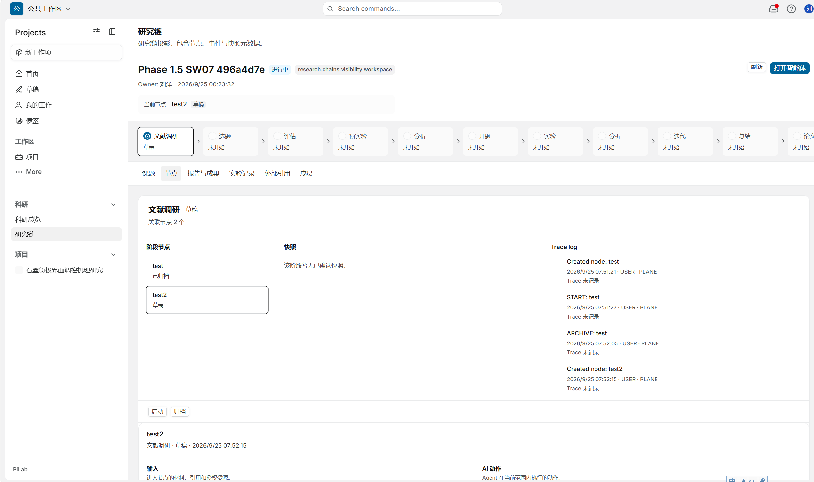

### 1.2研究链创建节点（需要进一步思考优化）

目前创建每个环节如何操作的流程需要做的更精简好理解一点。比如一个研究链的环节，如何做各类业务，应该做更用户友好的设计。目前创建节点，下面还有各类提交确认/审批/各种链接，各种快照。感觉功能逻辑很乱。应该进一步梳理出最好的逻辑。

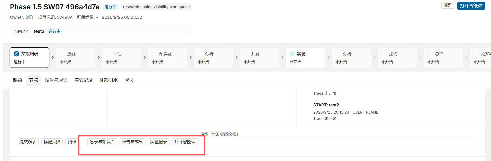

### 研究链报告成果（未修复）

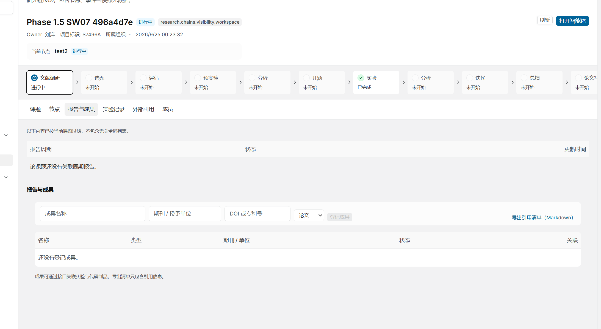

同上，报告成果好像也无法上传。目前好像依然没看到报告上传的地方啊。

### 实验记录（未修复）

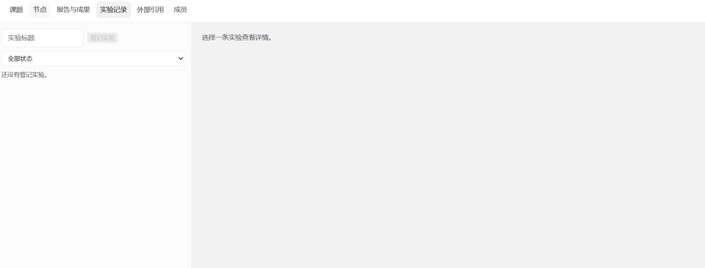

同上，目前好像依然没看到试验记录的地方啊。

### 1.5 RAGPortal 知识库（需要优化）

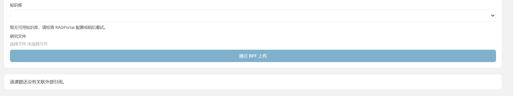

UI上，选择文件上传好像没有上传地方，通过BFF上传按钮做的很大很粗糙，这类细节渲染要做更好一点。

### 成员（未修复）

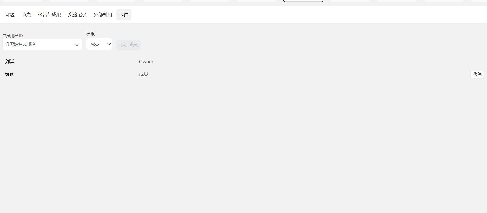

这个添加成员等功能是否能用，确保能用。且整个UI表格、阴影、色块、边框等细节要渲染，渲染成一个表格形式。

### 1.7 项目和课题的关联性（未修复）

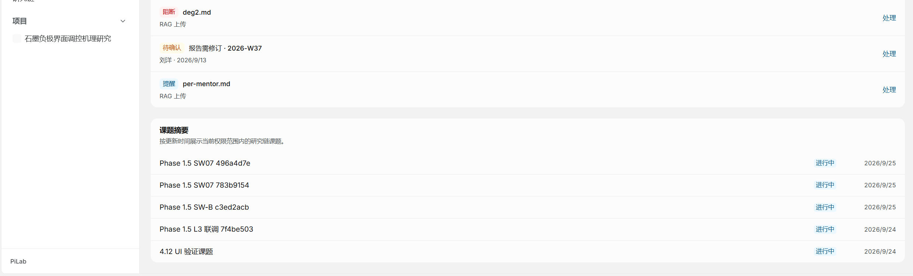

目前项目和课题好像是不相关的。课题做课题的之情，项目是项目的事情。我建议新建一个课题就默认新建一个项目，可见性参考课题。同样项目也可以做各类的审批，主要是项目管理用的。

明明liuyang有五个课题，但是只有一个项目，肯定是需要对应的。

## 2.liuyang.phd@ai4ms.local，学生 owner 主视角

### 2.1 课题可见性（未修复）

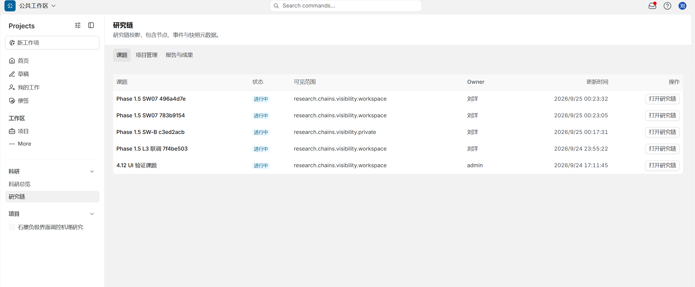

为何admin课题4.12 UI 验证课题 Liuyang可见到，现在依然可以看到

### 2.2科研摘要 （需要优化）

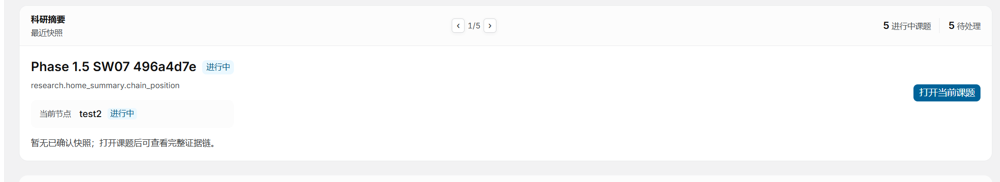

1/5，这个按钮要做的大一点

### 2.3 跨组件待办（需要优化）

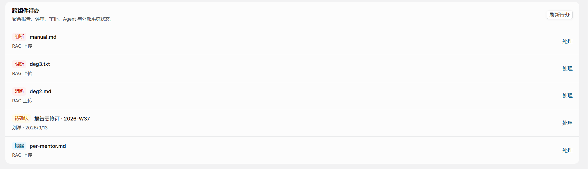

跨组件待办也要聚合所有待办，如果过多参考科研摘要方法。可以有个左右箭头可以切换不同待办。这个可以最多显示5行。左右按钮也要大一点。

### 2.4 课题摘要（需要优化）

课题摘要移到科研摘要-跨组件代办，中间。目前的地方不对。

### 2.5 新建科研项目（这部分的逻辑依然没有解释）

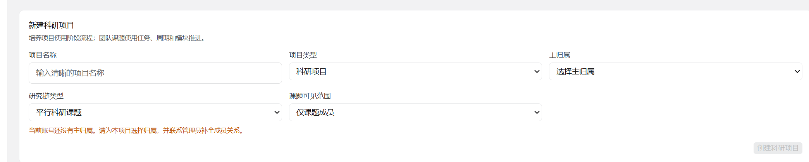

目前新建科研项目不同类型的选项是什么意思，告诉我，在设计上做更直观的区分。

### 2.6 周报等报告

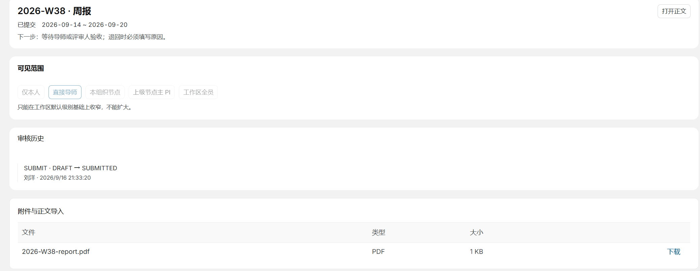

按道理，主PI拥有最高权限，可以看到所有人的报告。整个项目对于主PI可见性的逻辑要改。

## chenjing.advisor@ai4ms.local，导师

### 审批中心可见性

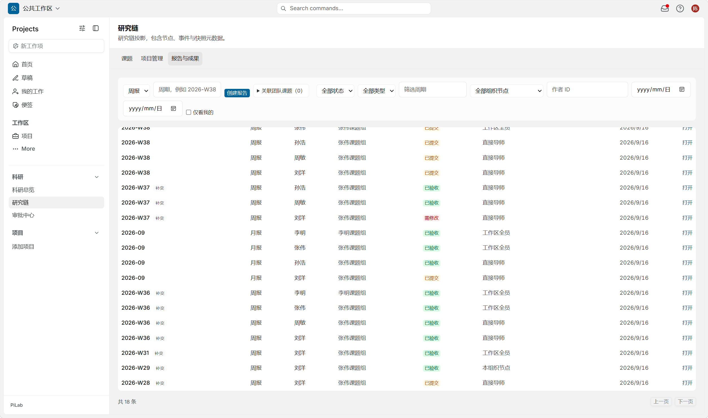

Chenjing不应该可以看到非她小组的成员的周报。旧数据要清楚，进一步确认。

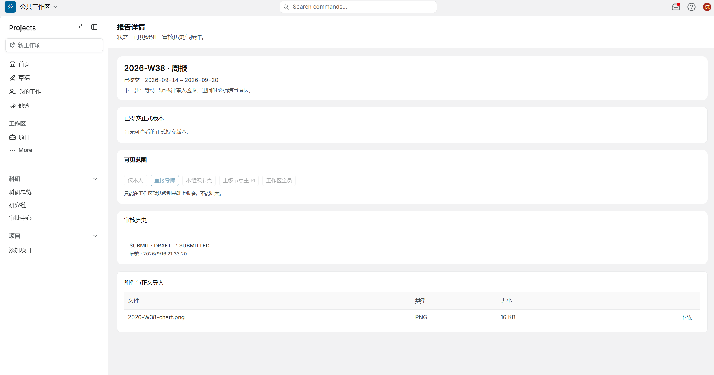

像liuyang提交，她可看，但是审核不了，不对。可以看的就要可以审批，但是没权限就要不可看。

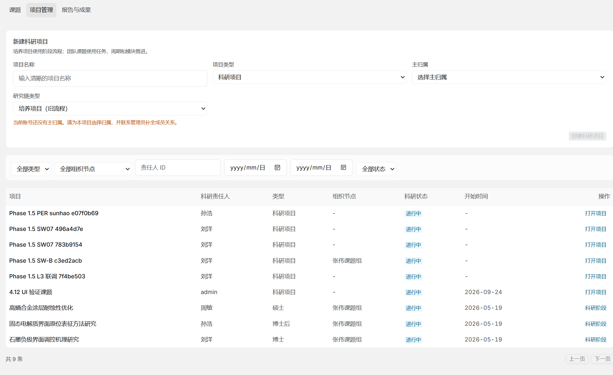

项目管理一样。可以看的就要可以审批，但是没权限就要不可看。

## zhangwei.pi@ai4ms.local，主PI

### 4.1 科研总览继承上面的基础功能。另外对这个页面做进一步美化。

### 4.2 课题，项目管理，报告成果的管理要都可以看到整个课题组的。

目前好像对报告的上传审核做的不是很细，在review一下。

## Admin，管理员

### 5.1 身份映射

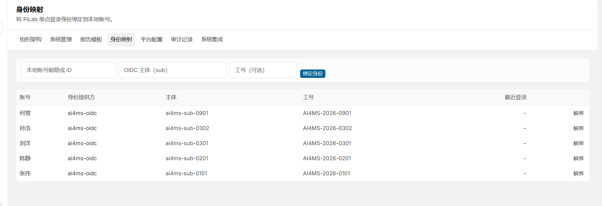

这几个身份映射的是谁？先清空吧

目前和ai4ms的身份可以互相登录了吗。

我ai4ms有个账号fangyikai，密码<已脱敏>，可否让我和plane的fangyikaii@163.com账号绑定。我要测试。

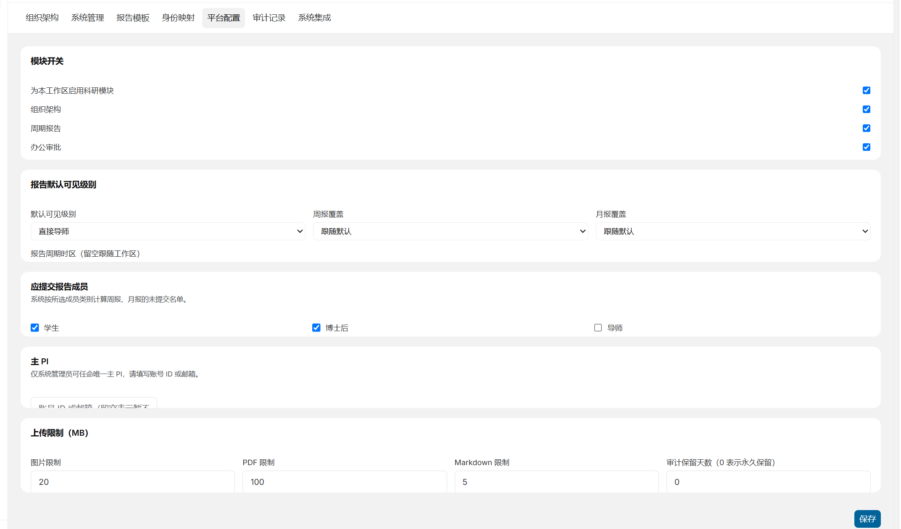

## 平台配置

上面说的报告可见性是不是在平台配置配的，如果是配成主PI就行，那就不用改，之前的问题。

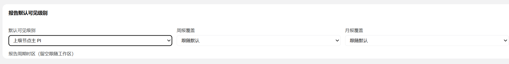

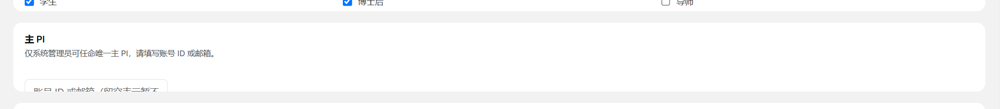

主PI这边显示不全。

## Agent

我用张伟账号登录，张伟的课题：锂电材料跨尺度计算平台

进行中research.chains.visibility.private

Owner: 张伟2026/9/22 17:50:35

Agent显示不可以访问，没有权限

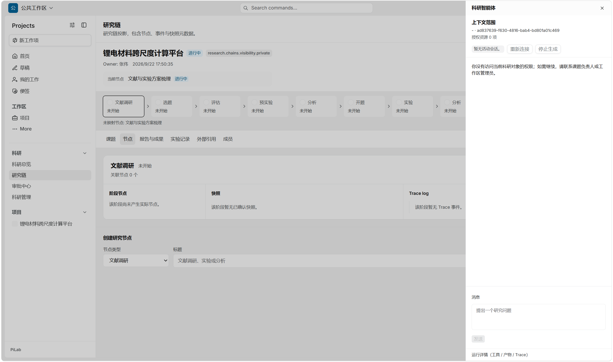

这个是不对的，张伟作为主PI，可以以主PI身份，通过agent去review所有课题。

另外，直接导师也一样，可以通过agent去review小组所有课题，对话。

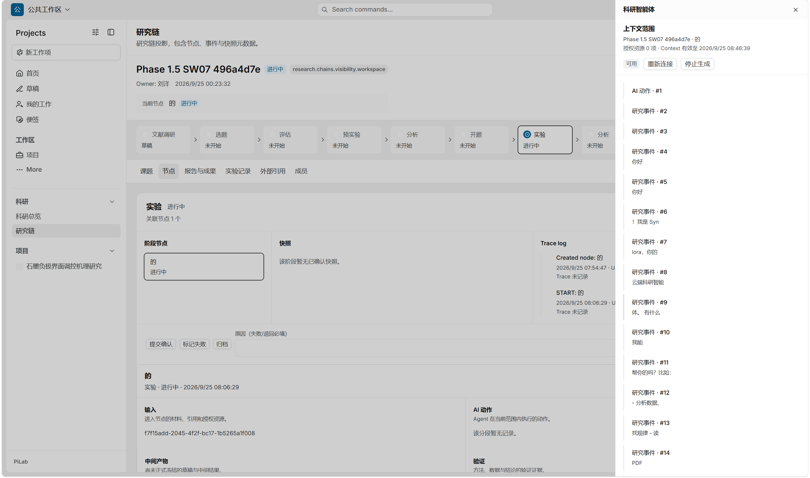

通用刘洋登录他的课题，显示智能体能回答。但是输出很乱。进一步做正常回答的优化。Agent插件部分后面再设计。

很多功能似乎都没优化，进一步核对确认，给出排查清单，另外，旧的数据逻辑不对都要删掉，重新做符合业务逻辑的数据。
