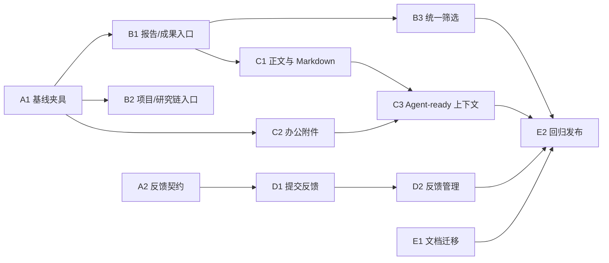

# 科研智能平台 Phase 1.5：1008 人工测试反馈实施计划

| 项目     | 内容                                                                                                                                                                                               |
| -------- | -------------------------------------------------------------------------------------------------------------------------------------------------------------------------------------------------- |
| 状态     | 已实施并完成自动化/隔离浏览器验收；2026-10-09 补齐四角色/双组织组合筛选基线与 HTTP/IP Web Crypto 兼容复测；生产 dry-run 与源备份仍未执行，按发布例外留待取得生产凭据后补做                         |
| 反馈来源 | 本地 `plane/refer/issue/issues1008.docx`；含 8 张界面截图，不进入 Git                                                                                                                              |
| 适用范围 | Plane `apps/web`、`apps/api`、`packages/*` 与 `docs/`                                                                                                                                              |
| 基线     | 计划编写时 `4.19.1`；4.20.0 已交付首轮兼容改进，4.21.0 完成主体补齐，4.22.0 修正反馈架构，4.22.1 修复 HTTP/IP 反馈幂等键兼容性，4.22.2 补齐组合筛选基线与收尾回归                                  |
| 目标     | 将报告、科研项目和研究链从“创建与浏览混杂、默认筛选造成空态”的体验，收敛为可直接浏览、可精细筛选、可在对话框内创建的研究工作台；补齐报告富内容、附件、Agent 上下文与平台反馈闭环，并整理文档目录。 |

## 1. 需求理解与范围边界

本轮人工测试集中暴露出四类问题：

1. **报告与成果入口混杂。** 现有报告页在同一工具栏中同时放置新建报告表单和查看筛选器；默认 `mine=true`，进入页面时容易在已有报告存在的情况下看见“无结果”。成果登记在项目内，和周期报告没有明确的阅读入口边界。
2. **科研项目与研究链浏览受创建和粗粒度筛选干扰。** 项目页同样把新建表单放在列表上方；筛选以 ID 或简陋日期输入为主，难以在主 PI 管理大量项目时按课题组、责任人、文本和时间范围定位。
3. **报告可交付物未形成完整心智模型。** 已有 Plane Page 正文、Markdown 导入、图片/PDF/Markdown 附件及 Agent Context API，但界面没有把正文编辑、插图、办公附件和“可供 Agent 使用”的状态清晰串联。现有附件校验尚不接受 `doc`、`docx`、`xls`、`xlsx` 等办公文件。
4. **反馈入口缺失。** Plane 仅支持通过环境变量跳转外部反馈链接；AI4MS 的 Spec_Agent 与 Poly_Agent 反馈体系仅作独立产品参考，不能成为 Plane 的反馈后端。Plane 需要自己的截图提交、角色查看和处置闭环。

本计划不改变已有报告审核状态机、可见性 ACL、项目/研究链的数据归属、跨仓 Agent 契约或历史报告快照语义。所有新增接口沿用现有工作区、组织单元和审计边界；截图、办公附件和反馈正文均不写入测试证据或日志。

## 2. 当前实现与设计决策

| 领域            | 可复用基础                                                                                    | 本轮决策                                                                                                                                                              |
| --------------- | --------------------------------------------------------------------------------------------- | --------------------------------------------------------------------------------------------------------------------------------------------------------------------- |
| 报告正文        | `PeriodicReport` 关联 Plane `Page`，`DocumentEditor` 已支持富文本；报告详情可打开正文         | 正文继续复用 Page 编辑器，不另建编辑器；创建后直达报告详情，并把“编辑正文”作为明确主操作。                                                                            |
| Markdown 与插图 | `import-markdown/`、编辑器上传能力、图片附件和本地图片替换提示已存在                          | 保留 Markdown 导入；补充导入说明、插图入口和失败反馈，不把本地 Markdown 图片静默丢失。                                                                                |
| 报告附件        | S3 直传、ACL、快照 manifest、图片/PDF/Markdown 类型和独立大小限制均已存在                     | 将白名单扩展为常用办公附件，按 MIME、扩展名、大小和下载 ACL 校验；附件仅在草稿/退回状态可改。                                                                         |
| Agent 上下文    | `agent-context.v2` 已将有权限的报告纳入资源清单，并可解析正式快照                             | 以已提交快照为 Agent-ready 的唯一版本；草稿须明确不作为默认 Agent 上下文，避免未提交内容泄露或漂移。                                                                  |
| 列表筛选        | 报告已有状态、类型、周期、组织、Owner、日期和 URL 同步；项目已有类型、组织、Owner、日期等参数 | 默认加载权限范围内全部项目/报告；把“仅我创建”降为可选范围筛选。Owner 改用可搜索人员选择器，组织使用课题组名称；日期使用“任意/近 7 天/近 30 天/自定义区间”的统一控件。 |
| 用户反馈        | Plane 有研究模型、FileAsset/S3、组织权限和 append-only 审计基础                               | Plane 自己保存反馈、截图、状态历史和权限判定；右上角提供提交弹窗，主 PI/管理员提供列表、筛选和状态处置。截图复用 FileAsset/S3，不通过 base64 写入事件。               |
| 视觉            | 现有 `ResearchDataSurface`、表格、弹窗和 `@plane/propel` 组件                                 | 按 `academic-editorial-ui`：列表为主、一个主操作、筛选置于标题下的独立控制区；使用排版、留白、分隔线和中性色建立层级，不新增渐变、彩色卡片或 AI 装饰。                |

### 2.1 目标页面结构

```text
报告与成果
├─ 页面头：标题、说明、[新建报告]、[登记成果]
├─ 范围栏：全部可见（默认）/ 仅我创建 / 我需审核
├─ 筛选栏：课题组、责任人、关键词、报告类型/成果类型、状态、日期
└─ 内容区：报告 | 成果 两个视图，各自为结构化表格与可解释空态

科研项目 / 研究链
├─ 页面头：标题、说明、[新建科研项目]
├─ 范围栏：全部可见（默认）/ 我负责 / 我参与
├─ 筛选栏：课题组、责任人、关键词、状态、类型、日期
└─ 内容区：已有项目列表；研究链入口保留既有导航和权限逻辑
```

“新建报告”和“新建科研项目”均以小型图标+文字主按钮打开对话框；表单仅在对话框内出现。默认范围由服务端 ACL 决定，不能因为移除 `mine=true` 绕过可见性控制。

### 2.2 2026-10-09 复测结论与 `4.22.1` 解决方案

**测试目标。** 以 `issues1008.docx` 的报告/成果、项目/研究链、富内容与附件、Agent Context、用户反馈五类问题为验收主线，并以 `issue1008反馈.docx` 补充主 PI、学生和反馈管理的实际操作路径。复测确认：既有 Phase B--D 实现已覆盖默认浏览、创建入口、精细筛选、返回导航、正文/附件/正式快照和反馈闭环；相应角色、ACL 与负例由既有 API、浏览器及组件测试保护。

**新增问题。** 反馈弹窗在不安全 HTTP 来源或 IP 地址访问时，浏览器可能不暴露 `crypto.randomUUID`。组件在首次渲染和每次编辑表单时直接调用该 API，导致用户无法打开或继续提交反馈；这与反馈文档中“右上角反馈可用”的基本路径冲突。

**根因。** `randomUUID` 被当作所有部署环境都可用的前端能力，缺少能力检测和回退策略。该值只用于一次反馈表单的幂等性，服务端仍负责请求去重和权限校验，因此前端可安全提供不可预测性较低但唯一性足够的降级值。

**解决方案。** 抽取 `createIdempotencyKey()`：优先调用 `globalThis.crypto.randomUUID()`，不可用时生成带时间戳与随机后缀的 `fallback-...` 键；新建表单、编辑分类/描述、增删截图及成功提交后的下一次表单均统一使用该函数。失败重试继续复用当前键，因而不改变 API 契约、幂等语义、截图存储或权限范围。

**验证与验收。** 新增 JSDOM 用例模拟 `globalThis.crypto` 存在但没有 `randomUUID`，断言生成降级键；执行 `pnpm --filter web test:components -- research-feedback-dialog.test.tsx`，得到 42 个文件、160 项测试通过。提交前还须通过格式、类型和完整 `pnpm check`；若这些检查暴露与本改动无关的既有失败，须在发布记录中单独说明。

## 3. 实施任务

### Phase A：契约冻结与可复现基线

#### A1：建立 1008 验收夹具与现状基线

**说明：** 使用可重复的研究项目、跨课题组人员、报告、成果和附件夹具，复现“默认空结果”“创建/浏览混杂”“大范围筛选”和报告编辑路径。记录现有 API 参数、ACL 结果与 1440px / 390px 脱敏截图。

**验收：**

- [x] 覆盖学生、直接导师、主 PI、工作区管理员四种身份及至少两个组织单元。
- [x] 默认列表、`mine=true`、组织、责任人、日期和关键字组合的结果数可复现。
- [x] 基线证据不含密码、Token、完整邮箱、报告正文或原始附件。

**验证：** 扩展 `test_research_reports.py`、`test_research_projects.py` 与 Web 组件查询测试；Playwright 采集脱敏结果。

**依赖：** 无。

**涉及位置：** `apps/api/plane/tests/contract/app/`、`apps/web/tests/components/`、`docs/evidence/phase-1.5/issue1008/`。

#### A2：冻结 Plane 内建反馈契约

**说明：** 冻结 Plane 自己的反馈模型、API、权限、截图存储、幂等和状态审计契约。反馈记录、截图关联和审计事件全部由 Plane 保存；AI4MS 反馈体系保持独立，两边不共享身份映射、存储或管理端。

**验收：**

- [x] `docs/contracts/research-intelligent-platform/feedback.v1.md` 明确请求、响应、错误码、权限和文件大小/类型限制。
- [x] 普通用户只能提交和查看自己的提交回执；主 PI/管理员仅查看当前工作区授权范围内反馈。
- [x] 文本、截图和 URL 参数均经过长度、类型、文件头和权限校验。
- [x] 反馈截图对所有通用资产接口独占；4.21 `platform=plane` 历史数据提供 dry-run 与幂等导入命令。

**验证：** 契约测试覆盖允许、越权、无效图片、超限和本地存储失败五类结果。

**依赖：** A1。

**涉及位置：** `docs/contracts/research-intelligent-platform/`、`apps/api/plane/db/models/research/`、`apps/api/plane/research/`、`FileAsset/S3`。

### Checkpoint A

- [x] A1、A2 的基线和契约评审通过。
- [x] 明确办公附件的白名单、单文件大小、恶意文件扫描责任方；反馈截图按 Plane 契约长期保留。
- [x] 不开始数据库迁移或 UI 改造，直至契约与权限矩阵确认。

### Phase B：列表信息架构与筛选体验

#### B1：拆分报告的浏览、创建和成果入口

**说明：** 将报告列表默认范围改为“当前用户有权查看的全部内容”，把“仅我创建”改为显式范围控件；把报告创建表单移到对话框。报告与成果在同一入口下使用清晰视图切换，成果仍复用项目内现有模型和登记流程。

**验收：**

- [x] 有可见报告时首次进入不显示由默认筛选造成的空态；无记录与筛选无结果的提示可区分。
- [x] 新建报告按钮打开对话框，可选择类型、周期、关联课题和模板；创建成功后打开新报告。
- [x] 报告表格与成果表格保留各自状态、ACL 与操作，视图切换不丢失 URL 可分享的筛选条件。

**验证：** API 查询回归、`ResearchReportList` 组件测试、报告创建到提交的浏览器流程。

**依赖：** A1。

**涉及位置：** `apps/web/core/components/research/reports/`、`apps/web/core/components/research/outcomes/`、`apps/web/app/(all)/[workspaceSlug]/(projects)/research/reports/`、i18n 文案与现有报告测试。

#### B2：重构科研项目/研究链的创建入口与默认范围

**说明：** 将项目创建字段移入对话框，列表默认显示权限范围内的现有项目；研究链保持现有项目绑定与导航，只改善“已有项目”和“新建项目”的层级关系。

**验收：**

- [x] 默认项目列表不会因 Owner 或项目 ID 的隐式条件显示假空态。
- [x] 创建按钮在有权限时可见，表单字段、审批和项目类型规则与当前接口一致。
- [x] 项目行能识别负责人、课题组、状态、日期和研究链入口；窄屏布局无页面级横向滚动。

**验证：** `ResearchProjectList` 组件测试、项目 ACL 契约测试、1440px/390px 浏览器检查。

**依赖：** A1。

**涉及位置：** `apps/web/core/components/research/projects/`、`apps/web/app/(all)/[workspaceSlug]/(projects)/research/projects/`、既有项目服务及测试。

#### B3：提供一致且可扩展的研究筛选控件

**说明：** 提取报告、项目、研究链和科研总览可复用的筛选状态与控件。组织按显示名称选择，责任人使用已有 `PersonSelect` 搜索；关键字在服务端参数稳定后支持标题、周期、负责人等字段；日期提供预设范围与自定义区间。

**验收：**

- [x] 课题组、责任人、关键词、状态、类型和日期可组合，激活条件以 chip 显示并可一键清除。
- [x] 选项名称对用户可读，URL 参数可回放；分页、刷新和切换视图不产生陈旧结果。
- [x] 主 PI 面对数百项目时，查询不因全量前端过滤而阻塞；文本/日期过滤走带索引的服务端查询。

**验证：** API 参数与性能契约测试、筛选状态单元测试、键盘和无障碍标签检查。

**依赖：** B1、B2。

**涉及位置：** `apps/web/core/components/research/common/`、`apps/web/core/components/research/common/person-select.tsx`、报告/项目/研究链服务与 API views、数据库索引迁移（仅当 explain 证明现有索引不足时）。

### Checkpoint B

- [x] 报告、成果、项目和研究链的默认范围、筛选、创建与空态经四角色矩阵验证。
- [x] 既有报告审核、项目审批、ACL、页面 URL 与深链接回归通过。
- [x] 灰度检查中，层级来自标题、范围栏、筛选区和表格，而非增加卡片、颜色或装饰。

### Phase C：报告内容、附件与 Agent-ready 闭环

#### C1：明确报告正文、插图与 Markdown 工作流

**说明：** 在报告详情中用明确操作串联“编辑正文”“从 Markdown 导入”“插入图片”“保存草稿”“提交正式版本”。复用 `DocumentEditor`，修正说明和错误状态，不重建富文本编辑器。

**验收：**

- [x] 作者可从报告详情进入正文编辑，并可在正文中插入支持类型的图片；非作者只读取最近正式版本。
- [x] 导入 Markdown 后保留标题、列表、代码块、表格和远程图片；本地图片逐项提示上传替换。
- [x] 断网或保存失败不会反复改写正文，重新连接后用户可辨识草稿和正式版本。

**验证：** Markdown 单元测试、编辑器图片上传回归、离线/失败状态浏览器测试。

**依赖：** B1。

**涉及位置：** `apps/web/core/components/research/reports/report-detail.tsx`、`packages/editor/`、`apps/api/plane/research/utils/files.py`、报告导入测试。

#### C2：扩展附件类型并保留审核和下载边界

**说明：** 在现有 S3 直传与 `ReportAttachment` 基础上支持 PDF、Markdown、DOC/DOCX、XLS/XLSX、PPT/PPTX、CSV/TSV 和图片；为每类类型设置可配置大小上限、MIME/扩展名/签名校验与下载处理。仅将图片用于正文预览，办公附件保持下载或受控预览。

**验收：**

- [x] 支持文档列举的 PDF、MD、DOCX、DOC、Excel 及上述补充基础办公类型；非法扩展名、伪造 MIME、超限文件均被拒绝并审计。
- [x] 附件随报告提交形成不可变正式版本，非作者只能访问该正式版本的附件。
- [x] 附件清单显示文件名、类型、大小、上传者和下载操作；不在列表直接执行 Office 文档内容。

**验证：** `test_research_attachments.py` 覆盖类型矩阵、伪造文件头、ACL 和快照；实际直传/下载浏览器测试。

**依赖：** A1。

**涉及位置：** `apps/api/plane/research/utils/files.py`、`views/attachments.py`、平台设置与迁移、`report-attachments.tsx`、附件契约测试。

#### C3：把正式报告标记为可供 Agent 使用的上下文资源

**说明：** 复用 `agent-context.v2` 的报告资源与快照解析，将“已提交且调用方可见”的报告及其附件 manifest 显式暴露为可选上下文。返回标准化 Markdown/文本摘要和受控附件元数据；二进制办公文件不直接注入模型，先保留可解析标识，后续由文档解析服务异步产生文本版本。

**验收：**

- [x] 每份已提交、可见报告都可通过资源 API 获得稳定版本号、正文 Markdown/HTML 文本和附件 manifest。
- [x] 草稿、未授权报告、过期版本和不可解析二进制附件不能被 Agent 获取。
- [x] Agent UI 显示上下文来自哪份报告和哪个正式版本，失败时给出可操作说明而非静默缺失。

**验证：** `test_research_context.py` 与 Agent 契约测试覆盖版本、权限和附件负例；端到端 Agent 上下文选择测试。

**依赖：** C1、C2、A2。

**涉及位置：** `apps/api/plane/research/views/context.py`、上下文 schema/examples、`apps/web/core/components/research/agent/`、跨仓 Agent 适配器与测试。

### Checkpoint C

- [x] 报告从创建、正文编辑、插图、附件、提交、审核到 Agent 读取的闭环可在脱敏夹具中完成。
- [x] 访问控制在正文、附件、快照和 Agent Context 四处保持一致。
- [x] 办公附件的病毒扫描/文本解析若未就绪，界面清晰显示“已保存、暂不可解析”，不得伪称已喂给 Agent。

### Phase D：用户反馈闭环

#### D1：实现 Plane 顶部反馈入口与截图提交

**说明：** 在全局顶部栏放置低干扰的反馈图标，打开对话框后提交分类、描述、当前页面上下文、浏览器版本和可选截图。敏感 URL query、Cookie、Authorization 和页面正文不进入反馈载荷。

**验收：**

- [x] 任意已登录用户可从右上角提交“缺陷、体验、建议、其他”四类反馈，并获得提交结果。
- [x] 可添加、移除和预览受限格式/大小的截图；提交失败保留表单，不重复创建反馈。
- [x] 对话框支持键盘焦点、必填说明和网络失败提示。

**验证：** 前端组件测试、Plane API 契约测试、桌面与移动端手工流程。

**依赖：** A2。

**涉及位置：** `apps/web/core/components/workspace/`、应用头部、`ResearchFeedbackService`、Plane feedback API。

#### D2：实现主 PI/管理员的反馈管理视图

**说明：** 在科研管理区增加受权限保护的反馈列表。支持分类、状态、提交时间、产品模块和关键字筛选，并显示受控截图和处置记录；普通用户无权查看其他人的反馈。

**验收：**

- [x] 主 PI/管理员可分页查看授权范围的反馈、筛选并更新状态/处理说明。
- [x] 普通用户访问管理路由返回与其权限一致的隐藏或拒绝，不泄露条目存在性。
- [x] 反馈状态变更在 Plane 数据库和审计事件中一致；本地存储失败时保留表单并可重试。

**验证：** 角色 ACL 契约测试、列表组件测试、越权负例和审计测试。

**依赖：** D1。

**涉及位置：** 研究管理导航、`apps/web/core/components/research/feedback/`、`apps/api/plane/research/`、`ResearchAuditEvent`。

### Checkpoint D

- [x] 提交、截图、角色隔离、筛选、处置、审计和本地存储失败降级完成验证。
- [x] 数据保留、截图访问、通用资产接口边界和幂等重试符合 A2 冻结的契约。

### Phase E：文档重组、回归与发布

#### E1：按文档职责迁移 `docs/` 并维护单一索引

**说明：** 在不丢失 Git 历史的前提下，把现有平铺文档迁移为以下稳定目录，并一次性更新相对链接、根 README 与文档索引。历史文档仅迁移，不重写当时事实。

```text
docs/
├─ README.md                         # 唯一入口与权威层级
├─ product/                          # 产品 PRD、路线图、UX
├─ plans/phase-0|phase-1|phase-1.5/ # 尚待执行或执行计划
├─ architecture/                     # 当前架构与工作区契约说明
├─ contracts/research-intelligent-platform/
├─ operations/                       # 部署、runbook、导入、测试账号/夹具
├─ releases/                         # release notes、验收、验证报告
├─ evidence/                         # 可复核证据（保持现有层级）
└─ archive/                          # 历史 P0/P1 与 UI/UX 过程文档
```

**验收：**

- [x] 每份现有 Markdown 文档恰好归入一个职责目录；`README.md` 保留在根目录并列出新路径。
- [x] 仓库内 Markdown 相对链接无断链，文档中引用的契约、运行手册和验收报告可从索引到达。
- [x] `refer/` 下的原始反馈 DOCX/XLSX 和运行时敏感证据仍不进入 Git。

**验证：** Markdown 链接检查、`rg` 检查旧路径、人工从 README 按四类读者路径抽查。

**依赖：** A1 至 D2；可在不修改同一文档的前提下与 D 阶段并行准备迁移清单。

**涉及位置：** `docs/`、根 `README.md`、所有被迁移文档中的相对链接。

#### E2：完成回归、证据与版本发布

**说明：** 汇总自动化、浏览器、可访问性和视觉证据；更新当前契约、使用指南、发布说明和版本号。依变更范围将 `4.19.1` 升为向下兼容功能版本 `4.20.0`，并同步所有维护的版本显示和发布标签。

**验收：**

- [x] 通过相关 API 契约测试、Web 单元/组件测试、类型检查、构建和关键路径 E2E。
- [x] 报告、项目、研究链、附件、Agent Context 与反馈的正反向权限场景均有脱敏证据。
- [x] 按 `academic-editorial-ui` 最终检查确认灰度可读、层级主要来自排版、边框/卡片克制、无 AI 仪表盘感。
- [x] 版本号、发布说明、文档索引和回滚说明口径一致；本项目当前不发布自定义 Git tag，若未来引入 tag 须另立发布流程。

**验证：** `pnpm check`、目标 Web 测试、Django 研究契约测试、Playwright 关键流、链接检查和发布前差异审查；本轮新增四角色/双组织组合筛选证据见 [`20261009-role-filter-baseline.md`](../../evidence/phase-1.5/issue1008/20261009-role-filter-baseline.md)。

**依赖：** B、C、D、E1。

**涉及位置：** `package.json`、应用版本展示、发布说明、`docs/README.md`、`docs/releases/`、测试与 evidence。

## 4. 依赖与执行顺序



A1 与 A2 可以并行；B1 与 B2 可以并行；C2 可与 C1 并行。B3、C3、D2 和 E2 各自依赖前序契约，避免在同一服务接口或文档链接上并发改写。

## 5. 验收矩阵

| 场景                           | 学生                  | 直接导师                     | 主 PI                    | 管理员                                                    |
| ------------------------------ | --------------------- | ---------------------------- | ------------------------ | --------------------------------------------------------- |
| 默认浏览报告/项目/成果         | 仅对象 ACL 可见范围   | 本人及有效指导学生范围       | 公共科研空间全部正式对象 | 按对象 ACL 与作者选择可见范围，不因技术管理员身份自动放宽 |
| 筛选组织、责任人、关键词、日期 | 可用但选项受 ACL 限制 | 可用                         | 可用                     | 可用                                                      |
| 创建报告/项目                  | 按当前角色和组织规则  | 按当前规则                   | 按当前规则               | 按当前规则                                                |
| 编辑正文、上传附件             | 仅本人草稿/退回报告   | 同当前 ACL                   | 同当前 ACL               | 同当前 ACL                                                |
| 读取 Agent-ready 报告          | 仅可见正式版本        | 仅可见正式版本               | 仅可见正式版本           | 仅可见正式版本                                            |
| 提交反馈                       | 可                    | 可                           | 可                       | 可                                                        |
| 查看和处置其他人反馈           | 不可                  | 不可（除非兼任主 PI/管理员） | 可，限授权范围           | 可，限工作区范围                                          |

## 6. 风险与缓解

| 风险                                   | 影响 | 缓解                                                                                           |
| -------------------------------------- | ---- | ---------------------------------------------------------------------------------------------- |
| 移除默认 `mine=true` 被误解为放宽权限  | 高   | 仅删除前端隐式参数；服务端 `report_queryset` 与 ACL 保持为唯一授权判断，并加越权回归。         |
| 办公附件可被伪造 MIME 或带来恶意内容   | 高   | 扩展名、MIME、文件头、大小、病毒扫描与下载鉴权分层校验；不在浏览器直接执行或渲染 Office 内容。 |
| Office/PDF 未解析却被宣称为 AI 上下文  | 高   | `agent-context` 仅暴露已生成的可解析文本；二进制附件明确标为待解析。                           |
| 反馈截图存储或数据库登记失败产生半成品 | 中   | 先上传后登记，失败清理新对象；契约测试覆盖本地存储失败与幂等重试。                             |
| 4.21 AI4MS 历史反馈丢失或重复导入      | 高   | 生产发布前执行只读 dry-run；导入命令按旧反馈 ID 幂等跳过，AI4MS 源数据保持只读并完整保留。     |
| 文档批量移动产生相对链接断裂           | 中   | 先生成迁移映射和链接检查，在一个原子提交中移动并更新索引。                                     |
| 项目量增长导致筛选延迟                 | 中   | 服务端筛选、游标分页、必要时添加数据库索引；以真实查询计划和性能测试决定迁移。                 |

## 7. 待确认事项

1. “报告与成果”是否以一个页面内的两个视图交付，还是成果继续只保留项目详情页并在报告页放跳转入口？本计划暂定前者，以满足“两个功能区明确区分”的反馈。
2. `doc/docx/xls/xlsx/ppt/pptx` 的单文件上限、病毒扫描服务和文本解析服务由哪一仓维护？本计划在 A 阶段冻结后实施。
3. Plane 反馈是否引入独立外部后端？已确认不引入；Plane 使用自身模型、FileAsset/S3 和审计闭环。
4. 主 PI 的反馈可见范围已确认为主管组织树投影；报告、项目、成果沿用科研 ACL 中“唯一主 PI 可见公共空间全部正式对象”的既有规则。工作区管理员仅在反馈管理中拥有当前工作区范围，不因此放宽科研正文 ACL。

## 8. 完成定义

本计划完成不以界面截图为唯一证据。每项功能必须具备实现、类型/契约测试、角色与负例验证、脱敏浏览器证据、文档回写和可回滚路径。任何涉及版本发布的提交在推送前必须按语义化版本同步版本信息；本轮实际交付为 `4.19.1 → 4.20.0 → 4.21.0 → 4.22.0 → 4.22.1 → 4.22.2`，其中 4.22.0 专门修正反馈架构边界，4.22.1 修复 HTTP/IP 环境中的反馈幂等键兼容性，4.22.2 补齐四角色/双组织组合筛选基线与收尾验证。
