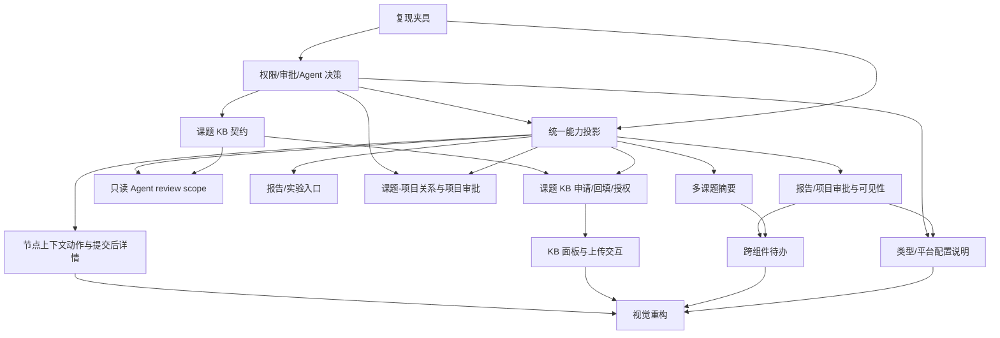
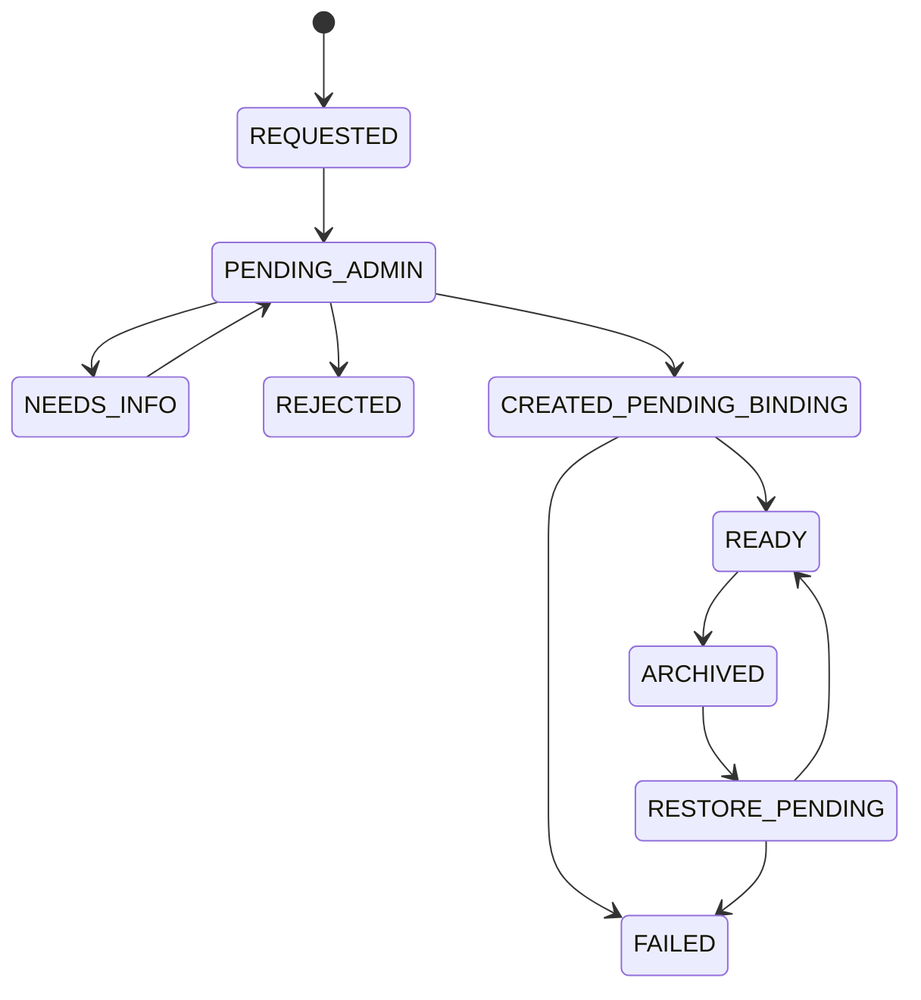

# 科研智能体平台 Phase 1.5 优化修复计划：人工测试问题收敛

| 项目         | 内容                                                                                                                                                                                                                                                                                                                                                  |
| ------------ | ----------------------------------------------------------------------------------------------------------------------------------------------------------------------------------------------------------------------------------------------------------------------------------------------------------------------------------------------------- |
| 计划版本     | v1.6                                                                                                                                                                                                                                                                                                                                                  |
| 文档类型     | 开发、测试、灰度与回滚执行计划                                                                                                                                                                                                                                                                                                                        |
| 编制日期     | 2026-09-25                                                                                                                                                                                                                                                                                                                                            |
| 问题来源     | [`evidence/phase-1.5/issue0925/document.md`](./evidence/phase-1.5/issue0925/document.md) 及 21 张现场截图                                                                                                                                                                                                                                             |
| 前置手册     | [`research-intelligent-platform-phase-1.5-manual-testing-guide.md`](./research-intelligent-platform-phase-1.5-manual-testing-guide.md)                                                                                                                                                                                                                |
| 前置联调计划 | [`research-intelligent-platform-phase-1.5-integration-debug-plan.md`](./research-intelligent-platform-phase-1.5-integration-debug-plan.md)                                                                                                                                                                                                            |
| 执行手册     | [`research-intelligent-platform-phase-1.5-execution-runbook.md`](./research-intelligent-platform-phase-1.5-execution-runbook.md)                                                                                                                                                                                                                      |
| 当前代码基线 | `develop` / `4.16.0`；历史 `4.14.2` 只作为问题复现版本保留                                                                                                                                                                                                                                                                                            |
| 相关契约     | [`research-intelligent-platform-prd.md`](./research-intelligent-platform-prd.md)、[`research-workspace-v3.md`](./research-workspace-v3.md)、[`research-workspace-ux-guide.md`](./research-workspace-ux-guide.md)、RAGPortal [`2026-09-24-pi-private-knowledge-space-prd.md`](../../RAGPortal/docs/specs/2026-09-24-pi-private-knowledge-space-prd.md) |
| 计划状态     | 业务决策已冻结；本轮完成 Plane/Synlora review scope 与 KB READY 门禁收紧，跨仓 OIDC/通知能力按依赖清单待联调                                                                                                                                                                                                                                          |
| 目标         | 把现场人工反馈转化为可复现、可开发、可验收的产品优化任务；不重复已完成的跨服务联调修复                                                                                                                                                                                                                                                                |

> **文档使用规则（v1.6）**：实现人员按第 6 节任务卡执行，契约以第 6 节和 `plane/docs/contracts/research-intelligent-platform/` 为准，测试按第 8 节命令和门禁执行，发布/回滚按第 10 节执行。正文中的“已有”表示代码已存在且需要复用，不表示已经满足本计划验收。若代码与本文冲突，先登记契约差异，不得直接修改权限或状态语义。

## 1. 结论摘要

本次人工测试暴露的不是单一的“页面不好看”问题，而是四个层次叠加：

1. **操作入口没有跟随用户上下文出现**：节点、报告成果、实验记录和文件操作分散在不同页签或外部系统入口，用户在节点详情中看不到下一步动作，因此将“功能存在但入口不在当前语境”理解为“不能操作”。
2. **研究链与 Plane Project 的关系没有被解释清楚**：代码已经在创建 `RESEARCH_CHAIN` 课题时一并创建一对一的 Plane Project 和 Chain，但页面没有同时展示二者的身份、管理边界和跳转关系，导致项目与课题看起来像两套数据。
3. **业务权限语义没有形成统一的查看、编辑、审批、Agent review 模型**：学生、直接导师、主 PI、工作区管理员和系统管理员在不同页面的可见范围、审批权和 Agent scope 需要使用同一套业务矩阵；“能看但不能审批”和“能看到标题但不能进入”都需要修正。
4. **课题私有知识库尚未成为正式产品对象**：当前 Plane BFF 可以从 RAGPortal 列出现有知识库并上传文件；已确认 RAGPortal 不能直接调用 WeKnora 建库，只能提交申请，由管理员在 WeKnora 手工建库后回填绑定。因此需要补齐“课题创建即提交申请、管理员通知与处理、手工建库回填、READY 后上传、按学生、直接导师、产业化负责人、基础研究负责人、课题组唯一 Main PI 及组织上级领导继承授权、随课题归档与恢复”的完整生命周期。

原 Phase 1.5 的 L1–L4 证据已经证明五服务健康、上传/解析/引用、Agent 检索、事件回放、快照导出、功能开关和 ACL 基础契约可用；本计划处理的是现场反馈对应的产品语义、上下文操作性、权限细化和 UI 质量问题。原 P15-001～P15-008 不重新打开，除非本计划回归发现同一根因再次出现。

## 2. 证据与现状核验

### 2.1 已确认的实现事实

| 事实                                                                                                                                | 证据                                                                                                  | 对本计划的影响                                                                                                 |
| ----------------------------------------------------------------------------------------------------------------------------------- | ----------------------------------------------------------------------------------------------------- | -------------------------------------------------------------------------------------------------------------- |
| `RESEARCH_CHAIN` 创建流程会同时创建 Plane Project、ResearchProjectProfile 和 ResearchChain，且 Chain 与 Project 一对一              | `plane/apps/api/plane/research/views/projects.py`、`plane/apps/api/plane/db/models/research/chain.py` | “项目和课题完全无关”主要是呈现、导航和对象模型解释不足；项目审批已确认复用 ApprovalRequest/Plane Issue         |
| 研究链课题页已有 `overview / nodes / reports / experiments / references / members` 六个 Tab                                         | `plane/apps/web/core/components/research/chains/research-chain-detail.tsx`                            | 节点详情需要增加上下文动作区和明确的“当前节点/当前课题”关联，不宜再新增平行一级入口                            |
| 节点详情已有事件、快照、六段证据结构和生命周期按钮                                                                                  | `research-chain-node-detail.tsx`、`research-chain-workflow-stage-detail.tsx`                          | 现场“节点提交后点不进去”需要先复现路由、选中态和只读详情，再决定是前端状态 bug 还是入口/文案问题               |
| RAG 上传面板位于“外部引用”Tab，当前只列出现有 KB                                                                                    | `research-chain-knowledge-panel.tsx`、`knowledge.py`、RAGPortal `kb.py`                               | 需要新增课题 KB 控制面和生命周期契约，不能只调下拉框颜色                                                       |
| 报告成果 `OutcomeList` 可登记成果、状态和导出，但没有文件选择入口                                                                   | `outcomes.py`、`outcome-list.tsx`                                                                     | “报告成果无法上传”至少包含产品入口缺失和结果附件模型缺口两部分                                                 |
| 实验记录支持文本结果和外部资产引用，明确拒绝直接上传实验数据文件                                                                    | `experiments.py`、`experiment-detail.tsx`                                                             | 需在 UI 明示“外部资产引用”与“报告附件上传”的差异，不能误把实验原始数据复制到 Plane                             |
| 首页科研摘要当前只取 `chains[0]`，待办虽有统一 collector 但展示缺少聚合翻页                                                         | `research-home-summary-card.tsx`、`research-todo-index.tsx`                                           | 需要增加跨课题聚合、分页/左右切换和最多 5 行规则，并保持 ACL 过滤                                              |
| 主 PI / 管理链可通过统一 ACL 查看正式报告和内容；审核能力由 `check_access(action="review")` 决定                                    | `research/utils/acl.py`、`reports.py`、`summary.py`                                                   | “能看就能审批”不能简单理解为所有可读者都获得审批；需要固化审批人集合，并在 UI 隐藏不可执行记录                 |
| Agent session 创建目前要求当前节点可见且 `_node_operator` 为真                                                                      | `research/views/agent.py`、`chain_foundation.py`                                                      | 主 PI/直接导师跨课题 review 需要独立的只读 review scope；不能放宽 Chain 写权限                                 |
| RAGPortal 底层客户端虽然存在建库调用封装，但当前产品边界不允许 RAGPortal 直接创建 WeKnora KB；Plane BFF 暴露的是列表/上传/状态/引用 | `RAGPortal/backend/app/core/weknora.py`、RAGPortal PRD v0.4、`plane/research/views/knowledge.py`      | 需要实现申请、通知、管理员手工建库回填、绑定校验、READY 门禁、成员授权、归档和恢复语义；不得按自动建库方案排期 |

### 2.2 原联调结论与本次反馈的边界

- `20260925-D5.md` 的“P15-001 至 P15-008 全部关闭”只表示当时登记的跨服务缺陷已修复，不表示 `issue0925` 中新增的产品反馈已经处理。
- `roles/20260925-L3.6.md` 的 VIS/PER 矩阵证明了当前测试夹具下 API 的基础可见性和写权限，但没有覆盖报告/项目审批的业务人选、主 PI 跨课题 Agent review、课题 KB 生命周期、节点详情可发现性、响应式 workflow 的可操作性。
- 本计划中的 P15-O 编号是“优化问题”编号，与联调缺陷 P15-001～008 分开，避免在历史证据中混淆。

### 2.3 基线冲突处理

- 真实数据基线只认 [`research-pi-lab-baseline-runbook.md`](./research-pi-lab-baseline-runbook.md) 和两份锁定 SHA-256 的 xlsx；`seed_research_demo` 仅保留给自动化测试，不得再用于 `public` 验收环境。
- 旧版测试账号手册仅作为历史测试资料；执行机通过环境变量注入凭证，证据不得保存明文密码。
- L3.6 中“导师可写 Chain”的历史结果只代表 Phase 1 基线，不代表本计划目标。v1.3 以 §5 的 review-only 规则为准：导师/PI 可以审批、评论和提交分析草稿，不可修改学生正式内容、节点生命周期、上传和引用确认。
- 执行手册表头“配套计划 v1.1”需同步改为 v1.3；任何引用本计划版本的 runbook、契约和 PR 在发布前必须完成一致性检查。
- 现有 `plane/apps/api/package.json`、`plane/apps/api/pyproject.toml` 和 `plane/apps/web/package.json` 版本号不在本次文档变更中调整；代码发布时按 AGENTS.md 的语义化版本规则，由各仓库发布负责人统一决定并记录。

## 3. 问题分级与处理原则

### 3.1 严重度定义

| 级别 | 判定                                                                         | 处理时限                 |
| ---- | ---------------------------------------------------------------------------- | ------------------------ |
| O0   | 数据越权、错误审批、课题资料跨空间暴露或无法安全恢复                         | 排期前置；未修复不得灰度 |
| O1   | 核心科研链路无法完成，或用户无法判断下一步操作，有人工绕行但会阻断试点       | 第一轮修复窗口           |
| O2   | 跨课题聚合、入口、响应式、状态表达和视觉层级问题，影响效率和理解但不破坏数据 | 第一轮或第二轮           |
| O3   | 纯文案、细节打磨、插件体验增强                                               | 与后续迭代合并           |

### 3.2 处理原则

1. 先冻结业务语义，再改 UI；避免用视觉补丁掩盖权限或数据模型问题。
2. 页面、API、Context、Agent、导出和外部 KB 使用同一份资源范围判定。
3. 读权限、编辑权限、审批权限、管理权限和 Agent review 权分开建模，并在响应中返回 `capabilities` 或等价的可执行动作集合。
4. 课题创建、归档、恢复和删除分别定义 KB、项目、报告、实验和成员的生命周期；失败时采用可重试的补偿任务，不把半成品显示成已成功。
5. UI 视觉遵循 `academic-editorial-ui`：中性背景、单一深青绿强调色、排版和留白建立层级、减少嵌套卡片和阴影；灰度下也必须能辨识状态和操作。

## 4. 问题台账：现象、根因假设与验收方向

| 编号    | 来源              | 现象归纳                                                         | 初步根因                                                                                   | 严重度 | 目标结果                                                                                                                                                                                          |
| ------- | ----------------- | ---------------------------------------------------------------- | ------------------------------------------------------------------------------------------ | ------ | ------------------------------------------------------------------------------------------------------------------------------------------------------------------------------------------------- |
| P15-O01 | issue 1.1         | workflow 在缩放或窄屏下显示不全                                  | 固定宽度 rail + 标签截断；缺少可见的横向滚动提示和紧凑模式                                 | O2     | 13 个研究链节点类型在 1280/1024/390 宽度下均可访问，节点名/状态不丢失，键盘可操作                                                                                                                 |
| P15-O02 | issue 1.2         | 创建节点后找不到上传和其他操作入口；节点均白底，层级不清         | 节点操作只在选中详情下出现，文件面板只在 references Tab；视觉状态依赖白底卡片              | O1/O2  | 选中节点后出现明确“记录/文件/Agent/生命周期”动作区；阶段、当前节点、已完成、待处理和只读状态可区分                                                                                                |
| P15-O03 | issue 3/4         | 报告成果、实验记录看起来无法上传                                 | Outcome 只有元数据登记；Experiment 只接受外部资产引用；没有解释上传边界                    | O1     | 报告支持 PDF/Markdown 附件上传/状态/删除权限；实验明确提供 SpecLabOS 外部资产关联 UI 和人工记录入口，禁止上传时有原因与深链                                                                       |
| P15-O04 | issue 1.5         | 只能选择已有 KB；期望每个课题有独立知识库和生命周期              | 缺少 Chain ↔ KB 申请/绑定、管理员通知、手工建库回填、READY 门禁、成员授权和归档补偿模型    | O0     | 课题创建后自动提交唯一 KB 申请；管理员在 WeKnora 手工建库并回填后才进入 READY；学生、直接导师、产业化负责人、基础研究负责人、唯一 Main PI 及组织架构上级领导按继承规则访问；归档/恢复可追踪       |
| P15-O05 | issue UI          | 文件选择/未选择状态不明显，表格、色块、边框、阴影细节弱          | 原生 file input 和状态反馈过轻；页面层级依赖边框                                           | O2     | 文件选择区有选中态、文件名、大小、类型、清除和上传中状态；灰度可读且无装饰性渐变                                                                                                                  |
| P15-O06 | issue 5           | 添加成员等功能需确认可用，界面细节需统一                         | API 已有成员增删，但缺少现场成功/失败回执、角色解释和可见性反馈                            | O1/O2  | 添加、改角色、移除均有确认、结果 toast、失败原因和刷新后持久化证据；表格密度与其他科研页面一致                                                                                                    |
| P15-O07 | issue 6           | 节点提交后似乎无法再次进入或查看细节                             | 需要排查选中节点 URL 参数、已提交节点路由、只读详情请求和列表过滤                          | O1     | 任一状态节点都可进入详情；只读状态保留事件/快照/引用，写按钮按能力隐藏并说明原因                                                                                                                  |
| P15-O08 | issue 1.7         | 项目与课题像两套互不相关的数据；建议课题默认建项目并支持项目审批 | 数据层已一对一，但页面/导航没有呈现关系；项目审批需复用既有 ApprovalRequest/Plane Issue    | O1     | 创建课题时强制创建独立 Plane Project；项目审批复用 ApprovalRequest/Plane Issue 并关联 Chain Event；创建/归档/可见性关系明确且可回归                                                               |
| P15-O09 | issue 2.1         | 学生可看到管理员的 PRIVATE 课题                                  | 需确认该课题的真实 owner、visibility、成员关系和历史缓存；当前 ACL 理论上应 fail closed    | O0     | 学生列表、详情、导出、Agent、KB 均不可见；若有授权必须展示授权来源；修复后清理缓存和旧链接                                                                                                        |
| P15-O10 | issue 2.2         | 科研摘要只显示一个课题                                           | 首页使用 `pickCurrentChain`，没有把所有可见课题做成可切换集合                              | O2     | 展示当前进行课题总数和当前项；左右箭头/键盘/Home-End 可切换；切换遵循同一 ACL                                                                                                                     |
| P15-O11 | issue 2.3/2.4     | 跨组件待办未聚合所有待办；课题摘要位置不合适                     | 待办虽有统一 collector，但首页展示缺少聚合分页和“课题上下文”信息                           | O2     | 聚合所有来源，默认最多 5 行，支持左右翻页；每行显示课题、来源、负责人、动作和更新时间；保留课题摘要与待办的语义区分，在同一共享区块中以摘要头 + 待办列表呈现                                      |
| P15-O12 | issue 2.5         | 新建科研项目类型含义不清                                         | `LEGACY_TRAINING` / `RESEARCH_CHAIN`、培养项目/团队项目缺少面向用户的差异说明              | O2     | `RESEARCH_CHAIN` 类型明确创建独立 Plane Project、Chain 和 KB 申请；类型使用分组、说明、适用对象、审批和可见性影响；表单提交前可预览结果                                                           |
| P15-O13 | issue 2.6/3.1/4.2 | 学生、导师、主 PI 对报告/课题摘要的范围不符合预期                | 汇总接口与 ACL 有基础能力，但“自己的课题 / 学生课题 / 整组课题 / 上级组织”展示语义没有统一 | O0/O1  | 为每个身份定义“我的课题”“指导范围”“课题组范围”“学院/上级范围”；卡片、列表、导出和审批口径一致，并显示负责人                                                                                       |
| P15-O14 | issue 3.2         | 导师看到非本组周报，且可看但不能审                               | 可见范围与 `review` 动作集合不一致，审批列表缺少资源级可执行过滤/解释                      | O0     | 非范围报告不出现在列表；被展示的待审批项均可执行；仅可读历史记录明确为“查看”，不能出现在待我审批                                                                                                  |
| P15-O15 | issue 5.1         | 身份映射对象不清，需清空；需要 AI4MS 与 Plane 账号绑定           | 管理界面缺少 provider/subject/目标用户说明；需要完成真实 OIDC/SSO 与 AccountLink 审计      | O0/O1  | 映射行显示 AI4MS subject、Plane 用户、状态、最近登录和解绑影响；清空需逐条确认；真实 OIDC/SSO 登录、绑定、解绑和撤权可用，绑定流程不接收或展示密码                                                |
| P15-O16 | issue 5.2         | 平台配置中的报告可见性、主 PI 显示不全                           | 配置项多、标签与说明弱；主 PI 字段过窄或缺少用户解析                                       | O2     | 默认报告可见性、周报/月报继承关系和主 PI 作用范围有说明；长名称可完整显示；保存后权限矩阵即时刷新                                                                                                 |
| P15-O17 | issue 6 Agent     | 主 PI/直接导师无法以 review 身份使用 Agent 查看小组课题          | Agent session 创建绑定节点 operator，缺少只读 review scope                                 | O0/O1  | 主 PI 可对组织继承范围内课题创建 review session；直接导师只能访问绑定学生及其课题；允许检索、查看事件/快照/引用、发表评论和提交分析结果草稿；不能改节点生命周期、上传、确认外部引用或覆盖正式报告 |
| P15-O18 | issue 6 Agent     | 学生 Agent 回复混乱；插件暂不做                                  | Agent 输出缺少结构化回答、引用、错误/工具区块和中文排版规范                                | O2/O3  | 先改善基础回答呈现：结论、依据、引用、工具调用和下一步分组；不提前实现插件市场或复杂插件管理                                                                                                      |

## 5. 已确认的目标权限与业务矩阵

### 5.1 资源动作矩阵

| 角色 / 范围                | 查看自己的课题                  | 查看指导学生课题 | 查看本课题组课题 | 审批指导范围报告/项目   | 审批本课题组范围 | 修改他人内容                          | Agent review                             |
| -------------------------- | ------------------------------- | ---------------- | ---------------- | ----------------------- | ---------------- | ------------------------------------- | ---------------------------------------- |
| 学生 / Research Owner      | ✅                              | —                | 按明确成员授权   | 否                      | 否               | 仅自己的可编辑草稿                    | 仅自己的课题、节点和授权 KB              |
| 直接导师 / Mentor          | ✅                              | ✅               | 按组织继承       | ✅（必评/有效绑定范围） | 按明确指派       | 不修改学生正式内容；可退回/审批       | 绑定学生课题 review；可评论/提交分析草稿 |
| 产业化/基础研究负责人      | 按 ACL                          | 按组织继承       | 按组织继承       | 按明确指派              | 按明确指派       | 不覆盖正式内容                        | 组织继承范围 review；可评论/提交分析草稿 |
| 课题组主 PI / 唯一 Main PI | ✅                              | 组内全部         | ✅               | ✅                      | ✅               | 默认审批/退回，不直接覆盖学生正式内容 | 组织继承范围 review；可评论/提交分析草稿 |
| 上级组织领导               | 按组织继承                      | 按组织继承       | 按组织继承       | 按明确审批指派          | 按明确指派       | 不覆盖正式内容                        | 组织继承范围 review；可评论/提交分析草稿 |
| 工作区管理员 / ADMIN       | 配置权不等于业务数据权          | 按 ACL           | 按 ACL           | 仅被指定时              | 仅被指定时       | 否                                    | 不因管理员身份自动获得 review            |
| Guest / NONE               | 无科研菜单或只读 WORKSPACE 例外 | 否               | 否               | 否                      | 否               | 否                                    | 否                                       |

### 5.2 课题私有 KB 可见矩阵（已冻结）

| 角色                       | 查看 KB/文档   | 上传           | 确认引用 | 管理成员               | 归档/恢复      |
| -------------------------- | -------------- | -------------- | -------- | ---------------------- | -------------- |
| 学生 owner                 | ✅             | ✅             | ✅       | 可邀请范围内成员       | ✅             |
| 直接导师                   | ✅（绑定学生） | ✅（绑定学生） | ✅       | 否，除非明确委托       | 否             |
| 产业化/基础研究负责人      | ✅（组织继承） | 按明确指派     | 按审批   | 否                     | 按组织策略     |
| 课题组主 PI / 唯一 Main PI | ✅（课题组）   | 按组织继承     | ✅       | 可管理组内授权         | 可管理组内课题 |
| 组织上级领导               | 按组织继承     | 默认否         | 按审批   | 否                     | 按组织策略     |
| ADMIN                      | 按 ACL         | 否             | 否       | 平台配置，不越权读内容 | 否             |

> 规则已确认：普通 WORKSPACE 可读者不能审批；主 PI 与课题组主 PI 是同一唯一身份；管理员配置权不扩大业务数据权；RAGPortal/WeKnora KB 可见范围按 Plane 组织架构和对象 ACL 向上继承。

## 6. 修复路线与任务拆分

任务按依赖顺序排列。每项都应在单独分支完成，先写契约/测试，再实现，最后补现场证据。

### 阶段 A：复现、决策与契约冻结（O0/O1 前置）

#### 任务 A1：建立 issue0925 可复现夹具

**范围：** 固定学生、导师、主 PI、管理员、NONE、Guest 六类账号；准备 WORKSPACE/PRIVATE 课题、已提交节点、报告、实验记录、项目审批、课题 KB 和跨课题待办。

**验收标准：**

- [ ] 每个问题都有最小复现 URL、账号、对象 ID、预期和实际结果。
- [ ] `issue0925` 中的管理员课题可判断真实 owner、visibility、org unit、成员和缓存来源。
- [ ] 所有测试对象均位于 `public` 测试工作区，WeKnora 只使用测试 KB。

**验证：** API/数据库快照 + 脱敏截图；浏览器回归环境必须安装 Chrome/Chromium，并记录 viewport。
**依赖：** 无。
**预计范围：** 中。

#### 任务 A2：冻结权限、审批和 Agent review 决策

**范围：** 将已确认的权限、审批、主 PI、组织继承和 Agent review 规则固化为版本化契约。

**验收标准：**

- [ ] 形成版本化 `research-visibility-actions.v1` 矩阵，覆盖 view/edit/submit/review/accept/return/export/agent_review/knowledge。
- [x] 管理员身份不扩大业务数据范围。
- [x] 项目审批复用 Plane Issue/ApprovalRequest，并关联 `research_project` 与 Chain Event。
- [x] 主 PI 与课题组主 PI 是同一唯一 `Main PI`。
- [x] 主 PI/直接导师 review Agent 允许评论和分析结果草稿，但禁止节点生命周期、上传、外部引用确认和正式报告覆盖。

**依赖：** A1。
**预计范围：** 小。

#### 任务 A3：冻结课题 KB 生命周期契约

**范围：** Plane、RAGPortal 和 WeKnora 之间定义申请/通知/手工建库回填/绑定、成员授权、状态、归档、恢复、失败补偿、幂等和错误码。RAGPortal 不直接创建 WeKnora KB。

**验收标准：**

- [ ] 课题创建请求可安全重试，最多对应一个未结束申请和一个 KB 绑定。
- [ ] 管理员收到申请通知后，能在 WeKnora 手工完成建库并回填外部 KB ID；回填对象通过唯一性和归属校验。
- [ ] 未回填/未校验前状态不是 `READY`，Plane 上传入口被门禁；补充信息、拒绝和失败原因可追踪。
- [ ] KB 映射不把 WeKnora 全局 API key 可见范围当作业务授权。
- [ ] 课题归档时 KB 进入只读或归档态；恢复和建库申请失败有可观测补偿状态。

**依赖：** A2；由 AI4MS/Plane 管理员维护申请通知、处理 SLA、WeKnora 手工建库参数和回填校验口径。
**预计范围：** 大。

### 阶段 B：核心正确性修复

#### 任务 B1：统一资源能力投影和权限边界

**范围：** 在 Chain、Node、Report、Experiment、Outcome、Approval、ExternalReference、Agent Session 返回 `capabilities` 或等价动作集合；前端不再用“能打开页面”推断“能执行操作”。项目审批复用现有 `ApprovalRequest`/Plane Issue，不创建第二套审批对象。

**验收标准：**

- [ ] 详情响应对每个动作给出允许/拒绝；拒绝包含稳定 error code 和中文可读原因。
- [ ] 列表、详情、导出、下载、审批和 Agent session 使用同一 ACL 判定。
- [ ] 管理员不会因配置权限自动获得 PRIVATE 内容写权；NONE/Guest 仍 fail closed。

**依赖：** A2、A1。
**预计范围：** 大。

#### 任务 B2：修复报告、项目审批和导师/PI 可见性

**范围：** 把报告/项目的 view 与 review/accept/return 规则统一到 §5；审批中心只展示当前用户可处理的项目；主 PI 聚合按课题组范围显示负责人。

**验收标准：**

- [ ] 陈静看不到非绑定组成员的私有周报；能看到的待审批报告具备 approve/return 动作。
- [ ] 张伟/主 PI 可见本课题组课题、项目、报告和成果，并能执行被授权的审批动作。
- [ ] 学生只能看到自己可见范围内的摘要、待办、报告和课题。

**依赖：** B1、A2。
**预计范围：** 大。

#### 任务 B3：增加只读 Agent review scope

**范围：** 为主 PI 和直接导师创建只读 Agent review session；scope 由 Plane 按组织继承和对象 ACL 计算并传入 Synlora context。允许检索、查看事件/快照/引用、发表评论和提交分析结果草稿，但不能写节点生命周期事件、上传文件、确认外部引用、覆盖正式报告或跨范围检索。

**验收标准：**

- [ ] 主 PI 可在授权课题节点打开 Agent 并读取事件、快照、引用和允许的 KB。
- [ ] 直接导师只可 review 已绑定学生课题；兄弟课题和 PRIVATE 未授权课题返回 403/404。
- [ ] review session 的节点生命周期写事件、上传、确认引用、正式报告覆盖均被拒绝；评论和分析结果草稿保存成功；学生 owner session 行为不回归。
- [ ] Context/Trace 记录 `scope_kind=REVIEW`、授权来源和 policy version，不记录 token/key。

**依赖：** B1、A2、A3。
**预计范围：** 大。

#### 任务 B4：修复身份映射和 AI4MS 绑定流程

**范围：** 清理无明确主体的映射展示；显示 provider、external subject、Plane 用户、状态和最近登录；提供安全绑定/解绑，不采集密码。

**验收标准：**

- [ ] 每条映射都能解释“谁 ↔ 谁”，subject 不为空且可审计。
- [ ] 解绑有影响提示，历史审计保留，已有链路按策略立即失效或保留到期。
- [ ] `oidc_configured=false` 时明确显示未启用，不显示伪成功。

**依赖：** A1、A2；真实 AI4MS ↔ Plane OIDC/SSO 绑定纳入本阶段。
**预计范围：** 中。

### 阶段 C：操作上下文与数据入口

#### 任务 C1：节点详情动作区和提交后可读性

**范围：** 节点详情固定显示当前节点上下文、可执行动作、文件/记录入口、Agent、事件/快照和只读原因；提交后 URL 保留 `tab/stage/node`，详情请求失败可重试。

**验收标准：**

- [ ] DRAFT/ACTIVE/WAITING_HUMAN/NEEDS_REVISION/COMPLETED/FAILED/ARCHIVED 每种状态都有明确动作或只读说明。
- [ ] 点击节点名称、阶段卡和深链都能打开同一个详情；刷新页面后选中态不丢失。
- [ ] 节点的上传文件、人工记录、报告/实验关联和 Agent 入口在当前节点上下文可发现，或明确指向对应 Tab。

**依赖：** B1。
**预计范围：** 中。

> **节点类型基线：** 研究链的 13 个节点类型按 `RESEARCH → LITERATURE_REVIEW → TOPIC_EVALUATION → PRE_EXPERIMENT → PLAN → OPENING → EXPERIMENT → ANALYSIS → ITERATION → SUMMARY → PAPER_WRITING → COMPLETION → TRANSFER` 展示；实际创建顺序仍由父节点和状态机校验，不把 UI 顺序当作数据库约束。

#### 任务 C2：报告成果与实验记录入口收敛

**范围：** 报告成果显示“登记成果”和“上传成果文件”两条不同能力；成果附件支持 PDF/Markdown；实验记录显示“保存人工记录”和“关联外部资产”，提供 SpecLabOS 资产选择、检索、确认和引用状态；错误时给出限制原因与来源系统入口。

**验收标准：**

- [ ] 有权限用户能从研究链上下文上传报告附件、查看状态、删除/下载，并在提交后锁定。
- [ ] 实验记录不接受 Plane 直接保存原始实验数据文件，但能通过关联 UI 新增/搜索/选择 SpecLabOS 外部资产，显示 source system、asset/run ID、链接和验证状态。
- [ ] 无权限用户看到只读内容和明确原因，不看到不可执行的上传按钮。

**依赖：** B1；实验原始数据不落 Plane，统一通过 SpecLabOS 外部资产关联 UI 引用。
**预计范围：** 大。

#### 任务 C3：研究链与项目关系可视化及项目审批入口

**范围：** 课题页头部和概览显示 Chain ID、Plane Project、owner、组织、可见性和状态；提供项目管理深链；项目审批固定复用既有 `ApprovalRequest`/Plane Issue。

**验收标准：**

- [ ] 新建 RESEARCH_CHAIN 后页面能看到“一课题一项目一研究链”的关系说明。
- [ ] 课题归档/恢复和项目状态的展示一致；项目列表能返回研究链上下文。
- [ ] 项目审批提交/审批/退回结果能回写 Chain Event，并按角色隐藏不可执行操作；不创建第二套审批对象。

**依赖：** A2、B1。
**预计范围：** 中至大。

### 阶段 D：课题私有知识库闭环

#### 2026-09-26 现行口径：小组共享知识库

本段取代下文 D1 里“一课题一库、跨课题禁止复用”的申请规则。历史验收记录不改写。

- 绑定单位是组织树 `TEAM`（多肽、电池、光刻胶、硅基等）。课题按项目组织、负责人主归属、最近上级 `TEAM` 依次归属。
- 同一小组只有一条 `ResearchGroupKnowledgeBinding`。管理员仍在 WeKnora 手工建库并回填一次，RAGPortal 不调用建库接口。该小组之后的新课题直接进入这个库。
- 组内全文可检索。上传 metadata 记录小组、课题和节点，但不按课题过滤。`PRIVATE` 课题文件也进入小组库。Plane 上的课题可见性和上传回执仍按课题 ACL；组外协作者不能因此检索整个小组库。
- 没有小组时课题仍可创建，知识状态为 `UNASSIGNED`，上传返回 `409 KB_GROUP_UNASSIGNED`，不建个人库。
- 数据迁移只归档非 `READY`、非 `ARCHIVED` 的旧课题申请，并收成小组绑定。已 `READY` 的旧绑定保持原库，不自动并库。
- 跨小组绑定返回 `409 KB_SCOPE_CONFLICT`，跨小组上传返回 `403 KB_SCOPE_CONFLICT`。知识库列表只返回当前这一条绑定。

#### 任务 D1：小组 KB 绑定、手工建库回填与检索范围

**范围：** 新建课题挂到所属 `TEAM` 的 `ResearchGroupKnowledgeBinding`。管理员在 WeKnora 手工建库后，用 Plane 绑定接口回填一次；RAGPortal 不调用建库接口，也不为学生课题创建个人建库申请。

**验收标准：**

- [ ] `RESEARCH_CHAIN` 课题创建仍创建独立 Plane Project，但只幂等挂接小组绑定；无小组时状态为 `UNASSIGNED`，不建个人库。
- [ ] 管理员完成 WeKnora 手工建库后回填外部 KB ID。同一小组之后的课题直接复用该库；已 `READY` 的历史课题绑定不自动并库。
- [ ] 未达到 `READY` 前，上传入口显示小组名称和处理状态，不得创建 WeKnora 上传任务；源文件和人工记录仍可保存。
- [ ] 跨小组绑定返回 `409 KB_SCOPE_CONFLICT`，跨小组上传返回 `403 KB_SCOPE_CONFLICT`，且不产生上传任务。
- [ ] 小组成员可检索整个小组库，文档 metadata 只追溯课题、不隔离正文。Plane 课题可见性和上传回执仍按课题 ACL；组外协作者不能因此检索整个小组库。

**依赖：** A3、B1。
**预计范围：** XL，须拆为 Plane 申请编排、RAGPortal 申请/回填、管理员通知与契约三条子任务。

#### 任务 D2：知识库面板和上传交互优化

**范围：** 默认选中当前课题 KB；显示 KB owner/授权范围/状态/生命周期；文件选择区显示文件名、大小、类型、hash、清除、上传中、解析中、成功/失败/人工记录。

**验收标准：**

- [ ] 选中的课题 KB 与当前 chain/node 一致，不能误选其他课题 KB。
- [ ] 上传、轮询、引用确认、重复上传和降级路径均有可见状态；失败有重试和人工记录入口。
- [ ] UI 在灰度和窄屏下可读；不使用渐变、发光和彩色装饰卡片。

**依赖：** D1、C1、academic-editorial-ui 视觉检查。
**预计范围：** 中。

### 阶段 E：跨课题总览、导航和视觉质量

#### 任务 E1：科研摘要多课题切换

**范围：** 使用所有可见、未归档/进行中的课题形成稳定排序；桌面显示一行摘要，窄屏允许上下布局；提供左右箭头、键盘操作、总数和当前序号。

**验收标准：**

- [ ] 学生可切换全部自己的进行中课题；导师/PI 不因聚合而看到无权课题。
- [ ] 切换后当前节点、最新快照、待办数和“打开课题”链接同步变化。
- [ ] 无课题、加载、错误和单课题状态都有清晰反馈。

**依赖：** B1。
**预计范围：** 中。

#### 任务 E2：跨组件待办聚合与课题摘要位置调整

**范围：** 聚合 review、approval、report、node、Agent、RAG 等待项；默认最多显示 5 行，支持左右翻页/总数，显示课题与责任人；依据 A2 决定课题摘要并入待办还是作为同区块摘要。

**验收标准：**

- [ ] 同一对象只生成一条当前待办；历史状态不进入当前队列。
- [ ] 每条待办深链回到正确课题、节点或审批详情；跨服务降级项显示来源和恢复动作。
- [ ] 导师/PI 的待办按可审批范围过滤，学生不出现审批中心入口。

**依赖：** A2、B2、E1。
**预计范围：** 中至大。

#### 任务 E3：项目类型和平台配置可解释性

**范围：** 新建项目类型、Chain kind、可见性和组织字段增加说明；平台配置显示继承关系、作用范围和主 PI 解析结果；长名称支持完整显示。

**验收标准：**

- [ ] 用户能理解每种项目类型会创建什么对象、谁可见、是否有 Chain/阶段/审批。
- [ ] 平台配置保存后显示当前生效值、来源（默认/继承/显式）和影响范围。
- [ ] 在 1280px、1024px 和 390px 宽度无横向溢出或遮挡。

**依赖：** A2、B2。
**预计范围：** 中。

#### 任务 E4：研究链 workflow、节点、成员和 Agent 视觉重构

**范围：** 按 `academic-editorial-ui` 规范统一 workflow rail、节点层级、成员表格、平台配置、Agent 消息和工具卡。

**验收标准：**

- [ ] workflow 通过排版、间距、状态标签和微妙分隔线表达层级；不依赖彩色底块。
- [ ] 节点状态在灰度下可辨识；卡片/边框数量可控；默认无阴影和渐变。
- [ ] Agent 输出按结论、依据、引用、工具事件、错误和下一步分组，长文本换行且不撑破布局。
- [ ] 完成 skill 最终清单：灰度可读、层级来自排版、无 AI 仪表盘感、连续使用不疲劳。

**依赖：** C1、D2、E1、E2、E3。
**预计范围：** 中至大。

### 6.1 执行约定与任务卡

#### 6.1.1 仓库、职责和分支

| 代码区    | 责任范围                                      | 默认负责人角色 | 目录                                            | 分支命名                    |
| --------- | --------------------------------------------- | -------------- | ----------------------------------------------- | --------------------------- |
| Plane API | 数据模型、迁移、ACL、BFF、报告/项目/Agent API | Plane 后端     | `plane/apps/api/plane/`                         | `phase15/<issue>-plane-api` |
| Plane Web | 路由、组件、状态、可访问性和视觉              | Plane 前端     | `plane/apps/web/`                               | `phase15/<issue>-plane-web` |
| RAGPortal | KB 申请、通知、回填、绑定校验、上传门禁       | RAGPortal 后端 | `RAGPortal/backend/app/`                        | `phase15/<issue>-ragportal` |
| Synlora   | REVIEW context、工具白名单、trace 字段和拒写  | Synlora 后端   | `Synlora/apps/web/backend/app/`                 | `phase15/<issue>-synlora`   |
| 契约/证据 | JSON Schema、示例、错误码、测试结果和截图     | 跨仓接口维护人 | `plane/docs/contracts/`、`plane/docs/evidence/` | `phase15/<issue>-contract`  |

一个任务可以产生多个仓库分支，但必须先合并契约分支，再合并服务端，最后合并 Web。每个 PR 描述必须包含：问题编号、依赖 PR、迁移编号、测试命令及结果、证据 manifest 路径、回滚开关。禁止把跨仓实现压在一个未评审的“大 PR”中。

#### 6.1.2 统一完成定义（DoD）

任务只有同时满足以下条件才可从“开发中”改为“待验收”：

- [ ] 代码、迁移、契约和测试已在对应仓库提交；跨仓接口的两个消费者均已更新。
- [ ] 正例、负例、重复请求和降级场景均有自动化测试；O0/O1 用例不得标记 `skip`。
- [ ] API 返回统一 envelope（成功带 `schema_version`，失败带 `error_code`、`message`、`request_id`）；前端不根据 HTTP 200 推断动作可用。
- [ ] 页面在 `1440×900`、`1280×800`、`1024×768`、`390×844` 通过键盘和灰度检查；无横向溢出。
- [ ] 证据 manifest、JUnit/JSON 测试结果、截图或 trace 已归档，且不含密码、token、API key、正文或个人敏感信息。
- [ ] 已执行旧路由/旧契约兼容回归；确认 feature flag 可关闭写入并保留只读访问。

#### 6.1.3 具体任务卡与产出

下表是每个任务开始前必须复制到 issue/PR 的最小任务卡。路径是当前实现的首选落点，若需改动其他文件必须在 PR 中说明原因。

| 任务 | 实现落点（首选）                                                                      | 必须新增或修改的测试                                                                            | 开发步骤（按顺序）                                                                     | 证据与关闭条件                                              |
| ---- | ------------------------------------------------------------------------------------- | ----------------------------------------------------------------------------------------------- | -------------------------------------------------------------------------------------- | ----------------------------------------------------------- |
| A1   | `plane/research/seed/{scenario,builder,verify}.py`、`docs/evidence/.../reproduction/` | `test_research_phase1_e2e.py`、`test_research_security.py`、seed verify                         | 生成固定对象 → 记录 ID → 复现 O0/O1 → 固定 viewport/服务版本                           | `A1-<fixture>.json` + 脱敏截图；六类账号和 A/B 课题均可重建 |
| A2   | `plane/research/utils/acl.py`、`capabilities.py`、`contracts/.../schemas/`            | `test_capabilities.py`、`test_research_approvals.py`、JSON Schema 校验                          | 定义 canonical action → 映射角色/范围 → 加负例 → 发布 `research-visibility-actions.v1` | 契约评审记录；普通 WORKSPACE 可读者不能审批                 |
| A3   | `plane/docs/contracts/...`、RAG/Plane/Synlora 适配器                                  | `test_ragportal_adapter.py`、`test_kb_request_service.py`、context contract                     | 冻结状态机 → 定义幂等键/错误码 → 约定回填校验 → 双侧 contract test                     | 状态机图、请求/响应 fixture、兼容窗口                       |
| B1   | `plane/research/utils/capabilities.py`、`resource_projections.py`、各 serializer      | Plane unit/contract 全部资源负例                                                                | 统一 capability resolver → 接入列表/详情/导出/下载 → 清理前端猜测逻辑                  | 每动作 allow/deny 均有 `reason_code`；直 ID 不泄露标题      |
| B2   | `views/reports.py`、`views/approvals.py`、`views/summary.py`、PI 聚合                 | `test_research_reports.py`、`test_research_approvals.py`、`test_research_summary.py`            | 固化必评人 → 过滤待审批队列 → 回写 Chain Event → 做导师/PI/学生矩阵                    | VIS/PER 矩阵全通过；审批列表只显示当前可执行项              |
| B3   | `views/agent.py`、`services/agent_orchestrator.py`、Synlora context                   | `test_research_agent_plugin.py`、`test_research_context.py`、`test_research_agent_contracts.py` | 增加 `scope_kind` → 计算 review scope → 交集工具白名单 → 撤权复验                      | review 只能读/评论/草稿；写工具 403 且有审计                |
| B4   | `views/account_links.py`、identity/settings 组件                                      | `test_research_account_links.py`、`test_research_identity.py`、OIDC sandbox                     | 清理空 subject → 增加绑定/解绑审计 → 验证 OIDC 未配置状态 → 回归撤权                   | 每行映射可解释；解绑后下一轮 token 失效                     |
| C1   | `chain_foundation.py`、`research-chain-detail.tsx`、`research-chain-node-detail.tsx`  | `test_research_chain.py`、`research-chain-detail.test.tsx`、workflow rail test                  | 固定 URL query → 补全状态动作 → 深链/刷新/后退 → 只读原因                              | 六类节点状态（含 FAILED）均可进入详情                       |
| C2   | `views/attachments.py`、`views/outcomes.py`、`views/experiments.py`、对应组件         | `test_research_attachments.py`、`test_research_outcomes.py`、`test_research_experiments.py`     | 复用 FileAsset → 限制 MIME/大小 → 提交锁定 → 外部资产关联                              | PDF/Markdown 正反例；实验文件不会落 Plane                   |
| C3   | `views/projects.py`、`views/approvals.py`、chain header                               | `test_research_projects.py`、`test_research_approvals.py`、navigation test                      | 头部展示一对一关系 → 复用 ApprovalRequest/Issue → 回写事件 → 归档回归                  | 无“若启用”分支；项目审批契约固定                            |
| D1-P | `views/projects.py`、`views/knowledge.py`、新增 `knowledge_requests.py`               | `test_research_chain_knowledge.py`、项目创建 contract                                           | 创建 Chain 同事务写申请 outbox → 重试 → READY 门禁 → 归档/恢复                         | Plane 侧申请 ID 唯一；未 READY 不可上传                     |
| D1-R | `RAGPortal/app/models/kb_request.py`、`services/kb_request_service.py`、`api/v1/`     | `test_kb_request_service.py`、API contract                                                      | 扩展状态/字段 → 新增回填接口 → 校验 external KB 归属/唯一性 → 保留旧接口               | 旧 `pending/approved/rejected` 可读；回填重复返回 409       |
| D1-N | RAGPortal 通知适配器、Plane integration call log                                      | 通知失败/重试测试                                                                               | 站内通知为必选 → 邮件/IM 为可选 → SLA 超时转 NEEDS_INFO/FAILED                         | 通知有 request/correlation ID；不阻断人工记录               |
| D2   | `research-chain-knowledge-panel.tsx`、`views/knowledge.py`                            | `research-chain-knowledge-panel.test.tsx`、knowledge contract                                   | 当前绑定自动选中 → 展示小组状态 → READY 才启用上传 → 失败重试/人工记录                 | 选项只含当前小组库或遗留 READY 绑定                         |
| E1   | `research-home-summary-card.tsx`、summary API                                         | `research-home-summary-card.test.tsx`、summary contract                                         | ACL 过滤 → 稳定排序 → 键盘切换 → empty/loading/error                                   | 总数、序号和当前节点同步                                    |
| E2   | `research-todo-index.tsx`、todo collector                                             | `research-todo-index.test.tsx`、PI aggregate test                                               | 定义 `dedupe_key` → 按动作权限过滤 → 最多 5 行 → 深链                                  | 同对象仅一条当前待办；无权对象不计数                        |
| E3   | `research-project-list.tsx`、platform settings                                        | project/settings component tests                                                                | 类型说明 → 继承来源 → 影响范围 → 长文本和窄屏                                          | 1280/1024/390 无溢出                                        |
| E4   | workflow rail、节点、Agent、成员组件                                                  | 现有 research component tests + 灰度截图                                                        | 先删装饰 → 合并语义区块 → 排版层级 → 灰度/可访问性检查                                 | 通过 `academic-editorial-ui` 最终清单                       |

#### 6.1.4 D1 跨仓实施顺序

```text
D1-A3 契约与 schema
  → D1-P1 Plane 申请 outbox/状态投影
  → D1-R1 RAG 状态迁移与旧接口兼容
  → D1-R2 管理员回填/绑定校验
  → D1-N 通知、SLA、重试
  → D1-P2 READY 门禁与成员授权
  → D2 UI 与端到端回归
```

Plane 只提交申请和消费状态，不调用 WeKnora 建库；RAGPortal 只接受管理员回填的外部 KB ID，不因拥有全局 WeKnora key 而扩大用户权限。任何一步失败，申请保持可重试状态，源文件/人工记录路径继续可用。

#### 6.1.5 里程碑与检查点

使用相对工作日排期，避免把未确认的人员假设写入计划。每个检查点未通过时停止后续开发，只修复当前阶段问题。

| 里程碑        | 完成范围          | 检查点       | 通过条件                                                     |
| ------------- | ----------------- | ------------ | ------------------------------------------------------------ |
| M0（D1）      | A1–A3             | 契约冻结     | seed 可重建；权限矩阵、KB 状态机、错误码和 schema 已评审     |
| M1（D2–D4）   | B1–B4             | 正确性门禁   | O0/O1 API 负例 100% 通过；迁移预检 0 异常；无裸 `detail`     |
| M2（D5–D7）   | C1–C3             | 核心链路门禁 | 节点深链、报告附件、项目审批端到端闭环；旧路由回归通过       |
| M3（D8–D11）  | D1-P/D1-R/D1-N/D2 | KB 门禁      | 申请→回填→READY→上传→归档→恢复可重放；跨课题绑定 0 次        |
| M4（D12–D14） | E1–E4             | 体验门禁     | 多视口、键盘、灰度和可访问性检查通过；待办重复数为 0         |
| M5（D15）     | 全部              | 发布评审     | §10 灰度、观测和回滚演练完成；manifest 双签；允许扩大 cohort |

每个里程碑结束时提交一份 `checkpoint-Mx.json`，包含测试命令、通过/失败数量、跳过用例、迁移版本、feature flag 值和证据目录。任何 O0 未关闭、O1 有人工绕行、契约测试有 skip、或回滚演练失败，均不得进入下一里程碑。

### 6.2 数据迁移与兼容策略

#### 6.2.1 Plane 迁移清单

按 **expand → backfill → enforce** 执行，迁移必须可重跑；生产不执行 destructive down migration。

| 迁移项            | 建议字段/索引                                                                                                                | 回填规则                                                             | 强制约束                                                          |
| ----------------- | ---------------------------------------------------------------------------------------------------------------------------- | -------------------------------------------------------------------- | ----------------------------------------------------------------- |
| Chain KB 申请投影 | `kb_request_id`、`kb_state`、`kb_external_id`、`kb_external_name`、`kb_policy_version`、`kb_updated_at`；`chain_id` 唯一索引 | 已有上传按 `knowledge_base_id` 生成 `LEGACY_BOUND`，不自动宣称 READY | 新建 `RESEARCH_CHAIN` 必须有申请投影；一 Chain 最多一个未结束申请 |
| Capability policy | `policy_version`、`capabilities`（响应投影，不落 token）                                                                     | 旧资源按当前 `research-visibility-actions.v1` 计算                   | 所有资源动作走 resolver                                           |
| Agent review      | `scope_kind`、`scope_source`、`policy_version`、`revoked_at`                                                                 | 旧 session 统一 `OWNER`；不回溯放宽权限                              | `REVIEW` 禁写工具，下一轮请求复验撤权                             |
| 审计              | `request_id`、`trace_id`、`policy_version`、`outcome`、`error_code`                                                          | 旧日志保留，不补写敏感字段                                           | 禁止 token/key/正文进入日志                                       |

迁移预检：

```bash
cd plane/apps/api
docker compose -f ../../docker-compose-test.yml run --rm api-tests python manage.py makemigrations --check
docker compose -f ../../docker-compose-test.yml run --rm api-tests python manage.py check
```

预检还必须统计：重复 `chain_id`、跨 workspace 的 `knowledge_base_id`、空 owner/subject、无效 mentor binding、未闭合 approval request。统计非零时停止迁移并登记 O0 缺陷。

#### 6.2.2 RAGPortal 迁移清单

当前 `kb_requests` 只有 `pending/approved/rejected`，需要追加 `chain_id`、`workspace_slug`、`request_id`、`payload_hash`、`state`、`external_kb_id`、`external_kb_name`、`external_instance`、`external_metadata_hash`、`needs_info_reason`、`last_error_code`、`retry_count`、`archived_at`、`restored_at`，并建立 `(workspace_slug, chain_id)`、`external_kb_id` 唯一索引。旧字段 `approved_kb_id/name` 迁移到新字段后保留只读兼容。

旧状态映射：`pending → PENDING_ADMIN`，`approved 且无 external_kb_id → CREATED_PENDING_BINDING`，`approved 且有 external_kb_id → READY（必须重新跑归属校验）`，`rejected → REJECTED`。映射失败进入 `FAILED`，不得静默进入 READY。

RAGPortal 当前接口保留 30 天兼容窗口：

- 旧：`POST /api/kb-requests`、`GET /api/kb-requests/mine`、`POST /api/admin/kb-requests/{id}/approve|reject`。
- 新：`POST /api/v1/research/chains/{chain_id}/knowledge-base-requests`、`GET /api/v1/research/chains/{chain_id}/knowledge-base-request`、`POST /api/v1/admin/research/knowledge-base-requests/{id}/bind`、`POST .../{id}/archive`、`POST .../{id}/restore`。
- 旧 approve 只允许转入 `PENDING_ADMIN`/`CREATED_PENDING_BINDING`，不得再隐式创建或宣称 READY；兼容期结束后返回 `410` 并给出新路径。

### 6.3 失败处理、重试和幂等

所有跨仓写请求同时携带 `X-Request-ID` 和 `Idempotency-Key`；服务端保存 `request_id + payload_hash`。相同 hash 重放返回首次结果，不同 hash 返回 `409 IDEMPOTENCY_CONFLICT`。网络超时只允许客户端重试幂等请求，指数退避 `1s/2s/4s`，最多 3 次；收到 `401/403/409/422` 不自动重试。

| 场景                     | HTTP/错误码                                 | 状态变化                                     | 用户可执行动作       |
| ------------------------ | ------------------------------------------- | -------------------------------------------- | -------------------- |
| 申请重复                 | `409 / IDEMPOTENCY_CONFLICT`                | 保留首次申请                                 | 查看原申请           |
| KB 尚未绑定              | `409 / KB_NOT_READY`                        | `PENDING_ADMIN` 或 `CREATED_PENDING_BINDING` | 查看状态、补充信息   |
| 外部 KB 已被其他小组绑定 | `409` 绑定 / `403` 上传 `KB_SCOPE_CONFLICT` | 不写入新绑定或上传任务                       | 改绑本小组的库       |
| WeKnora/RAG 超时         | `503 / UPSTREAM_TIMEOUT`                    | 保留当前状态，增加 retry_count               | 稍后重试，不重复上传 |
| 撤权后旧 Agent token     | `403 / CONTEXT_ACCESS_DENIED`               | session 标记 `DEGRADED`                      | 重新打开并重新授权   |
| 报告已提交后修改         | `409 / REPORT_READ_ONLY`                    | 不变                                         | 查看正式版本         |

### 6.4 接口实现对照表与示例

以下接口是本阶段的最小实现面。已有接口保持路径不变，通过新增字段向后兼容；新增接口必须在 OpenAPI/JSON Schema、Plane BFF 和前端 client 同时登记。所有写请求要求认证、`X-Request-ID`、`Idempotency-Key`；请求头中的 key 不写入日志。

| 服务      | 方法与路径                                                                             | 用途                                        | 认证/权限                     | 成功                                                     | 失败                                                |
| --------- | -------------------------------------------------------------------------------------- | ------------------------------------------- | ----------------------------- | -------------------------------------------------------- | --------------------------------------------------- |
| Plane     | `POST /api/research/workspaces/{slug}/chains/`                                         | 创建 `RESEARCH_CHAIN`、Project、KB 申请投影 | Chain create                  | `201`，返回 `chain + project + kb_request_id + kb_state` | `409 IDEMPOTENCY_CONFLICT`、`422 CHAIN_INVALID`     |
| Plane     | `GET /api/research/workspaces/{slug}/chains/{chain_id}/knowledge-base-request/`        | 查询课题 KB 生命周期                        | Chain view                    | `200 knowledge-base-lifecycle.v1`                        | 无权统一 `404 CHAIN_NOT_FOUND`                      |
| Plane     | `POST /api/research/workspaces/{slug}/chains/{chain_id}/knowledge-base-request/retry/` | 重试 FAILED/UPSTREAM_TIMEOUT 申请           | owner/指定管理员              | `202`，返回新任务状态                                    | `409 state_conflict`                                |
| Plane     | 现有 `POST /api/research/workspaces/{slug}/chains/{chain_id}/uploads/`                 | 上传课题资料                                | `knowledge_write` 且 KB READY | `201`，返回 upload receipt                               | `409 KB_NOT_READY`、`403 KB_SCOPE_CONFLICT`         |
| Plane     | `POST /api/research/workspaces/{slug}/agent/sessions/`                                 | 创建 OWNER/REVIEW session                   | `agent_review` 或 owner write | `201`，返回 `scope_kind/capabilities`                    | `403 AGENT_SCOPE_INVALID`                           |
| Plane     | 现有报告附件 presign/register/delete/download 路径                                     | 报告 PDF/Markdown 附件                      | report edit/download          | `200/201/204`                                            | `409 REPORT_READ_ONLY`、`422 FILE_TYPE_NOT_ALLOWED` |
| RAGPortal | `POST /api/v1/research/chains/{chain_id}/knowledge-base-requests`                      | 接收 Plane 幂等申请                         | Plane service token           | `201/200`                                                | `409 IDEMPOTENCY_CONFLICT`                          |
| RAGPortal | `GET /api/v1/research/chains/{chain_id}/knowledge-base-request`                        | 返回状态与授权投影                          | chain ACL 透传                | `200`                                                    | `404`                                               |
| RAGPortal | `POST /api/v1/admin/research/knowledge-base-requests/{id}/bind`                        | 回填 WeKnora 手工创建结果                   | RAG admin                     | `200 READY` 或 `202 CREATED_PENDING_BINDING`             | `403 KB_SCOPE_CONFLICT`、`409`                      |
| RAGPortal | `POST .../{id}/archive` / `restore`                                                    | 归档/恢复绑定                               | RAG admin + Plane chain state | `200`                                                    | `409 state_conflict`                                |
| Synlora   | 现有 context exchange/agent API，新增 `scope_kind=REVIEW`                              | 执行只读 review                             | delegated service token       | `200` context/trace                                      | `401/403 CONTEXT_ACCESS_DENIED`                     |

创建课题请求/响应示例：

```http
POST /api/research/workspaces/public/chains/
X-Request-ID: req-phase15-001
Idempotency-Key: req-phase15-001
Content-Type: application/json

{"chain_kind":"RESEARCH_CHAIN","name":"电池材料课题 A","visibility":"PRIVATE","org_unit_id":"unit-redacted"}
```

```json
{
  "schema_version": "research-chain.v1",
  "data": {
    "chain_id": "chain-redacted",
    "project_id": "project-redacted",
    "kb_request_id": "kbreq-redacted",
    "kb_state": "PENDING_ADMIN",
    "capabilities": {
      "knowledge_write": { "allowed": false, "reason_code": "KB_NOT_READY", "reason": "知识库尚未完成管理员绑定" }
    }
  },
  "request_id": "req-phase15-001"
}
```

管理员回填请求示例：

```http
POST /api/v1/admin/research/knowledge-base-requests/42/bind
X-Request-ID: req-bind-001
Idempotency-Key: req-bind-001
Content-Type: application/json

{"external_kb_id":"weknora-kb-redacted","external_kb_name":"课题 A 私有库","external_instance":"weknora-test","metadata_hash":"sha256:redacted","parameter_summary":{"embedding":"configured","parser":"configured"}}
```

回填只在 external ID 未绑定其他 `workspace_slug + chain_id`、实例归属可验证、参数摘要完整时进入 `READY`。重复相同 payload 返回首次 `200`；相同 request ID 但 payload 不同返回 `409 IDEMPOTENCY_CONFLICT`。

报告附件复用现有 `FileAsset` + `ReportAttachment`，不新建第二套文件存储：目标类型为 `PDF`/`MARKDOWN`，MIME 与扩展名必须一致，大小使用 workspace research setting（默认上限 100 MiB）；报告为 `DRAFT` 或 `RETURNED` 且当前用户拥有 `edit` 时可上传/删除，提交后只读，下载每次重新检查 `download` ACL。实验复用 `experiments/<record_id>/assets/` 外部资产关联接口，Plane 不接收原始实验数据文件。

`ResearchAPIException`/`research_error` 是 Plane 失败响应唯一出口；新增 `KB_NOT_READY`、`KB_SCOPE_CONFLICT`、`CAPABILITY_DENIED` 等错误码必须同步 `plane/docs/contracts/research-intelligent-platform/error-codes.json`、对应 `examples/error-codes.v1.json` 与前端 `error-messages.ts`，不得返回裸 `detail`。

## 7. 依赖图与执行顺序



推荐顺序：A1 → A2 → B1 → B2/B3 → C1/C2/C3 → A3 → D1 → D2 → E1/E2/E3 → E4。D1 是跨仓高风险项，应在契约确认后单独排期；E4 不得先于操作和权限语义冻结。

## 8. 测试与验收矩阵

### 8.1 自动化测试

| 层级                    | 必测内容                                                                                                                  |
| ----------------------- | ------------------------------------------------------------------------------------------------------------------------- |
| Plane API unit/contract | 能力投影、ACL 六级可见性、review/accept/return、主 PI/导师范围、项目-Chain 关系、KB 映射幂等、归档恢复、Agent review 禁写 |
| RAGPortal contract      | 申请/通知/手工建库回填、绑定门禁、成员授权、生命周期、重复请求、失败补偿、未授权 KB 过滤、WeKnora 错误归一化              |
| Synlora contract        | `scope_kind=REVIEW`、只读 capability 交集、禁止写工具、context/trace 授权来源                                             |
| Web unit/component      | workflow overflow、节点状态动作、提交后深链、文件选择状态、摘要切换、待办翻页、类型说明、Agent 输出分段                   |
| E2E API                 | 学生/导师/PI/ADMIN/NONE/Guest 逐格验证 view/edit/review/export/agent/knowledge                                            |

### 8.1.1 可直接执行的命令和通过门禁

命令在仓库根目录执行；需要外部服务的用例先按执行手册 L1 启动，并在证据中记录服务 commit/镜像版本。命令失败或出现 `skip` 时不得进入人工验收。

```bash
# Plane：迁移预检、能力/适配器单测和本阶段契约
cd plane
docker compose -f docker-compose-test.yml run --rm api-tests \
  python manage.py makemigrations --check
docker compose -f docker-compose-test.yml run --rm api-tests \
  pytest -q plane/tests/unit/research/test_capabilities.py \
  plane/tests/unit/research/test_ragportal_adapter.py \
  plane/tests/contract/app/test_research_chain_knowledge.py \
  plane/tests/contract/app/test_research_reports.py \
  plane/tests/contract/app/test_research_approvals.py \
  plane/tests/contract/app/test_research_agent_plugin.py \
  plane/tests/contract/app/test_research_security.py

# Plane Web：研究链组件、类型、格式和构建
pnpm --filter web test:components -- \
  tests/components/research-chain-knowledge-panel.test.tsx \
  tests/components/research-chain-workflow-rail.test.tsx \
  tests/components/research-chain-detail.test.tsx \
  tests/components/research-home-summary-card.test.tsx \
  tests/components/research-todo-index.test.tsx
pnpm --filter web check:types
pnpm --filter web check:lint
pnpm --filter web check:format
pnpm --filter web build

# RAGPortal：申请状态机、上传元数据和 WeKnora 适配器
cd ../RAGPortal/backend
AUTH_SECRET=test-secret AI4MS_BASE_URL=http://ai4ms.test \
WEKNORA_BASE_URL=http://weknora.test WEKNORA_API_KEY=test-key \
.venv/bin/pytest -q app/tests/test_kb_request_service.py \
  app/tests/test_research_metadata.py app/tests/test_backfill_service.py \
  app/tests/test_weknora_upload.py

# Synlora：review context、工具边界和会话运行时
cd ../../Synlora/apps/web/backend
AUTH_SECRET=test-secret .venv/bin/pytest -q \
  tests/test_research_context.py tests/test_research_agent_contracts.py \
  tests/test_runtime_assembly.py tests/test_session_runtime.py
```

通过门禁：Plane API、RAGPortal、Synlora 测试均 0 failed/0 skipped；Web 类型、lint、format、build 全通过；新增 O0/O1 测试必须至少包含一个越权负例和一个幂等重放负例。测试产物保存为 `junit.xml`、`coverage.xml` 或 Vitest JSON，不接受只贴终端摘要。

### 8.1.2 契约与状态机

新增契约文件放在 `plane/docs/contracts/research-intelligent-platform/`，版本只允许追加字段/枚举：

| 契约                               | 必填字段                                                                                                    | 关键约束                                                                                                                                                       |
| ---------------------------------- | ----------------------------------------------------------------------------------------------------------- | -------------------------------------------------------------------------------------------------------------------------------------------------------------- |
| `research-capabilities.v1.json`    | `schema_version`、`resource`、`actions`、`policy_version`                                                   | action 名称固定为 `view/edit/submit/review/accept/return/export/download/agent_review/knowledge_read/knowledge_write`；每项为 `{allowed, reason_code, reason}` |
| `agent-context.v2.json`            | `scope_kind`、`scope_source`、`allowed_tools`、`allowed_knowledge_base_ids`、`policy_version`、`expires_at` | `REVIEW` 只允许检索/读证据/评论/草稿；token TTL 默认 600 秒且不得小于 60 秒；每轮请求复验撤权                                                                  |
| `knowledge-base-lifecycle.v1.json` | `request_id`、`chain_id`、`workspace_slug`、`state`、`external_kb_id`、`policy_version`                     | 状态仅可按下图迁移；跨课题 external ID、重复绑定均拒绝                                                                                                         |
| `research-todo.v1.json`            | `dedupe_key`、`source`、`resource_id`、`chain_id`、`action`、`assignee_id`、`updated_at`                    | 当前对象同一 action 只出现一次；无权对象不参与计数                                                                                                             |



Plane 和 RAGPortal 都必须执行 `READY` 门禁：Plane 在上传前检查状态和 chain 绑定，RAGPortal 在上传请求中再次检查 `research_project_id/chain_id/kb_id` 三元组。任何一侧非 READY 均返回 `409 KB_NOT_READY`，不得创建 WeKnora 上传任务。

### 8.1.3 负例覆盖矩阵

每个资源至少验证以下入口：列表、详情、直 ID、导出、下载、Context、Agent、KB 搜索。断言 HTTP 状态、`error_code`、响应不含标题/文件名/正文，并检查审计字段 `actor/resource/action/policy_version/request_id/outcome`。

| 负例                                                                        | 预期                                                                               |
| --------------------------------------------------------------------------- | ---------------------------------------------------------------------------------- |
| 学生访问管理员 PRIVATE Chain                                                | 列表不出现；详情/直 ID/导出/Agent/KB 返回 404 或 `CHAIN_ACCESS_DENIED`，不泄露标题 |
| 普通 WORKSPACE 可读者审批报告                                               | 不出现在待我审批；直接 action 返回 `403 approval_action_not_allowed`               |
| 导师访问未绑定学生课题                                                      | Agent 创建和 Context 资源均 `403/404`；不生成 session                              |
| REVIEW session 调用节点 transition、upload、reference confirm、正式报告覆盖 | `403`，记录 `agent_review_denied_total` 和审计；评论/分析草稿仍可成功              |
| 跨小组 KB ID 上传/搜索                                                      | `403 KB_SCOPE_CONFLICT`；RAG/Plane 均不创建 upload/task。同一小组复用允许。        |
| 过期或撤销 Context 下一轮请求                                               | `401/403 CONTEXT_ACCESS_DENIED`；session 变为 `DEGRADED`                           |
| PDF/Markdown 以伪造 MIME、超限大小或重复 hash 上传                          | `422 FILE_TYPE_NOT_ALLOWED` / `413 FILE_SIZE_EXCEEDED` / 幂等返回原记录            |

### 8.2 人工浏览器回归

每个视口至少走一遍：`1440×900`、`1280×800`、`1024×768`、`390×844`。

1. 学生：创建两个课题 → 切换摘要 → 打开节点 → 上传报告附件 → 添加人工记录 → 上传/引用课题 KB → 创建自己的 Agent session。
2. 导师：查看绑定学生课题 → 从节点打开只读 Agent review → 查看/审批报告 → 尝试访问非绑定课题并确认 fail closed。
3. 主 PI：查看课题组聚合 → 打开成员/项目/报告/成果 → review 课题 Agent → 验证不获得配置以外的编辑能力。
4. 管理员：查看身份映射和平台配置 → 验证配置权与业务数据权分离 → 不应因管理员身份看到 PRIVATE 内容。
5. 提交后节点：对每种状态刷新/深链/浏览器后退，确认详情和证据保留。

### 8.2.1 路由、状态和可访问性检查表

| 用例     | 路由/组件                                                                                              | 必测状态                                                                    | 键盘与语义断言                                                                | 证据                        |
| -------- | ------------------------------------------------------------------------------------------------------ | --------------------------------------------------------------------------- | ----------------------------------------------------------------------------- | --------------------------- |
| UI-C1    | `/projects/{project}/chains/{chain}?tab=nodes&stage={stage}&node={node}`、`research-chain-node-detail` | DRAFT、ACTIVE、WAITING_HUMAN、NEEDS_REVISION、COMPLETED、FAILED、ARCHIVED   | Tab 顺序进入动作区；按钮有 `aria-label`；只读原因以 `aria-live` 播报          | `chain-ui/P15-O02-*`        |
| UI-C2    | 报告详情、`report-attachments`、实验详情                                                               | 未选文件、上传中、解析中、失败、成功、提交后锁定                            | 文件名/大小/类型可读；错误与重试按钮可聚焦；原始实验数据上传入口不存在        | `content-entry/P15-O03-*`   |
| UI-D2    | `research-chain-knowledge-panel`                                                                       | PENDING_ADMIN、NEEDS_INFO、CREATED_PENDING_BINDING、READY、FAILED、ARCHIVED | 非 READY 上传按钮不渲染；状态和原因文本可读；KB 选择只出现当前 chain          | `knowledge-space/P15-O04-*` |
| UI-E1/E2 | 首页摘要、待办共享区块                                                                                 | 无课题、单课题、多课题、加载、错误、降级                                    | 左右箭头/Home/End 可用；当前序号和总数播报；每条待办深链可聚焦                | `overview/P15-O10-*`        |
| UI-E4    | workflow rail、成员表格、Agent 消息                                                                    | 窄屏、灰度、长文本、工具错误                                                | 390px 无横向溢出；状态不依赖颜色；结论/依据/引用/工具/错误/下一步语义标题存在 | `visual/P15-O01-*`          |

浏览器证据至少保存截图和 console/network 摘要；若使用 Playwright，保存 trace 与 viewport 配置，禁止保存 Cookie、Authorization header 和文件正文。

### 8.3 视觉质量门禁

- [ ] 灰度截图仍能区分阶段、当前节点、待处理、已完成、只读和错误。
- [ ] workflow 不因缩放或窄屏隐藏阶段；不出现不可滚动的裁切。
- [ ] 页面层级主要来自排版、留白、对齐和中性色背景，而不是多色卡片。
- [ ] 文件选择、未选文件、上传中、解析中、失败和成功均有明显但克制的反馈。
- [ ] 表格行、边框、阴影和圆角符合科研编辑风格；不新增渐变、发光、AI 徽章或装饰图形。
- [ ] 控件具备可访问名称、键盘顺序、焦点态和状态播报。

## 9. 证据归档与缺陷关闭规则

新增证据目录建议：

```text
plane/docs/evidence/phase-1.5/optimization/
├── reproduction/       # A1 最小复现与对象快照
├── acl/                # B1/B2/B3 权限矩阵与负例
├── chain-ui/           # C1/C3 workflow、节点、项目关系
├── content-entry/      # C2 报告/实验入口与附件
├── knowledge-space/    # D1/D2 课题 KB 生命周期与上传
├── overview/           # E1/E2 总览、待办、PI 聚合
├── administration/    # B4/E3 身份映射与平台配置
└── visual/             # E4 多视口、灰度、可访问性截图
```

每个优化问题关闭前必须具备：

1. 原始复现证据和固定对象 ID。
2. 根因说明，区分数据、权限、接口、交互、视觉或环境问题。
3. 修复提交/迁移编号和受影响仓库。
4. 自动化回归结果及原始场景复验截图或日志。
5. 影响范围和回滚方式；跨仓契约变更需记录版本。

### 9.1 证据 manifest

每个 `P15-Oxx` 至少维护一个 `manifest.json`，文件名为 `P15-Oxx-<run_id>.manifest.json`，模板如下：

```json
{
  "issue_id": "P15-O04",
  "fixture_id": "phase15-kb-chain-a",
  "actor": { "user_id": "redacted", "role": "RESEARCHER" },
  "workspace_id": "redacted",
  "chain_id": "redacted",
  "node_id": "redacted",
  "report_id": null,
  "kb_request_id": "redacted",
  "environment": {
    "plane_commit": "<sha>",
    "ragportal_commit": "<sha>",
    "synlora_commit": "<sha>",
    "browser": "Chromium <version>",
    "viewport": "390x844",
    "timezone": "Asia/Shanghai"
  },
  "commands": ["<exact command>"],
  "request_ids": ["<redacted>"],
  "expected": { "http_status": 409, "error_code": "KB_NOT_READY" },
  "actual": { "http_status": 409, "error_code": "KB_NOT_READY" },
  "artifacts": [{ "path": ".../P15-O04-kb.png", "sha256": "<sha256>", "kind": "screenshot" }],
  "reviewer": "<role>",
  "status": "passed",
  "recorded_at": "2026-09-25T12:00:00+08:00"
}
```

`actual` 与 `expected` 必须同时填写；自动化结果引用 JUnit/coverage/Playwright trace；截图使用 `issue_id + case_id + viewport` 命名。manifest 中的用户、对象和 request ID 使用稳定脱敏值，原始数据只保存在受控测试环境，保留 90 天后清理。任何 O0 越权证据必须由实现人和复核人双签，状态才可改为 `closed`。

### 9.2 观测指标和告警

日志统一携带 `request_id`、`trace_id`、`workspace_id`、`resource_type`、`resource_id`、`policy_version`、`outcome`、`error_code`；禁止记录 token、key、密码和文件正文。至少新增以下指标：

| 指标                                | 维度                            | 告警阈值（灰度 15 分钟窗口）                  |
| ----------------------------------- | ------------------------------- | --------------------------------------------- |
| `research_acl_denied_total`         | role/resource/action/error_code | 同一角色误拒绝率 > 5% 或出现跨 workspace 允许 |
| `agent_review_denied_total`         | scope_kind/tool/action          | REVIEW 写工具允许数 > 0 立即停止              |
| `kb_request_state_duration_seconds` | state/workspace                 | PENDING_ADMIN p95 > 24h                       |
| `kb_binding_failure_total`          | error_code                      | 任何 `KB_SCOPE_CONFLICT` 或连续 3 次 FAILED   |
| `todo_duplicate_total`              | dedupe_key/source               | > 0 即阻止发布 E2                             |
| `research_upstream_degraded_total`  | source_system/error_code        | 5 分钟内 > 3 次切换人工路径并保留告警         |

查询证据至少包含 Plane `IntegrationCallLog`、RAGPortal 应用日志、Synlora context/trace 和前端 console 错误四类；跨服务用 `request_id` 串联，归档到 `observability/`。

## 10. 发布、灰度与回滚

### 10.1 发布顺序与停止条件

1. **预检**：备份 Plane/RAGPortal 数据库；执行 `makemigrations --check`、契约 schema 校验、seed verify 和 O0/O1 自动化测试。
2. **兼容发布**：先发布 Plane migration/API（新字段可选、旧状态可读），再发布 RAGPortal API，再发布 Synlora review context，最后发布 Web。任何服务未健康不得切换下一个服务。
3. **灰度**：仅对 `public` 测试工作区和 6 个 seed 账号开启 `phase15_optimization_enabled`；先只读，再打开报告附件和 KB 申请写入，最后打开 REVIEW Agent。
4. **观察**：每个阶段至少观察 15 分钟；ACL 越权、review 写工具允许、KB 跨课题绑定、待办重复或 5xx 超阈值立即停止并回滚。
5. **扩大**：通过人工浏览器回归、L3.6 角色矩阵和 manifest 双签后，才扩大工作区 cohort。

健康检查：Plane `GET /api/research/health/`、RAGPortal `GET /api/health`、Synlora `GET /api/health`；各自返回 200 且日志无连续认证/迁移错误。

### 10.2 回滚步骤

```text
发现 O0/O1 → 关闭 phase15 写入开关（保留只读）
  → 导出 IntegrationCallLog、审计、队列和 manifest
  → 停止新增 KB 申请/回填/Agent REVIEW
  → 回退 Web → Synlora → RAGPortal → Plane API 到上一个兼容版本
  → 保留已写入的申请、附件、评论草稿和外部映射，不做破坏性删除
  → 重新执行健康、ACL 负例、导出 hash 和人工记录回归
  → 失败项登记并保持写入关闭，修复后从兼容版本再次前滚
```

迁移只允许向前兼容；不得直接执行 destructive down migration。孤儿 KB 映射进入 `FAILED` 并由补偿任务重试，附件/草稿/评论保留原审计链。目标 RTO：O0 越权 30 分钟内关闭写入并恢复上一版本；目标 RPO：0（不丢失已提交事件、附件元数据、申请和审计）。

## 11. 风险与缓解

| 风险                                   | 影响 | 缓解与回滚                                                                                                                             |
| -------------------------------------- | ---- | -------------------------------------------------------------------------------------------------------------------------------------- |
| 放宽导师/PI scope 造成越权             | 高   | 先落 capability contract 和负例；默认 fail closed；撤销 review scope 即时失效                                                          |
| 课题 KB 申请、手工建库或回填失败       | 高   | 申请幂等、管理员通知、`PENDING_ADMIN`/`NEEDS_INFO`/`CREATED_PENDING_BINDING` 状态、回填校验和补偿任务；保留人工记录路径；不删除原有 KB |
| 项目审批与现有 Plane Issue 语义冲突    | 高   | 固定复用 `ApprovalRequest`/Plane Issue；契约测试确保 Chain Event 关联，不创建第二套审批对象                                            |
| 报告附件与实验原始数据边界混淆         | 中   | 报告走 FileAsset/附件契约；实验只保存外部资产引用；前端明确来源系统                                                                    |
| 首页聚合暴露无权对象标题               | 高   | 聚合前执行 ACL；无权限对象不参与计数、搜索、导出或链接生成                                                                             |
| UI 重构破坏 IA v2/旧路由               | 中   | 保留现有路由和页签；每轮跑 SW-05、L3.6 和多视口浏览器回归                                                                              |
| 浏览器环境缺少 Chrome 导致证据不可复验 | 中   | 在执行机安装固定版本 Chromium/Chrome，记录版本；无法安装时由人工提供截图并标注环境限制                                                 |

## 12. 已冻结决策与未决技术问题

业务决策已冻结；以下未决项只允许影响实现细节，不得重新打开已确认的权限边界：

本轮业务决策已确认：

- `RESEARCH_CHAIN` 课题强制创建独立 Plane Project 并自动提交独立 RAGPortal KB 申请；课题在管理员手工建库和回填前保持 `PENDING_ADMIN`。
- 主 PI 与直接导师 review Agent 允许检索、查看事件/快照/引用、发表评论和提交分析结果草稿；禁止节点生命周期、上传、外部引用确认和正式报告覆盖。
- 审批仅对必评人、唯一 Main PI、有效直接导师或明确指派人开放；普通 WORKSPACE 可读者不能审批。
- 当前课题组主 PI 与平台配置中的唯一 Main PI 是同一身份；组织上级领导按组织继承规则可见。
- 项目审批复用 `ApprovalRequest`/Plane Issue，并通过 `research_project` 关联 Chain Event。
- 报告成果上传 PDF/Markdown 附件；实验原始数据不落 Plane，实验记录通过 UI 关联 SpecLabOS 外部资产。
- AI4MS ↔ Plane 账号绑定实现真实 OIDC/SSO；Plane/AI4MS 管理员维护 KB 申请通知、SLA、参数清单和回填校验。
- 首页保留课题摘要与跨组件待办的语义区分，但在一个共享区块内呈现摘要头和待办列表。
- `public` 初始基线仅导入 π-Lab 真实人员和组织，不预造课题；洪文晶是唯一 Main PI。

未决技术问题（进入实现前由接口维护人填写）：

- [ ] 管理员通知渠道：站内通知必选，邮件/IM 是否启用及 SLA 值。
- [ ] RAGPortal 新旧接口兼容窗口的实际下线日期和调用方清单。
- [ ] WeKnora 回填时可供校验的实例标识、参数摘要字段和管理员操作审计字段。
- [ ] 浏览器自动化执行机的 Chromium 版本、登录注入方式和截图存储位置。
- [ ] Plane 迁移发布窗口、备份位置和回滚审批人。

## 13. 变更记录

| 版本 | 日期       | 变更                                                                                                                                                                                                                                                 |
| ---- | ---------- | ---------------------------------------------------------------------------------------------------------------------------------------------------------------------------------------------------------------------------------------------------- |
| v1.6 | 2026-09-25 | 以当前 `refer/issue.docx` 重新转录 21 张截图；新增 π-Lab 真实数据基线、备份恢复演练、唯一 Main PI、189 名学生 / 14 位导师 / 21 个小组和不预造课题约束；修复 workflow 自动换行与门户多课题切换                                                        |
| v1.3 | 2026-09-25 | 增加任务卡、仓库职责、DoD、D1 跨仓拆分、迁移与兼容策略、状态机、HTTP/错误码、自动化命令、负例矩阵、证据 manifest、观测指标、发布灰度和可执行回滚；收敛现有代码与目标契约的差异                                                                       |
| v1.4 | 2026-09-25 | 回写本轮 Plane 实现与验证：统一 Chain/Node 能力投影、节点上下文入口、多课题摘要和待办分页、课题 KB 申请/READY 门禁、成果附件、实验外部资产入口、项目/课题上下文和成员成功回执；记录 Synlora REVIEW scope、真实 OIDC/SSO、跨仓通知/SLA 仍需联调的边界 |
| v1.5 | 2026-09-25 | 进一步 review 实现：review Agent 明确隔离为只读 scope，工具与 Context/Trace 携带 scope/policy 版本；课题 KB 缺少申请记录时统一阻断上传并返回 KB_NOT_READY；补充迁移、跨仓 Context v2 契约和测试环境阻塞记录                                          |
| v1.2 | 2026-09-25 | 写入已确认业务决策：课题强制创建 Project/KB 申请、PENDING_ADMIN、主 PI/导师 review Agent 评论与分析草稿、审批范围、唯一 Main PI、组织继承、项目审批复用、成果附件、SpecLabOS 资产关联、真实 OIDC/SSO 和总览布局                                      |
| v1.1 | 2026-09-25 | 根据 RAGPortal/WeKnora 现有边界，将课题 KB 方案改为“申请 → 管理员手工建库 → 回填绑定 → READY 门禁”，同步修正任务、验收、风险和开放问题                                                                                                               |
| v1.0 | 2026-09-25 | 基于 issue0925 现场问题、现有代码和 Phase 1.5 联调证据，新增问题台账、权限/KB 契约、任务依赖、验收矩阵与待确认业务决策                                                                                                                               |
