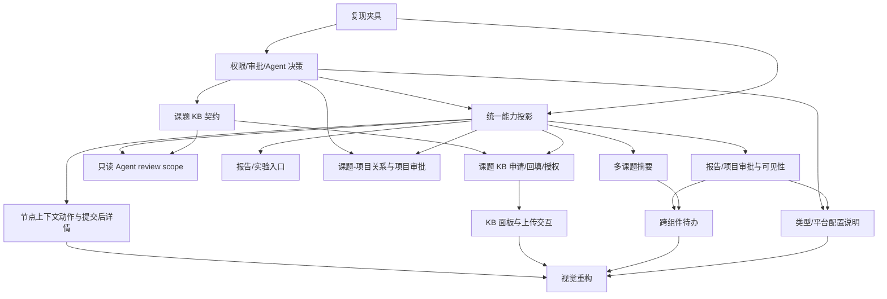

# 科研智能体平台 Phase 1.5 优化修复计划：人工测试问题收敛

| 项目         | 内容                                                                                                                                                                                                                                                                                                                                                  |
| ------------ | ----------------------------------------------------------------------------------------------------------------------------------------------------------------------------------------------------------------------------------------------------------------------------------------------------------------------------------------------------- |
| 计划版本     | v1.2                                                                                                                                                                                                                                                                                                                                                  |
| 编制日期     | 2026-09-25                                                                                                                                                                                                                                                                                                                                            |
| 问题来源     | [`evidence/phase-1.5/issue0925/document.md`](./evidence/phase-1.5/issue0925/document.md) 及 24 张现场截图                                                                                                                                                                                                                                             |
| 前置手册     | [`research-intelligent-platform-phase-1.5-manual-testing-guide.md`](./research-intelligent-platform-phase-1.5-manual-testing-guide.md)                                                                                                                                                                                                                |
| 前置联调计划 | [`research-intelligent-platform-phase-1.5-integration-debug-plan.md`](./research-intelligent-platform-phase-1.5-integration-debug-plan.md)                                                                                                                                                                                                            |
| 执行手册     | [`research-intelligent-platform-phase-1.5-execution-runbook.md`](./research-intelligent-platform-phase-1.5-execution-runbook.md)                                                                                                                                                                                                                      |
| 相关契约     | [`research-intelligent-platform-prd.md`](./research-intelligent-platform-prd.md)、[`research-workspace-v3.md`](./research-workspace-v3.md)、[`research-workspace-ux-guide.md`](./research-workspace-ux-guide.md)、RAGPortal [`2026-09-24-pi-private-knowledge-space-prd.md`](../../RAGPortal/docs/specs/2026-09-24-pi-private-knowledge-space-prd.md) |
| 计划状态     | 业务决策已确认，进入实现排期                                                                                                                                                                                                                                                                                                                          |
| 目标         | 把现场人工反馈转化为可复现、可开发、可验收的产品优化任务；不重复已完成的跨服务联调修复                                                                                                                                                                                                                                                                |

## 1. 结论摘要

本次人工测试暴露的不是单一的“页面不好看”问题，而是四个层次叠加：

1. **操作入口没有跟随用户上下文出现**：节点、报告成果、实验记录和文件操作分散在不同页签或外部系统入口，用户在节点详情中看不到下一步动作，因此将“功能存在但入口不在当前语境”理解为“不能操作”。
2. **研究链与 Plane Project 的关系没有被解释清楚**：代码已经在创建 `RESEARCH_CHAIN` 课题时一并创建一对一的 Plane Project 和 Chain，但页面没有同时展示二者的身份、管理边界和跳转关系，导致项目与课题看起来像两套数据。
3. **业务权限语义没有形成统一的查看、编辑、审批、Agent review 模型**：学生、直接导师、主 PI、工作区管理员和系统管理员在不同页面的可见范围、审批权和 Agent scope 需要使用同一套业务矩阵；“能看但不能审批”和“能看到标题但不能进入”都需要修正。
4. **课题私有知识库尚未成为正式产品对象**：当前 Plane BFF 可以从 RAGPortal 列出现有知识库并上传文件；已确认 RAGPortal 不能直接调用 WeKnora 建库，只能提交申请，由管理员在 WeKnora 手工建库后回填绑定。因此需要补齐“课题创建即提交申请、管理员通知与处理、手工建库回填、READY 后上传、按学生、直接导师、产业化负责人、基础研究负责人、课题组唯一 Main PI 及组织上级领导继承授权、随课题归档与恢复”的完整生命周期。

原 Phase 1.5 的 L1–L4 证据已经证明五服务健康、上传/解析/引用、Agent 检索、事件回放、快照导出、功能开关和 ACL 基础契约可用；本计划处理的是现场反馈对应的产品语义、上下文操作性、权限细化和 UI 质量问题。原 P15-001～P15-008 不重新打开，除非本计划回归发现同一根因再次出现。

## 2. 证据与现状核验

### 2.1 已确认的实现事实

| 事实                                                                                                                                | 证据                                                                                                  | 对本计划的影响                                                                                                 |
| ----------------------------------------------------------------------------------------------------------------------------------- | ----------------------------------------------------------------------------------------------------- | -------------------------------------------------------------------------------------------------------------- |
| `RESEARCH_CHAIN` 创建流程会同时创建 Plane Project、ResearchProjectProfile 和 ResearchChain，且 Chain 与 Project 一对一              | `plane/apps/api/plane/research/views/projects.py`、`plane/apps/api/plane/db/models/research/chain.py` | “项目和课题完全无关”主要是呈现、导航和对象模型解释不足；项目审批已确认复用 ApprovalRequest/Plane Issue         |
| 研究链课题页已有 `overview / nodes / reports / experiments / references / members` 六个 Tab                                         | `plane/apps/web/core/components/research/chains/research-chain-detail.tsx`                            | 节点详情需要增加上下文动作区和明确的“当前节点/当前课题”关联，不宜再新增平行一级入口                            |
| 节点详情已有事件、快照、六段证据结构和生命周期按钮                                                                                  | `research-chain-node-detail.tsx`、`research-chain-workflow-stage-detail.tsx`                          | 现场“节点提交后点不进去”需要先复现路由、选中态和只读详情，再决定是前端状态 bug 还是入口/文案问题               |
| RAG 上传面板位于“外部引用”Tab，当前只列出现有 KB                                                                                    | `research-chain-knowledge-panel.tsx`、`knowledge.py`、RAGPortal `kb.py`                               | 需要新增课题 KB 控制面和生命周期契约，不能只调下拉框颜色                                                       |
| 报告成果 `OutcomeList` 可登记成果、状态和导出，但没有文件选择入口                                                                   | `outcomes.py`、`outcome-list.tsx`                                                                     | “报告成果无法上传”至少包含产品入口缺失和结果附件模型缺口两部分                                                 |
| 实验记录支持文本结果和外部资产引用，明确拒绝直接上传实验数据文件                                                                    | `experiments.py`、`experiment-detail.tsx`                                                             | 需在 UI 明示“外部资产引用”与“报告附件上传”的差异，不能误把实验原始数据复制到 Plane                             |
| 首页科研摘要当前只取 `chains[0]`，待办虽有统一 collector 但展示缺少聚合翻页                                                         | `research-home-summary-card.tsx`、`research-todo-index.tsx`                                           | 需要增加跨课题聚合、分页/左右切换和最多 5 行规则，并保持 ACL 过滤                                              |
| 主 PI / 管理链可通过统一 ACL 查看正式报告和内容；审核能力由 `check_access(action="review")` 决定                                    | `research/utils/acl.py`、`reports.py`、`summary.py`                                                   | “能看就能审批”不能简单理解为所有可读者都获得审批；需要固化审批人集合，并在 UI 隐藏不可执行记录                 |
| Agent session 创建目前要求当前节点可见且 `_node_operator` 为真                                                                      | `research/views/agent.py`、`chain_foundation.py`                                                      | 主 PI/直接导师跨课题 review 需要独立的只读 review scope；不能放宽 Chain 写权限                                 |
| RAGPortal 底层客户端虽然存在建库调用封装，但当前产品边界不允许 RAGPortal 直接创建 WeKnora KB；Plane BFF 暴露的是列表/上传/状态/引用 | `RAGPortal/backend/app/core/weknora.py`、RAGPortal PRD v0.4、`plane/research/views/knowledge.py`      | 需要实现申请、通知、管理员手工建库回填、绑定校验、READY 门禁、成员授权、归档和恢复语义；不得按自动建库方案排期 |

### 2.2 原联调结论与本次反馈的边界

- `20260925-D5.md` 的“P15-001 至 P15-008 全部关闭”只表示当时登记的跨服务缺陷已修复，不表示 `issue0925` 中新增的产品反馈已经处理。
- `roles/20260925-L3.6.md` 的 VIS/PER 矩阵证明了当前测试夹具下 API 的基础可见性和写权限，但没有覆盖报告/项目审批的业务人选、主 PI 跨课题 Agent review、课题 KB 生命周期、节点详情可发现性、响应式 workflow 的可操作性。
- 本计划中的 P15-O 编号是“优化问题”编号，与联调缺陷 P15-001～008 分开，避免在历史证据中混淆。

## 3. 问题分级与处理原则

### 3.1 严重度定义

| 级别 | 判定                                                                         | 处理时限                 |
| ---- | ---------------------------------------------------------------------------- | ------------------------ |
| O0   | 数据越权、错误审批、课题资料跨空间暴露或无法安全恢复                         | 排期前置；未修复不得灰度 |
| O1   | 核心科研链路无法完成，或用户无法判断下一步操作，有人工绕行但会阻断试点       | 第一轮修复窗口           |
| O2   | 跨课题聚合、入口、响应式、状态表达和视觉层级问题，影响效率和理解但不破坏数据 | 第一轮或第二轮           |
| O3   | 纯文案、细节打磨、插件体验增强                                               | 与后续迭代合并           |

### 3.2 处理原则

1. 先冻结业务语义，再改 UI；避免用视觉补丁掩盖权限或数据模型问题。
2. 页面、API、Context、Agent、导出和外部 KB 使用同一份资源范围判定。
3. 读权限、编辑权限、审批权限、管理权限和 Agent review 权分开建模，并在响应中返回 `capabilities` 或等价的可执行动作集合。
4. 课题创建、归档、恢复和删除分别定义 KB、项目、报告、实验和成员的生命周期；失败时采用可重试的补偿任务，不把半成品显示成已成功。
5. UI 视觉遵循 `academic-editorial-ui`：中性背景、单一深青绿强调色、排版和留白建立层级、减少嵌套卡片和阴影；灰度下也必须能辨识状态和操作。

## 4. 问题台账：现象、根因假设与验收方向

| 编号    | 来源              | 现象归纳                                                         | 初步根因                                                                                   | 严重度 | 目标结果                                                                                                                                                                                          |
| ------- | ----------------- | ---------------------------------------------------------------- | ------------------------------------------------------------------------------------------ | ------ | ------------------------------------------------------------------------------------------------------------------------------------------------------------------------------------------------- |
| P15-O01 | issue 1.1         | workflow 在缩放或窄屏下显示不全                                  | 固定宽度 rail + 标签截断；缺少可见的横向滚动提示和紧凑模式                                 | O2     | 13 个阶段在 1280/1024/390 宽度下均可访问，阶段名/状态不丢失，键盘可操作                                                                                                                           |
| P15-O02 | issue 1.2         | 创建节点后找不到上传和其他操作入口；节点均白底，层级不清         | 节点操作只在选中详情下出现，文件面板只在 references Tab；视觉状态依赖白底卡片              | O1/O2  | 选中节点后出现明确“记录/文件/Agent/生命周期”动作区；阶段、当前节点、已完成、待处理和只读状态可区分                                                                                                |
| P15-O03 | issue 3/4         | 报告成果、实验记录看起来无法上传                                 | Outcome 只有元数据登记；Experiment 只接受外部资产引用；没有解释上传边界                    | O1     | 报告支持 PDF/Markdown 附件上传/状态/删除权限；实验明确提供 SpecLabOS 外部资产关联 UI 和人工记录入口，禁止上传时有原因与深链                                                                       |
| P15-O04 | issue 1.5         | 只能选择已有 KB；期望每个课题有独立知识库和生命周期              | 缺少 Chain ↔ KB 申请/绑定、管理员通知、手工建库回填、READY 门禁、成员授权和归档补偿模型    | O0     | 课题创建后自动提交唯一 KB 申请；管理员在 WeKnora 手工建库并回填后才进入 READY；学生、直接导师、产业化负责人、基础研究负责人、唯一 Main PI 及组织架构上级领导按继承规则访问；归档/恢复可追踪       |
| P15-O05 | issue UI          | 文件选择/未选择状态不明显，表格、色块、边框、阴影细节弱          | 原生 file input 和状态反馈过轻；页面层级依赖边框                                           | O2     | 文件选择区有选中态、文件名、大小、类型、清除和上传中状态；灰度可读且无装饰性渐变                                                                                                                  |
| P15-O06 | issue 5           | 添加成员等功能需确认可用，界面细节需统一                         | API 已有成员增删，但缺少现场成功/失败回执、角色解释和可见性反馈                            | O1/O2  | 添加、改角色、移除均有确认、结果 toast、失败原因和刷新后持久化证据；表格密度与其他科研页面一致                                                                                                    |
| P15-O07 | issue 6           | 节点提交后似乎无法再次进入或查看细节                             | 需要排查选中节点 URL 参数、已提交节点路由、只读详情请求和列表过滤                          | O1     | 任一状态节点都可进入详情；只读状态保留事件/快照/引用，写按钮按能力隐藏并说明原因                                                                                                                  |
| P15-O08 | issue 1.7         | 项目与课题像两套互不相关的数据；建议课题默认建项目并支持项目审批 | 数据层已一对一，但页面/导航没有呈现关系；项目审批需复用既有 ApprovalRequest/Plane Issue    | O1     | 创建课题时强制创建独立 Plane Project；项目审批复用 ApprovalRequest/Plane Issue 并关联 Chain Event；创建/归档/可见性关系明确且可回归                                                               |
| P15-O09 | issue 2.1         | 学生可看到管理员的 PRIVATE 课题                                  | 需确认该课题的真实 owner、visibility、成员关系和历史缓存；当前 ACL 理论上应 fail closed    | O0     | 学生列表、详情、导出、Agent、KB 均不可见；若有授权必须展示授权来源；修复后清理缓存和旧链接                                                                                                        |
| P15-O10 | issue 2.2         | 科研摘要只显示一个课题                                           | 首页使用 `pickCurrentChain`，没有把所有可见课题做成可切换集合                              | O2     | 展示当前进行课题总数和当前项；左右箭头/键盘/Home-End 可切换；切换遵循同一 ACL                                                                                                                     |
| P15-O11 | issue 2.3/2.4     | 跨组件待办未聚合所有待办；课题摘要位置不合适                     | 待办虽有统一 collector，但首页展示缺少聚合分页和“课题上下文”信息                           | O2     | 聚合所有来源，默认最多 5 行，支持左右翻页；每行显示课题、来源、负责人、动作和更新时间；保留课题摘要与待办的语义区分，在同一共享区块中以摘要头 + 待办列表呈现                                      |
| P15-O12 | issue 2.5         | 新建科研项目类型含义不清                                         | `LEGACY_TRAINING` / `RESEARCH_CHAIN`、培养项目/团队项目缺少面向用户的差异说明              | O2     | `RESEARCH_CHAIN` 类型明确创建独立 Plane Project、Chain 和 KB 申请；类型使用分组、说明、适用对象、审批和可见性影响；表单提交前可预览结果                                                           |
| P15-O13 | issue 2.6/3.1/4.2 | 学生、导师、主 PI 对报告/课题摘要的范围不符合预期                | 汇总接口与 ACL 有基础能力，但“自己的课题 / 学生课题 / 整组课题 / 上级组织”展示语义没有统一 | O0/O1  | 为每个身份定义“我的课题”“指导范围”“课题组范围”“学院/上级范围”；卡片、列表、导出和审批口径一致，并显示负责人                                                                                       |
| P15-O14 | issue 3.2         | 导师看到非本组周报，且可看但不能审                               | 可见范围与 `review` 动作集合不一致，审批列表缺少资源级可执行过滤/解释                      | O0     | 非范围报告不出现在列表；被展示的待审批项均可执行；仅可读历史记录明确为“查看”，不能出现在待我审批                                                                                                  |
| P15-O15 | issue 5.1         | 身份映射对象不清，需清空；需要 AI4MS 与 Plane 账号绑定           | 管理界面缺少 provider/subject/目标用户说明；需要完成真实 OIDC/SSO 与 AccountLink 审计      | O0/O1  | 映射行显示 AI4MS subject、Plane 用户、状态、最近登录和解绑影响；清空需逐条确认；真实 OIDC/SSO 登录、绑定、解绑和撤权可用，绑定流程不接收或展示密码                                                |
| P15-O16 | issue 5.2         | 平台配置中的报告可见性、主 PI 显示不全                           | 配置项多、标签与说明弱；主 PI 字段过窄或缺少用户解析                                       | O2     | 默认报告可见性、周报/月报继承关系和主 PI 作用范围有说明；长名称可完整显示；保存后权限矩阵即时刷新                                                                                                 |
| P15-O17 | issue 6 Agent     | 主 PI/直接导师无法以 review 身份使用 Agent 查看小组课题          | Agent session 创建绑定节点 operator，缺少只读 review scope                                 | O0/O1  | 主 PI 可对组织继承范围内课题创建 review session；直接导师只能访问绑定学生及其课题；允许检索、查看事件/快照/引用、发表评论和提交分析结果草稿；不能改节点生命周期、上传、确认外部引用或覆盖正式报告 |
| P15-O18 | issue 6 Agent     | 学生 Agent 回复混乱；插件暂不做                                  | Agent 输出缺少结构化回答、引用、错误/工具区块和中文排版规范                                | O2/O3  | 先改善基础回答呈现：结论、依据、引用、工具调用和下一步分组；不提前实现插件市场或复杂插件管理                                                                                                      |

## 5. 已确认的目标权限与业务矩阵

### 5.1 资源动作矩阵

| 角色 / 范围                | 查看自己的课题                  | 查看指导学生课题 | 查看本课题组课题 | 审批指导范围报告/项目   | 审批本课题组范围 | 修改他人内容                          | Agent review                             |
| -------------------------- | ------------------------------- | ---------------- | ---------------- | ----------------------- | ---------------- | ------------------------------------- | ---------------------------------------- |
| 学生 / Research Owner      | ✅                              | —                | 按明确成员授权   | 否                      | 否               | 仅自己的可编辑草稿                    | 仅自己的课题、节点和授权 KB              |
| 直接导师 / Mentor          | ✅                              | ✅               | 按组织继承       | ✅（必评/有效绑定范围） | 按明确指派       | 不修改学生正式内容；可退回/审批       | 绑定学生课题 review；可评论/提交分析草稿 |
| 产业化/基础研究负责人      | 按 ACL                          | 按组织继承       | 按组织继承       | 按明确指派              | 按明确指派       | 不覆盖正式内容                        | 组织继承范围 review；可评论/提交分析草稿 |
| 课题组主 PI / 唯一 Main PI | ✅                              | 组内全部         | ✅               | ✅                      | ✅               | 默认审批/退回，不直接覆盖学生正式内容 | 组织继承范围 review；可评论/提交分析草稿 |
| 上级组织领导               | 按组织继承                      | 按组织继承       | 按组织继承       | 按明确审批指派          | 按明确指派       | 不覆盖正式内容                        | 组织继承范围 review；可评论/提交分析草稿 |
| 工作区管理员 / ADMIN       | 配置权不等于业务数据权          | 按 ACL           | 按 ACL           | 仅被指定时              | 仅被指定时       | 否                                    | 不因管理员身份自动获得 review            |
| Guest / NONE               | 无科研菜单或只读 WORKSPACE 例外 | 否               | 否               | 否                      | 否               | 否                                    | 否                                       |

### 5.2 课题私有 KB 可见矩阵（建议）

| 角色                       | 查看 KB/文档   | 上传           | 确认引用 | 管理成员               | 归档/恢复      |
| -------------------------- | -------------- | -------------- | -------- | ---------------------- | -------------- |
| 学生 owner                 | ✅             | ✅             | ✅       | 可邀请范围内成员       | ✅             |
| 直接导师                   | ✅（绑定学生） | ✅（绑定学生） | ✅       | 否，除非明确委托       | 否             |
| 产业化/基础研究负责人      | ✅（组织继承） | 按明确指派     | 按审批   | 否                     | 按组织策略     |
| 课题组主 PI / 唯一 Main PI | ✅（课题组）   | 按组织继承     | ✅       | 可管理组内授权         | 可管理组内课题 |
| 组织上级领导               | 按组织继承     | 默认否         | 按审批   | 否                     | 按组织策略     |
| ADMIN                      | 按 ACL         | 否             | 否       | 平台配置，不越权读内容 | 否             |

> 规则已确认：普通 WORKSPACE 可读者不能审批；主 PI 与课题组主 PI 是同一唯一身份；管理员配置权不扩大业务数据权；RAGPortal/WeKnora KB 可见范围按 Plane 组织架构和对象 ACL 向上继承。

## 6. 修复路线与任务拆分

任务按依赖顺序排列。每项都应在单独分支完成，先写契约/测试，再实现，最后补现场证据。

### 阶段 A：复现、决策与契约冻结（O0/O1 前置）

#### 任务 A1：建立 issue0925 可复现夹具

**范围：** 固定学生、导师、主 PI、管理员、NONE、Guest 六类账号；准备 WORKSPACE/PRIVATE 课题、已提交节点、报告、实验记录、项目审批、课题 KB 和跨课题待办。

**验收标准：**

- [ ] 每个问题都有最小复现 URL、账号、对象 ID、预期和实际结果。
- [ ] `issue0925` 中的管理员课题可判断真实 owner、visibility、org unit、成员和缓存来源。
- [ ] 所有测试对象均位于 `public` 测试工作区，WeKnora 只使用测试 KB。

**验证：** API/数据库快照 + 脱敏截图；浏览器回归环境必须安装 Chrome/Chromium，并记录 viewport。
**依赖：** 无。
**预计范围：** 中。

#### 任务 A2：冻结权限、审批和 Agent review 决策

**范围：** 将已确认的权限、审批、主 PI、组织继承和 Agent review 规则固化为版本化契约。

**验收标准：**

- [ ] 形成版本化 `research-visibility-actions.v1` 矩阵，覆盖 view/edit/submit/review/accept/return/export/agent_review/knowledge。
- [x] 管理员身份不扩大业务数据范围。
- [x] 项目审批复用 Plane Issue/ApprovalRequest，并关联 `research_project` 与 Chain Event。
- [x] 主 PI 与课题组主 PI 是同一唯一 `Main PI`。
- [x] 主 PI/直接导师 review Agent 允许评论和分析结果草稿，但禁止节点生命周期、上传、外部引用确认和正式报告覆盖。

**依赖：** A1。
**预计范围：** 小。

#### 任务 A3：冻结课题 KB 生命周期契约

**范围：** Plane、RAGPortal 和 WeKnora 之间定义申请/通知/手工建库回填/绑定、成员授权、状态、归档、恢复、失败补偿、幂等和错误码。RAGPortal 不直接创建 WeKnora KB。

**验收标准：**

- [ ] 课题创建请求可安全重试，最多对应一个未结束申请和一个 KB 绑定。
- [ ] 管理员收到申请通知后，能在 WeKnora 手工完成建库并回填外部 KB ID；回填对象通过唯一性和归属校验。
- [ ] 未回填/未校验前状态不是 `READY`，Plane 上传入口被门禁；补充信息、拒绝和失败原因可追踪。
- [ ] KB 映射不把 WeKnora 全局 API key 可见范围当作业务授权。
- [ ] 课题归档时 KB 进入只读或归档态；恢复和建库申请失败有可观测补偿状态。

**依赖：** A2；由 AI4MS/Plane 管理员维护申请通知、处理 SLA、WeKnora 手工建库参数和回填校验口径。
**预计范围：** 大。

### 阶段 B：核心正确性修复

#### 任务 B1：统一资源能力投影和权限边界

**范围：** 在 Chain、Node、Report、Experiment、Outcome、Approval、ExternalReference、Agent Session 返回 `capabilities` 或等价动作集合；前端不再用“能打开页面”推断“能执行操作”。项目审批复用现有 `ApprovalRequest`/Plane Issue，不创建第二套审批对象。

**验收标准：**

- [ ] 详情响应对每个动作给出允许/拒绝；拒绝包含稳定 error code 和中文可读原因。
- [ ] 列表、详情、导出、下载、审批和 Agent session 使用同一 ACL 判定。
- [ ] 管理员不会因配置权限自动获得 PRIVATE 内容写权；NONE/Guest 仍 fail closed。

**依赖：** A2、A1。
**预计范围：** 大。

#### 任务 B2：修复报告、项目审批和导师/PI 可见性

**范围：** 把报告/项目的 view 与 review/accept/return 规则统一到 §5；审批中心只展示当前用户可处理的项目；主 PI 聚合按课题组范围显示负责人。

**验收标准：**

- [ ] 陈静看不到非绑定组成员的私有周报；能看到的待审批报告具备 approve/return 动作。
- [ ] 张伟/主 PI 可见本课题组课题、项目、报告和成果，并能执行被授权的审批动作。
- [ ] 学生只能看到自己可见范围内的摘要、待办、报告和课题。

**依赖：** B1、A2。
**预计范围：** 大。

#### 任务 B3：增加只读 Agent review scope

**范围：** 为主 PI 和直接导师创建只读 Agent review session；scope 由 Plane 按组织继承和对象 ACL 计算并传入 Synlora context。允许检索、查看事件/快照/引用、发表评论和提交分析结果草稿，但不能写节点生命周期事件、上传文件、确认外部引用、覆盖正式报告或跨范围检索。

**验收标准：**

- [ ] 主 PI 可在授权课题节点打开 Agent 并读取事件、快照、引用和允许的 KB。
- [ ] 直接导师只可 review 已绑定学生课题；兄弟课题和 PRIVATE 未授权课题返回 403/404。
- [ ] review session 的节点生命周期写事件、上传、确认引用、正式报告覆盖均被拒绝；评论和分析结果草稿保存成功；学生 owner session 行为不回归。
- [ ] Context/Trace 记录 `scope_kind=REVIEW`、授权来源和 policy version，不记录 token/key。

**依赖：** B1、A2、A3。
**预计范围：** 大。

#### 任务 B4：修复身份映射和 AI4MS 绑定流程

**范围：** 清理无明确主体的映射展示；显示 provider、external subject、Plane 用户、状态和最近登录；提供安全绑定/解绑，不采集密码。

**验收标准：**

- [ ] 每条映射都能解释“谁 ↔ 谁”，subject 不为空且可审计。
- [ ] 解绑有影响提示，历史审计保留，已有链路按策略立即失效或保留到期。
- [ ] `oidc_configured=false` 时明确显示未启用，不显示伪成功。

**依赖：** A1、A2；真实 AI4MS ↔ Plane OIDC/SSO 绑定纳入本阶段。
**预计范围：** 中。

### 阶段 C：操作上下文与数据入口

#### 任务 C1：节点详情动作区和提交后可读性

**范围：** 节点详情固定显示当前节点上下文、可执行动作、文件/记录入口、Agent、事件/快照和只读原因；提交后 URL 保留 `tab/stage/node`，详情请求失败可重试。

**验收标准：**

- [ ] DRAFT/ACTIVE/WAITING_HUMAN/NEEDS_REVISION/COMPLETED/ARCHIVED 每种状态都有明确动作或只读说明。
- [ ] 点击节点名称、阶段卡和深链都能打开同一个详情；刷新页面后选中态不丢失。
- [ ] 节点的上传文件、人工记录、报告/实验关联和 Agent 入口在当前节点上下文可发现，或明确指向对应 Tab。

**依赖：** B1。
**预计范围：** 中。

#### 任务 C2：报告成果与实验记录入口收敛

**范围：** 报告成果显示“登记成果”和“上传成果文件”两条不同能力；成果附件支持 PDF/Markdown；实验记录显示“保存人工记录”和“关联外部资产”，提供 SpecLabOS 资产选择、检索、确认和引用状态；错误时给出限制原因与来源系统入口。

**验收标准：**

- [ ] 有权限用户能从研究链上下文上传报告附件、查看状态、删除/下载，并在提交后锁定。
- [ ] 实验记录不接受 Plane 直接保存原始实验数据文件，但能通过关联 UI 新增/搜索/选择 SpecLabOS 外部资产，显示 source system、asset/run ID、链接和验证状态。
- [ ] 无权限用户看到只读内容和明确原因，不看到不可执行的上传按钮。

**依赖：** B1；实验原始数据不落 Plane，统一通过 SpecLabOS 外部资产关联 UI 引用。
**预计范围：** 大。

#### 任务 C3：研究链与项目关系可视化及项目审批入口

**范围：** 课题页头部和概览显示 Chain ID、Plane Project、owner、组织、可见性和状态；提供项目管理深链；项目审批按 A2 决定复用或新增。

**验收标准：**

- [ ] 新建 RESEARCH_CHAIN 后页面能看到“一课题一项目一研究链”的关系说明。
- [ ] 课题归档/恢复和项目状态的展示一致；项目列表能返回研究链上下文。
- [ ] 若启用项目审批，提交/审批/退回结果能回写 Chain Event，并按角色隐藏不可执行操作。

**依赖：** A2、B1。
**预计范围：** 中至大。

### 阶段 D：课题私有知识库闭环

#### 任务 D1：课题 KB 申请、手工建库回填与成员授权

**范围：** 课题创建时由 Plane/RAGPortal 提交唯一知识库申请并通知管理员；管理员根据 WeKnora 所需完整参数手工建库；管理员将外部 KB ID、名称和参数摘要回填 RAGPortal；RAGPortal 完成校验、绑定和状态推进。RAGPortal 不直接调用 WeKnora 建库接口。

**验收标准：**

- [ ] `RESEARCH_CHAIN` 课题创建强制创建独立 Plane Project，并生成 `REQUESTED`/`PENDING_ADMIN` 申请；申请幂等且可查看处理人、补充信息和拒绝原因。
- [ ] 管理员完成 WeKnora 手工建库后可回填，申请先进入 `CREATED_PENDING_BINDING`，通过外部 ID 唯一性、实例归属和参数完整性校验后才进入 `READY`。
- [ ] 未达到 `READY` 前，上传入口显示“知识库申请处理中/待绑定”，不得创建 WeKnora 上传任务；源文件和人工记录仍可保存。
- [ ] 重复申请不产生多个未结束申请；跨课题 KB ID 被拒绝。
- [ ] 学生、直接导师、产业化负责人、基础研究负责人、课题组唯一 Main PI 及组织架构上级领导按继承规则可见；具体动作由 Plane/RAGPortal ACL 决定，与 WeKnora 全局 key 解耦。

**依赖：** A3、B1。
**预计范围：** XL，须拆为 Plane 申请编排、RAGPortal 申请/回填、管理员通知与契约三条子任务。

#### 任务 D2：知识库面板和上传交互优化

**范围：** 默认选中当前课题 KB；显示 KB owner/授权范围/状态/生命周期；文件选择区显示文件名、大小、类型、hash、清除、上传中、解析中、成功/失败/人工记录。

**验收标准：**

- [ ] 选中的课题 KB 与当前 chain/node 一致，不能误选其他课题 KB。
- [ ] 上传、轮询、引用确认、重复上传和降级路径均有可见状态；失败有重试和人工记录入口。
- [ ] UI 在灰度和窄屏下可读；不使用渐变、发光和彩色装饰卡片。

**依赖：** D1、C1、academic-editorial-ui 视觉检查。
**预计范围：** 中。

### 阶段 E：跨课题总览、导航和视觉质量

#### 任务 E1：科研摘要多课题切换

**范围：** 使用所有可见、未归档/进行中的课题形成稳定排序；桌面显示一行摘要，窄屏允许上下布局；提供左右箭头、键盘操作、总数和当前序号。

**验收标准：**

- [ ] 学生可切换全部自己的进行中课题；导师/PI 不因聚合而看到无权课题。
- [ ] 切换后当前节点、最新快照、待办数和“打开课题”链接同步变化。
- [ ] 无课题、加载、错误和单课题状态都有清晰反馈。

**依赖：** B1。
**预计范围：** 中。

#### 任务 E2：跨组件待办聚合与课题摘要位置调整

**范围：** 聚合 review、approval、report、node、Agent、RAG 等待项；默认最多显示 5 行，支持左右翻页/总数，显示课题与责任人；依据 A2 决定课题摘要并入待办还是作为同区块摘要。

**验收标准：**

- [ ] 同一对象只生成一条当前待办；历史状态不进入当前队列。
- [ ] 每条待办深链回到正确课题、节点或审批详情；跨服务降级项显示来源和恢复动作。
- [ ] 导师/PI 的待办按可审批范围过滤，学生不出现审批中心入口。

**依赖：** A2、B2、E1。
**预计范围：** 中至大。

#### 任务 E3：项目类型和平台配置可解释性

**范围：** 新建项目类型、Chain kind、可见性和组织字段增加说明；平台配置显示继承关系、作用范围和主 PI 解析结果；长名称支持完整显示。

**验收标准：**

- [ ] 用户能理解每种项目类型会创建什么对象、谁可见、是否有 Chain/阶段/审批。
- [ ] 平台配置保存后显示当前生效值、来源（默认/继承/显式）和影响范围。
- [ ] 在 1280px、1024px 和 390px 宽度无横向溢出或遮挡。

**依赖：** A2、B2。
**预计范围：** 中。

#### 任务 E4：研究链 workflow、节点、成员和 Agent 视觉重构

**范围：** 按 `academic-editorial-ui` 规范统一 workflow rail、节点层级、成员表格、平台配置、Agent 消息和工具卡。

**验收标准：**

- [ ] workflow 通过排版、间距、状态标签和微妙分隔线表达层级；不依赖彩色底块。
- [ ] 节点状态在灰度下可辨识；卡片/边框数量可控；默认无阴影和渐变。
- [ ] Agent 输出按结论、依据、引用、工具事件、错误和下一步分组，长文本换行且不撑破布局。
- [ ] 完成 skill 最终清单：灰度可读、层级来自排版、无 AI 仪表盘感、连续使用不疲劳。

**依赖：** C1、D2、E1、E2、E3。
**预计范围：** 中至大。

## 7. 依赖图与执行顺序



推荐顺序：A1 → A2 → B1 → B2/B3 → C1/C2/C3 → A3 → D1 → D2 → E1/E2/E3 → E4。D1 是跨仓高风险项，应在契约确认后单独排期；E4 不得先于操作和权限语义冻结。

## 8. 测试与验收矩阵

### 8.1 自动化测试

| 层级                    | 必测内容                                                                                                                  |
| ----------------------- | ------------------------------------------------------------------------------------------------------------------------- |
| Plane API unit/contract | 能力投影、ACL 六级可见性、review/accept/return、主 PI/导师范围、项目-Chain 关系、KB 映射幂等、归档恢复、Agent review 禁写 |
| RAGPortal contract      | 申请/通知/手工建库回填、绑定门禁、成员授权、生命周期、重复请求、失败补偿、未授权 KB 过滤、WeKnora 错误归一化              |
| Synlora contract        | `scope_kind=REVIEW`、只读 capability 交集、禁止写工具、context/trace 授权来源                                             |
| Web unit/component      | workflow overflow、节点状态动作、提交后深链、文件选择状态、摘要切换、待办翻页、类型说明、Agent 输出分段                   |
| E2E API                 | 学生/导师/PI/ADMIN/NONE/Guest 逐格验证 view/edit/review/export/agent/knowledge                                            |

### 8.2 人工浏览器回归

每个视口至少走一遍：`1440×900`、`1280×800`、`1024×768`、`390×844`。

1. 学生：创建两个课题 → 切换摘要 → 打开节点 → 上传报告附件 → 添加人工记录 → 上传/引用课题 KB → 创建自己的 Agent session。
2. 导师：查看绑定学生课题 → 从节点打开只读 Agent review → 查看/审批报告 → 尝试访问非绑定课题并确认 fail closed。
3. 主 PI：查看课题组聚合 → 打开成员/项目/报告/成果 → review 课题 Agent → 验证不获得配置以外的编辑能力。
4. 管理员：查看身份映射和平台配置 → 验证配置权与业务数据权分离 → 不应因管理员身份看到 PRIVATE 内容。
5. 提交后节点：对每种状态刷新/深链/浏览器后退，确认详情和证据保留。

### 8.3 视觉质量门禁

- [ ] 灰度截图仍能区分阶段、当前节点、待处理、已完成、只读和错误。
- [ ] workflow 不因缩放或窄屏隐藏阶段；不出现不可滚动的裁切。
- [ ] 页面层级主要来自排版、留白、对齐和中性色背景，而不是多色卡片。
- [ ] 文件选择、未选文件、上传中、解析中、失败和成功均有明显但克制的反馈。
- [ ] 表格行、边框、阴影和圆角符合科研编辑风格；不新增渐变、发光、AI 徽章或装饰图形。
- [ ] 控件具备可访问名称、键盘顺序、焦点态和状态播报。

## 9. 证据归档与缺陷关闭规则

新增证据目录建议：

```text
plane/docs/evidence/phase-1.5/optimization/
├── reproduction/       # A1 最小复现与对象快照
├── acl/                # B1/B2/B3 权限矩阵与负例
├── chain-ui/           # C1/C3 workflow、节点、项目关系
├── content-entry/      # C2 报告/实验入口与附件
├── knowledge-space/    # D1/D2 课题 KB 生命周期与上传
├── overview/           # E1/E2 总览、待办、PI 聚合
├── administration/    # B4/E3 身份映射与平台配置
└── visual/             # E4 多视口、灰度、可访问性截图
```

每个优化问题关闭前必须具备：

1. 原始复现证据和固定对象 ID。
2. 根因说明，区分数据、权限、接口、交互、视觉或环境问题。
3. 修复提交/迁移编号和受影响仓库。
4. 自动化回归结果及原始场景复验截图或日志。
5. 影响范围和回滚方式；跨仓契约变更需记录版本。

## 10. 风险与回滚

| 风险                                   | 影响 | 缓解与回滚                                                                                                                             |
| -------------------------------------- | ---- | -------------------------------------------------------------------------------------------------------------------------------------- |
| 放宽导师/PI scope 造成越权             | 高   | 先落 capability contract 和负例；默认 fail closed；撤销 review scope 即时失效                                                          |
| 课题 KB 申请、手工建库或回填失败       | 高   | 申请幂等、管理员通知、`PENDING_ADMIN`/`NEEDS_INFO`/`CREATED_PENDING_BINDING` 状态、回填校验和补偿任务；保留人工记录路径；不删除原有 KB |
| 项目审批与现有 Plane Issue 语义冲突    | 高   | A2 先决策；未确认前只做关系展示，不创建新审批对象                                                                                      |
| 报告附件与实验原始数据边界混淆         | 中   | 报告走 FileAsset/附件契约；实验只保存外部资产引用；前端明确来源系统                                                                    |
| 首页聚合暴露无权对象标题               | 高   | 聚合前执行 ACL；无权限对象不参与计数、搜索、导出或链接生成                                                                             |
| UI 重构破坏 IA v2/旧路由               | 中   | 保留现有路由和页签；每轮跑 SW-05、L3.6 和多视口浏览器回归                                                                              |
| 浏览器环境缺少 Chrome 导致证据不可复验 | 中   | 在执行机安装固定版本 Chromium/Chrome，记录版本；无法安装时由人工提供截图并标注环境限制                                                 |

## 11. 待用户确认的业务问题

以下问题会直接决定数据模型、权限和排期，建议先确认再进入 B/D 阶段：

本轮业务决策已确认：

- `RESEARCH_CHAIN` 课题强制创建独立 Plane Project 并自动提交独立 RAGPortal KB 申请；课题在管理员手工建库和回填前保持 `PENDING_ADMIN`。
- 主 PI 与直接导师 review Agent 允许检索、查看事件/快照/引用、发表评论和提交分析结果草稿；禁止节点生命周期、上传、外部引用确认和正式报告覆盖。
- 审批仅对必评人、唯一 Main PI、有效直接导师或明确指派人开放；普通 WORKSPACE 可读者不能审批。
- 当前课题组主 PI 与平台配置中的唯一 Main PI 是同一身份；组织上级领导按组织继承规则可见。
- 项目审批复用 `ApprovalRequest`/Plane Issue，并通过 `research_project` 关联 Chain Event。
- 报告成果上传 PDF/Markdown 附件；实验原始数据不落 Plane，实验记录通过 UI 关联 SpecLabOS 外部资产。
- AI4MS ↔ Plane 账号绑定实现真实 OIDC/SSO；Plane/AI4MS 管理员维护 KB 申请通知、SLA、参数清单和回填校验。
- 首页保留课题摘要与跨组件待办的语义区分，但在一个共享区块内呈现摘要头和待办列表。

## 12. 变更记录

| 版本 | 日期       | 变更                                                                                                                                                                                                            |
| ---- | ---------- | --------------------------------------------------------------------------------------------------------------------------------------------------------------------------------------------------------------- |
| v1.2 | 2026-09-25 | 写入已确认业务决策：课题强制创建 Project/KB 申请、PENDING_ADMIN、主 PI/导师 review Agent 评论与分析草稿、审批范围、唯一 Main PI、组织继承、项目审批复用、成果附件、SpecLabOS 资产关联、真实 OIDC/SSO 和总览布局 |
| v1.1 | 2026-09-25 | 根据 RAGPortal/WeKnora 现有边界，将课题 KB 方案改为“申请 → 管理员手工建库 → 回填绑定 → READY 门禁”，同步修正任务、验收、风险和开放问题                                                                          |
| v1.0 | 2026-09-25 | 基于 issue0925 现场问题、现有代码和 Phase 1.5 联调证据，新增问题台账、权限/KB 契约、任务依赖、验收矩阵与待确认业务决策                                                                                          |
