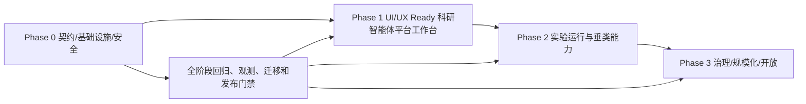

# 科研智能体平台整体架构与建设需求 PRD

| 项目     | 内容                                                                                                                                                                                                         |
| -------- | ------------------------------------------------------------------------------------------------------------------------------------------------------------------------------------------------------------ |
| 文档版本 | v2.1                                                                                                                                                                                                         |
| 文档状态 | 平台级建设规划；Phase 0 与 Phase 1 Plane UI/UX 闭环已实施，进入灰度验收                                                                                                                                      |
| 日期     | 2026-09-24                                                                                                                                                                                                   |
| 适用范围 | Plane、研究链、RAGPortal、Synlora、ScienceDiscovery、SpecLabOS、PolyAgent 及 SpecAgent 的跨仓库协作                                                                                                          |
| 目标规模 | 内部约 500 名成员，预留后续社会用户开放能力                                                                                                                                                                  |
| 上游文档 | [`research-management-prd-roadmap.md`](./research-management-prd-roadmap.md)、[`research-workspace-v3.md`](./research-workspace-v3.md)、[`research-p0-p1-architecture.md`](./research-p0-p1-architecture.md) |

## 1. 文档定位与决策摘要

本文档是科研智能体平台的跨仓库总 PRD，定义产品边界、系统分工、研究链主线、第一阶段最小闭环和后续演进路线。它不替换 Plane 已有的 P0/P1/P2 开发、验收和发布文档，也不直接修改业务代码、数据库或部署配置。

平台采用以下职责分工：

| 能力层                   | 权威系统           | 平台职责                                                                   |
| ------------------------ | ------------------ | -------------------------------------------------------------------------- |
| 统一门户、身份与科研权限 | Plane              | 提供统一入口、课题 ACL、科研待办、审批、审计和跨系统引用聚合               |
| 科研过程主线             | Plane 研究链       | 组织课题、节点、快照、事件、反思和人工决策                                 |
| Agent 科研管理层         | Plane Orchestrator | 解析课题/节点/角色策略，签发与复验 Context，装配 Synlora persona/插件/工具 |
| 云端通用 Agent Runtime   | Synlora            | 提供会话、模型路由、工具调用、审批、插件、沙箱、SSE 和 Trace               |
| 知识资产入口             | RAGPortal          | 负责文献/资料上传、阅读入口、上传审计和 WeKnora BFF                        |
| 知识检索底座             | WeKnora            | 已部署的内网知识服务，负责文档解析、向量和混合检索；Plane 不开发 WeKnora   |
| 本地或可信端科研工作站   | ScienceDiscovery   | 提供本地连接器、MCP、长任务、证据溯源和可复现执行参考                      |
| 实验与设备能力           | SpecLabOS          | 提供设备、工作流、Experiment Runtime、RunEvent 和数据资产                  |
| 高分子研发与算法能力     | PolyAgent          | 提供 ResearchEngine、阶段 Gate、算法运行、实验下发和 Trace                 |
| 谱学垂类能力             | SpecAgent          | 通过 Synlora 插件提供已验证的 NMR 能力；其他谱种和异步任务后续确认         |

总体定位为：**Plane 负责科研过程、课题权限、能力策略、Context 授权和 Chain 投影；Synlora 负责唯一云端 Agent Runtime 与插件工具执行；RAGPortal 负责知识资产入口；WeKnora 负责检索；专业系统负责实验和分析能力。**

Agent 侧采用统一管理层：

```text
Plane 研究链 / Node
  → Plane Research Agent Orchestrator
      ├─ 课题与节点 ACL
      ├─ Research Context 签发、刷新与复验
      ├─ node_type/role → persona + plugin + tool 策略解析
      ├─ Synlora delegated identity
      └─ Synlora event cursor → Chain Event/Snapshot projection
  → Synlora Agent Runtime
      ├─ Session / SSE / Trace / Approval
      ├─ Plugin Tool Registry
      └─ Poly_Agent / Spec_Agent / SpecLabOS connectors
  → 垂类专业系统
```

Plane 不复制 Synlora 的工具注册表，也不直接执行用户侧工具调用；Plane 只保存能力策略投影和映射关系。健康检查、管理配置和状态投影可以由 Plane Integration 层执行。

信息架构采用“权威对象保留、用户入口收敛、科研过程回归 研究链”的原则：`Project`、`PeriodicReport`、审批、审计、集成等权威模型不合并；开启 `research_ia_v2` 后，科研导航收敛为科研总览、研究链、审批中心和科研管理四个一级入口，旧列表路由提供兼容跳转。

## 2. 现状基线与必须先解决的阻塞项

### 2.1 仓库事实

- Plane 已有科研项目、阶段、文献、实验、代码、成果、审批、评审、审计、双链时间线、外部引用和只读 Agent Context API。
- Plane 当前培养类项目对同一 Workspace 和责任人限制为一个 active project；团队型 `RESEARCH_PROJECT` 才允许多个项目。这与研究链的平行课题需求不一致。
- Plane 当前时间线聚合已有科研对象，但还没有完整的“输入 → AI 动作 → 中间产物 → 验证 → 人类决策 → 输出”节点模型，也没有通用循环边和反思日志。
- RAGPortal 当前是 FastAPI 上传 BFF，实际接口包括 `/api/kb/list`、`/api/uploads` 和上传详情接口；Plane 现有适配器中预期的 `/api/knowledge/entries/` 路径尚未与工作区 RAGPortal 对齐。
- Synlora 已有 Agent 会话、工具审批、SSE、事件持久化、沙箱、WeKnora hybrid-search、能力中心（专家/技能/扩展）、用户 MCP、插件市场和已接入的 Poly_Agent / Spec_Agent / Sciverse 插件；但插件仍需管理员配置、用户手动安装或会话勾选，且项目、会话、文件和运行记录按自身 `user_id` 隔离，尚无 Plane Workspace/课题 ACL、delegated identity 和自动能力装配语义。
- ScienceDiscovery 的 README 明确其不是多用户生产服务，默认使用 loopback、单 bearer token 且不终止 TLS；不能直接作为 500 人云端 Agent 后端。
- Plane 的 OIDC `IdentityMapping` 是登录身份映射，不等同于 Plane 账号与 AI4MS 账号的双向绑定，也不提供账号合并语义。
- WeKnora 虽不在本代码仓库，但已作为内网服务部署在 `http://10.26.15.93:8000/`；其服务维护、索引、向量、图谱和底层数据生命周期不属于本项目开发范围。

### 2.2 一期开发前的阻塞决策

以下事项在 Phase 0 必须完成设计和契约确认，未完成前不得将对应能力标记为已打通：

1. 解决 Plane 培养项目“一人一个”约束与平行课题需求的模型冲突。
2. 以 RAGPortal 实际接口为准重写 Plane 适配器和联调契约。
3. 为 Synlora 增加 Plane 课题上下文、delegated identity、capability manifest、每轮 ACL 复验、自动能力装配、并发队列和 Trace 对齐。
4. 明确 ScienceDiscovery 作为本地/可信端能力，不承诺直接云化；如需云化，另行完成多租户安全改造。
5. 设计独立的 `AccountLink` 账号绑定契约，不把 `IdentityMapping` 当作账号合并机制。

## 3. 产品目标与非目标

### 3.1 产品目标

平台服务研究生及导师的完整科研过程，逐步覆盖：

```text
文献调研 → 选题 → 评估 → 预实验 → 分析 → 开题 → 实验
→ 分析 → 迭代 → 总结 → 论文写作 → 结题 → 转化
```

目标包括：

- 记录实验过程、研究过程和关键操作，并支持回溯。
- 持续沉淀数据、文档、实验记录、AI 交互、验证结果和人类决策。
- 让用户直观看到课题位于科研链路的哪个位置，以及已产生的过程数据。
- 为通用 Agent 注入经过 ACL 过滤的课题上下文、文件上下文和知识库上下文。
- 形成可导出、可审计、可复现的研究链。

### 3.2 非目标

第一阶段不在 Plane 内重复建设：

- RAGPortal/WeKnora 的文档解析、向量索引、知识图谱和完整知识库管理。所有文献和研究资料统一由 RAGPortal 作为入库入口，Plane 不直连 WeKnora 写入接口。
- SpecLabOS 的设备管理、湿实验执行、原始数据存储和设备监控。
- PolyAgent 的算法包、计算引擎和高分子研发工作台。
- SpecAgent 的完整谱学服务；工作区当前只验证 Synlora 中的 NMR 插件适配层。
- ScienceDiscovery 的云端多租户化。
- 模型隐藏思维链的完整保存或对外展示。

## 4. 研究链产品模型

### 4.1 课题组织

研究链以平行课题为基本组织单元，不预设“主毕业课题”和“辅助课题”。一个学生可以创建和参与多个相互独立的课题；课题之间通过 ACL 隔离。

建议在现有 `ResearchProjectProfile` 上增加 `chain_kind`：

| 值                | 语义                             | 约束                                                             |
| ----------------- | -------------------------------- | ---------------------------------------------------------------- |
| `LEGACY_TRAINING` | 既有 PHD/MASTER/POSTDOC 培养项目 | 继续遵守历史的一人一个 active project 规则，除非迁移方案另行批准 |
| `RESEARCH_CHAIN`  | 研究链平行课题                   | 同一学生可以创建多个 active 课题                                 |

课题仍复用普通 Plane Project、ProjectMember 和科研对象 ACL，不创建第二套项目系统。创建、归档、恢复、报告归属、阶段初始化和列表查询都必须识别 `chain_kind`。

### 4.2 课题可见性

新增或扩展课题级 `chain_visibility`：

| 值          | 可见范围                         |
| ----------- | -------------------------------- |
| `PRIVATE`   | 课题负责人及显式授权成员         |
| `MEMBERS`   | 课题成员                         |
| `ORG`       | 所属组织节点成员及其授权管理者   |
| `WORKSPACE` | Workspace 内有科研模块权限的成员 |

默认值为 `PRIVATE`。课题负责人可以收窄或在授权策略允许的范围内扩大可见性，不能绕过 Workspace 权限。后端必须在课题列表、详情、搜索、Context、引用、文件下载、Agent 工具和导出接口统一判权；前端隐藏入口不能替代后端鉴权。

### 4.3 主链与可循环节点

主链提供规范阶段，但不把科研过程强制为单向状态机。实验、分析和迭代可以产生多个节点实例，支持：

- 节点重复执行。
- 验证失败后回溯到上一节点。
- 重新提交和版本化验证。
- 失败实验保留在链路中。
- 同一课题同时存在多个进行中的研究分支。

### 4.4 节点记录结构

每个节点逐步形成以下记录：

```text
输入 → AI 动作 → 中间产物 → 验证结果 → 人类决策 → 输出
```

建议模型：

- `ResearchChain`：课题链及当前状态。
- `ResearchChainNode`：节点类型、父节点、循环编号、状态和责任人。
- `ResearchChainSnapshot`：节点在某一时点的引用快照和摘要。
- `ResearchChainEvent`：追加式过程事件。
- `ResearchReflectionLog`：一轮迭代的反思、失败原因和后续行动。

节点引用现有文献、Stage Material、Page、Periodic Report、Experiment Record、Code Artifact、Outcome 和 External Reference，不复制正文、原始实验数据或向量数据。

事件至少包含：

| 字段                                 | 说明                                 |
| ------------------------------------ | ------------------------------------ |
| `actor`                              | 用户、导师、PI、Agent 或系统         |
| `source_system`                      | Plane、RAGPortal、Synlora 或专业系统 |
| `occurred_at`                        | 事件发生时间                         |
| `request_id`                         | 请求幂等和跨服务关联标识             |
| `session_id` / `run_id` / `trace_id` | Agent 会话和运行关联标识             |
| `input_refs` / `output_refs`         | 输入和输出对象引用                   |
| `parent_event_id` / `loop_iteration` | 回溯和循环关系                       |
| `validator_result`                   | 验证器状态和摘要                     |
| `human_decision`                     | 采纳、拒绝、修改、确认或退回         |
| `content_hash` / `source_version`    | 内容完整性和来源版本                 |

事件、正式快照和审计记录均为 append-only，不允许覆盖或静默删除。日志不得写入 API Key、密码、长期 token 或未获授权的正文。

## 5. 第一阶段：UI/UX Ready 科研智能体平台工作台

**实施状态（2026-09-24）**：Plane 已完成任务 1.9 的首页摘要、科研总览重排、跨组件待办、Chain 页面 Tab/主链/六段详情、Agent 结构化卡片与抽屉、审批中心 Agent 队列，以及状态矩阵、响应式和可访问性验收。RAGPortal 与 Synlora 的跨仓能力沿用 Phase 1 既有契约；本阶段不扩大专业系统执行范围。

### 5.1 用户闭环

第一阶段必须完成以下最小闭环，并通过对应的 Plane UI/UX 工作台完成查看、操作、确认和回放：

1. 学生创建第一个和第二个平行课题，并分别设置公开和隔离可见性。
2. 从 Plane 进入对应课题的研究链。
3. 在课题内打开 RAGPortal，上传文献和研究资料，查看上传状态并引用知识条目。
4. 通过 Synlora 进行文献检索、阅读讨论、选题和评估。
5. 根据已有研究上下文生成研究计划，学生和导师可以修改并确认。
6. 手动记录实验目标、参数、过程、失败原因、数据引用和分析结果。
7. 生成研究快照、事件链和反思日志。
8. 在 Plane 首页、科研总览、课题页、节点详情、审批中心和 Agent 工作台查看节点状态、研究快照、科研待办、审批、Trace 和降级状态。

### 5.2 第一阶段的过程记录

首期记录以下内容：

- 文献上传记录、知识库和条目引用。
- RAGPortal/Synlora 会话关联。
- AI 调用的 Agent、工具、时间、状态、输入输出摘要和中间产物引用。
- 学生、导师或 PI 的修改、确认、退回和决策理由。
- 研究计划版本、实验记录、分析结果和引用关系。
- 外部服务调用状态、request ID、耗时和降级原因。

AI Trace 展示可解释摘要、工具调用和结果引用，不承诺展示模型隐藏推理过程。

### 5.3 第一阶段明确不交付

- 自动设备调用、完整 Experiment Runtime 和真实湿实验闭环。
- SpecLabOS、PolyAgent、SpecAgent 的生产级 Tool Call。
- 专业系统 Job/DataAsset 的真实执行、运行回执和自动 ELN 外部段；本阶段只保留容器、入口、空态和降级占位。
- 完整的伦理、预算、知识产权、数据安全和可复现性治理。
- ScienceDiscovery 的云端多用户部署。
- WeKnora 图谱和向量服务本身的开发；本阶段只通过 RAGPortal 既有入库链路使用服务，并保存外部引用和状态。
- 论文自动写作和自动替代导师/PI 决策。
- 社会用户、租户、配额、伦理/IP 治理和审计导出；本阶段只保留治理扩展边界。

### 5.4 Phase 1 Plane UI/UX 交付记录

| 交付范围     | 已交付行为                                                                                                | 验收口径                                                                   |
| ------------ | --------------------------------------------------------------------------------------------------------- | -------------------------------------------------------------------------- |
| Plane 首页   | 紧凑科研摘要卡展示当前课题、当前节点、待办数量、最近快照和科研总览入口                                    | 无权限、未启用、空态、错误态不泄露课题标题、正文、结果或计数               |
| 科研总览     | 统计周期、刷新时间、跨组件待办、课题摘要、提交汇总、管理统计和研究链入口按固定顺序组织                    | 待办按阻断、待确认、提醒、截止时间与更新时间排序，并按来源对象去重         |
| 研究链       | 课题页提供固定上下文条、七类页面 Tab、主链可视化、循环编号、成员管理和上下文过滤列表                      | 报告、成果、实验与外部引用仅显示显式关联当前课题或节点的对象               |
| 节点详情     | 按“输入 → AI 动作 → 中间产物 → 验证 → 人类决策 → 输出”六段展示事件与快照证据                              | 不向用户展示原始事件 JSON、未解释技术枚举或 Context token                  |
| Agent 工作台 | 固定 Context 条、三组装配摘要、结构化工具卡、审批抽屉、产物抽屉、Trace 筛选和事件跳转                     | 审批按 request id 幂等；产物保存失败保留草稿；Context 过期提供恢复入口     |
| 审批中心     | 阶段评审、报告审核、Agent 审批与办公审批统一 Tab；Agent 队列展示课题、节点、提交人、风险与主操作          | 仅返回当前用户可操作且 Context 未过期的等待会话；决策写入既有 Run endpoint |
| 状态与可用性 | loading、empty、degraded、forbidden、waiting approval、saving、error、closed 等状态具备可读文案和恢复动作 | 1920/1440/1280/390 无横向溢出；关键 Tab、抽屉、状态和按钮具备 aria 语义    |

## 6. 统一门户与通用 Agent

### 6.1 Plane 门户演进

Plane 首页逐步从项目管理入口演进为科研智能体平台门户，保留既有通用路由和导航。Plane 首页仅展示紧凑的科研摘要卡和入口，不复制完整科研总览；开启 `research_ia_v2` 后，科研模块采用四入口结构：

```text
Plane
├─ 首页 / 草稿 / 我的工作 / 便签
├─ 工作区 / 项目 / More
└─ 科研
   ├─ 科研总览       ← 跨课题工作台、提交汇总与活动索引
   ├─ 研究链 ← 课题、节点、报告、成果、实验与过程回放
   ├─ 审批中心       ← 阶段评审、报告审核、Agent 审批与办公审批
   └─ 科研管理       ← 组织、系统、模板、身份、平台、审计与集成
```

四个入口的职责如下：

- **科研总览**是唯一跨课题工作台，负责科研概览、提交汇总、管理统计、最近活动和待办索引；不维护第二套 Chain 时间线。
- **研究链**是科研过程主线，负责课题创建、成员、节点、快照、事件、报告与成果、实验记录、外部引用、Agent 协作和过程回放。
- **审批中心**统一处理阶段评审、报告审核、Agent 审批和办公审批；与课题关联的审批生成 Chain Event，并可跳回节点上下文。
- **科研管理**聚合管理域能力，包含组织与人员、账号与系统、模板、身份与账号绑定、平台配置、审计记录和系统集成。

`research_ia_v2` 仅控制信息架构呈现，默认开启；工作区管理员可将其关闭以回退现有科研导航和页面行为。该开关不合并、不放宽任何既有权限语义，也不改变既有 API 契约。

研究链入口、课题页和组件入口必须经过同一套 Workspace 与课题 ACL。

### 6.1.1 旧功能收敛与兼容矩阵

| 原入口   | 重合判断                                                 | 收敛方案                                                                                                         |
| -------- | -------------------------------------------------------- | ---------------------------------------------------------------------------------------------------------------- |
| 科研总览 | 与 Plane 首页、研究链进度、待办和活动重复                | 保留为唯一跨课题工作台；承接提交汇总、管理统计、最近活动索引；不复制 Chain 时间线                                |
| 报告     | 与 Chain 快照、过程事件、导师确认重复                    | 保留 `PeriodicReport`、正式快照和审核状态为权威对象；报告列表、创建、提交、退回入口迁入 Chain 的“报告与成果”视图 |
| 提交汇总 | 与科研总览、导师和 PI 聚合看板重复                       | 移除独立入口，改为科研总览中的 `report_submission` 保存视图，沿用原 ACL                                          |
| 科研项目 | 与研究链课题列表强重复；当前 Chain 已一对一挂接 Project  | 研究链课题列表成为科研项目主入口；项目创建、成员、归档、恢复在 Chain 内完成；旧项目列表路由重定向到 Chain        |
| 待我评审 | 与统一待办、Chain HITL、导师确认重复                     | 并入审批中心的 `stage_review`、`report_review`、`agent_approval` 队列；从待办可跳回 Chain 节点上下文             |
| 办公审批 | 与 Chain 审批事件部分重合，但仍有非课题办公审批          | 保留为审批中心；Chain 关联审批生成事件和节点状态，独立办公审批继续在审批中心处理                                 |
| 组织架构 | 非科研过程功能，但支撑 ACL                               | 并入科研管理的“组织与人员”页；Chain 只消费组织与导师关系，不复制组织树                                           |
| 系统管理 | 管理域功能，与研究链日常操作不重合                       | 并入科研管理的“账号与系统”页                                                                                     |
| 报告模板 | 模板配置入口分散，且未来需服务 Chain 产物                | 并入科研管理的“模板”页；Phase 1 仅保留报告模板，Phase 2 扩展为研究计划、实验记录等科研模板                       |
| 身份映射 | 管理域功能，与 AccountLink 相关但不应进入研究链          | 并入科研管理的“身份与账号绑定”页                                                                                 |
| 平台配置 | Feature Flag 和模块开关配置                              | 并入科研管理的“平台配置”页；`research_ia_v2`、`research_chain_enabled` 均在此配置                                |
| 审计记录 | 全局审计与 Chain Event、Trace 有查询重复，但事实粒度不同 | 全局审计保留在科研管理；Chain 节点内展示过程事件和 Trace，并通过 `request_id`、`trace_id` 双向跳转               |
| 系统集成 | 集成配置与 Chain 外部引用、Job 结果混杂                  | 配置、健康、调用日志进入科研管理的“集成”页；用户侧外部结果、Job、DataAsset 只在 Chain 节点展示                   |

开启 `research_ia_v2` 后，旧列表路由按以下规则兼容；报告详情、项目详情等对象级深链保留，不在本轮强制改址：

| 旧路由                      | 目标路由                               |
| --------------------------- | -------------------------------------- |
| `/research/projects`        | `/research/chains?view=projects`       |
| `/research/reports`         | `/research/chains?view=reports`        |
| `/research/reports/summary` | `/research?view=report_submission`     |
| `/research/reviews`         | `/research/approvals?tab=stage_review` |
| 管理配置旧路由              | `/research/settings/{tab}`             |

普通 Plane 的首页、草稿、我的工作、便签、工作区项目和 More 保持原路由、权限和行为不变。实现上继续使用既有 `overview`、`reports`、`projects`、`approvals`、`system`、`platform`、`audit`、`integrations` 和 `research_chain` 导航能力 key；四入口只是前端呈现分组，Tab 级能力仍逐项判定，不新增第二套权限模型。

入口收敛不得改变权威数据边界：

- 不合并 `Project`、`PeriodicReport`、`ApprovalRequest`、审计、集成等权威模型。
- Chain 只保存节点、快照、事件、引用和摘要，不复制正文、附件、原始实验数据或向量数据。
- 权限仍按 Workspace、能力、对象 ACL、动作四层判断；入口收敛不得改变权限结果。

欢迎页的科研待办是跨组件聚合视图，不是 Plane 自己的一套孤立任务。每条待办统一包含来源系统、课题、节点、责任人、优先级、截止时间、动作类型、状态、深链和权限范围；来源系统不可用时显示降级标记，不伪造已完成状态。

视觉演进采用增量式设计：复用 Plane 现有导航、颜色、组件和交互约定，只新增 研究链、Agent、组件入口和科研待办的视觉层；不通过大规模重写替换现有项目管理界面。桌面端、窄屏端和无障碍状态共享同一信息层级。

### 6.2 Synlora 与 ScienceDiscovery 的角色

阶段性决策如下：

- Synlora 作为唯一云端通用 Agent Runtime，承载会话、模型路由、工具调用、审批、插件、沙箱、SSE、运行事件和 Trace。
- ScienceDiscovery 作为本地或可信网络工作站，承载本地科研连接器、MCP、长任务、证据链、CAS/Artifact 和可复现执行参考。
- 两者不在第一阶段重复提供同一套云端 Agent UI；需要统一时，以 Plane 的课题标识和 Synlora 的云端 Agent Trace 为一期主线。
- Poly_Agent、Spec_Agent、SpecLabOS 等垂类系统只提供专业能力和原始执行事实，不各自建设面向用户的科研管理层。

ScienceDiscovery 如未来云化，必须单独完成租户隔离、TLS、用户级 token、资源配额、Worker 隔离、审计和压测，不得以当前单 bearer token 形态直接公网部署。

### 6.3 通用 Agent 插件

首期将“Plane 中的通用 Agent 插件”定义为 Plane Web 内的同源业务模块，不直接 iframe 外部页面，也不依赖跨站 `localStorage` 共享 token。插件继承 Synlora 的通用 Agent 能力，但由 Plane Research Agent Orchestrator 提供课题上下文、权限、页面生命周期、能力装配和研究链投影。

插件由四部分组成：

1. **入口层**：欢迎页、研究链课题页和节点详情页中的 Agent 入口。
2. **工作台层**：对话、上下文摘要、工具状态、人工确认和产物列表。
3. **链路层**：将会话、工具调用、验证、人工决策和输出写回当前 Chain Node。
4. **治理层**：显示课题 scope、工具授权、敏感操作审批、用量和审计链接。

插件生命周期为：

```text
进入课题/节点 → 解析 ACL 与 capability policy → 换取 Synlora delegated identity
→ 自动装配 persona/plugins/tools → 创建/恢复 Agent Session → 注入 Context
→ 每轮复验 Context → 对话与工具协作 → 人工确认/修改 → 保存产物
→ Plane 消费 event cursor → 写入 Chain Event/Snapshot → 结束或继续会话
```

插件 UI 必须提供加载、空状态、无权限、外部降级、流式中断、工具审批、保存成功和保存失败状态；所有写操作由 Plane BFF 代发并重新执行 ACL。插件不得直接读取 Plane 数据库、RAGPortal 凭证或 WeKnora API Key。

Plane 负责：

- 课题和节点 ACL。
- 上下文授权和短期交换 token。
- Synlora AccountLink、delegated identity 和能力策略解析。
- 研究链节点、快照、审批和审计。
- Agent 结果和事件的链路投影。
- capability manifest 的只读投影和不可用原因展示。

Synlora 负责：

- Agent 会话、模型路由和流式响应。
- 插件注册、工具执行、审批和沙箱；这是工具运行时事实源。
- WeKnora hybrid-search。
- 原始运行事件和 Trace。

Agent 会话元数据至少包含：

```text
workspace_id
workspace_slug
research_project_id
chain_node_id
context_id
schema_version
context_hash
visibility_scope
expires_at
```

Phase 1 起会话装配由 Plane 自动完成，用户不需要在 Synlora 手动安装、勾选或注册研究工具。Synlora 最终工具集合必须按防御性交集计算：

```text
final_tools =
  Synlora registry tools
  ∩ assistant/persona whitelist
  ∩ session enabled_plugins
  ∩ Plane allowed_tools
  ∩ Synlora admin plane-enabled policy
```

Plane 授权只能收窄可用范围，不能放大 Synlora 中隐藏、未安装或未配置的插件。

自动装配不消除管理员的一次性准备工作：Synlora 管理员仍需安装插件、配置服务地址和加密凭证，Workspace Admin 仍需配置 Plane integration policy 和风险策略；自动化消除的是用户侧手动安装、勾选和注册。

Synlora 当前会话和文件按自身 `user_id` 隔离，因此必须新增 Research Context Adapter、课题授权映射、租户绑定、调用限额、队列和多实例状态管理，不能仅透传 `project_id` 就视为已完成课题协作接入。

## 7. 跨仓库接口与数据契约

### 7.1 Plane Context API

复用现有只读 Context API：

```text
GET /api/research/workspaces/{workspace_slug}/context/
GET /api/research/workspaces/{workspace_slug}/context/resources/{kind}/{id}/
```

Context 返回版本、生成时间、分页信息和经过 ACL 过滤的资源元数据；不直接返回未授权正文，不允许 Agent 通过该接口写入或执行流程。每次读取写入 `context.read` 审计。

Agent 通过短期 exchange token 或受控的 Research Context ID 调用该接口，token 继承当前用户和课题权限，不使用长期共享 API Key 代替课题鉴权。

### 7.2 研究链 API

新增接口统一放在 `/api/research/` 命名空间下，至少覆盖：

```text
/chains
/chains/{chain_id}/nodes
/chains/{chain_id}/snapshots
/chains/{chain_id}/events
/chains/{chain_id}/reflections
/chains/{chain_id}/timeline
/chains/{chain_id}/export
/agent-sessions
/agent-traces
```

接口要求：

- 写操作携带 `request_id` 并实现幂等。
- 响应包含 `schema_version`。
- 正式快照、事件和审计记录 append-only。
- 记录超时、重试、取消、失败和降级状态。
- 统一使用后端 ACL，不把前端筛选作为权限来源。

### 7.3 RAGPortal 与 WeKnora

第一阶段以工作区实际 RAGPortal 接口为准：

```text
GET /api/kb/list
POST /api/uploads
GET /api/uploads/{id}
```

上传请求需要关联 `workspace_slug`、`research_project_id` 和 `chain_node_id`；RAGPortal 和 Plane 后端必须二次校验用户课题权限。

Plane 只保存：

- `knowledge_id`。
- `kb_id`。
- 上传记录和状态。
- 课题、节点和阶段关联。
- 外部对象标题、摘要、链接、版本和 hash。

Plane 不保存文档正文、向量副本或 WeKnora API Key。检索由 Synlora 的 `knowledge.search` 调用 WeKnora，知识库范围必须与课题 ACL 取交集。

RAGPortal 或 WeKnora 不可用时，按 `LINK_ONLY` 或 `HIDDEN` 降级；手动研究记录仍可继续，研究链保留 `degraded` 状态、`request_id` 和原因。

### 7.4 专业系统接口边界

后续接入复用现有外部连接和引用模型：

- SpecLabOS：引用 `RunEvent`、`ExternalExperimentDispatch` 和 `DataAsset`，不复制原始数据。
- PolyAgent：引用 `ResearchRun`、`StageRun`、`GateReview`、算法运行和 Trace。
- SpecAgent：首期通过 Synlora 插件使用已验证的 NMR forward/reverse/search；其他谱种和异步 Job 需独立确认。

Plane 侧健康检查、管理配置和状态投影经过 Plane Integration 层；用户侧工具调用由 Synlora 插件/connector 执行，并通过 `research-correlation.v1` 回传。两类链路都记录系统、操作、request ID、状态、耗时、错误码和降级结果，不记录敏感请求/响应正文。

Plane 为科研组件统一提供四类入口契约：

1. **Tool Call**：能力名、输入 schema、审批要求、request ID 和调用结果。
2. **数据返回**：Markdown、结构化 JSON、文件引用、DataAsset 和 content hash。
3. **Experiment Runtime**：任务创建、排队、运行、取消、失败和完成回执。
4. **轨迹结构化**：`job_id`、`run_id`、`trace_id`、`artifact_id`、步骤、操作者、版本和事件序号。

入口契约只定义跨系统交换和链路留痕，不把专业系统的执行引擎复制到 Plane。

### 7.5 Agent 编排与关联契约

Phase 1 固定四个版本化契约：

#### `agent-context.v2`

在课题、节点、Context 基础字段上增加授权资源和能力范围：

```json
{
  "schema_version": "agent-context.v2",
  "workspace_id": "...",
  "workspace_slug": "...",
  "research_project_id": "...",
  "chain_node_id": "...",
  "context_id": "...",
  "context_hash": "...",
  "visibility_scope": "PRIVATE",
  "expires_at": "...",
  "allowed_knowledge_base_ids": [],
  "allowed_file_ids": [],
  "allowed_plugins": [],
  "allowed_tools": [],
  "policy_id": "...",
  "policy_hash": "..."
}
```

Raw Context token 只允许出现在 `X-Research-Context-Token` 请求头，不进入 JSON、URL、localStorage、数据库或日志。Synlora 创建 session 时只持久化 metadata；Plane BFF 每轮发送消息或启动 run 前重新携带或刷新 token，Synlora 复验 scope、有效期和撤权状态。

#### `plane-delegated-auth.v1`

Plane BFF 使用服务身份调用 Synlora delegated token 接口，以 ACTIVE 的 `provider=synlora` AccountLink 换取短效用户 token。该 token 只留在 Plane 后端内存，不返回浏览器。AccountLink 解绑、用户禁用或 Context 撤销后，新 token 拒绝签发，既有 session 下一轮 fail closed。禁止用一个共享服务账号承载所有用户的 Synlora 会话。

#### `capability-manifest.v1`

Synlora 提供只读能力清单，建议端点为 `GET /api/v1/integrations/capabilities`，返回 `plugin_id`、`expert_id`、`tool_name`、`version`、`configured`、`healthy`、`risk_level`、`required_scopes`、`supported_node_types`、`sync/async` 和 `input_schema_digest`。Plane 定期或按需同步该清单，仅用于策略解析和 UI 展示；执行事实仍以 Synlora runtime registry 为准。

#### `research-correlation.v1`

垂类系统通过请求 header 或 payload `extra_metadata` 接收 `plane_workspace_id`、`research_project_id`、`chain_node_id`、`context_id`、`synlora_run_id` 和 `trace_id`。这些字段只用于审计、追溯和回执，不替代垂类系统自身鉴权；run、artifact、trace 和 callback 必须原样返回关联 ID。

Chain 正式事实由 Plane 写入。Synlora 保留原始 session/run/tool 事件并通过 `after_seq` cursor 供 Plane 消费；Plane 投影为 `ResearchAgentRunEvent`、Chain Event 和 Snapshot，不由 Synlora 对每个工具事件双写 Chain。

## 8. 账号与权限体系

### 8.1 主身份与账号绑定

Plane 用户体系为平台主身份。既有 AI4MS、RAGPortal、Synlora 等账号通过 OIDC、HMAC 互信和明确的绑定关系访问跨系统资源。

新增独立 `AccountLink` 契约，至少包含：

| 字段                                    | 说明                                    |
| --------------------------------------- | --------------------------------------- |
| `canonical_identity`                    | 平台统一身份标识                        |
| `provider` / `system`                   | 身份提供方和所属系统                    |
| `external_subject` / `external_user_id` | 外部账号主键                            |
| `local_user_id`                         | Plane 本地账号                          |
| `status`                                | `PENDING / ACTIVE / REVOKED / UNLINKED` |
| `verified_at`                           | 验证时间                                |
| `bound_by`                              | 用户或管理员                            |
| `unlinked_at`                           | 解绑时间                                |
| `audit_event_id`                        | 绑定审计引用                            |

绑定规则：

- 绑定前需要二次验证或管理员批准。
- 禁止仅按邮箱自动合并账号。
- 两个原生账号仍可独立登录。
- 绑定不合并历史数据，不扩大任一原生账号权限。
- 账号冲突、重复 subject、多账号邮箱和解绑都必须失败安全并写审计。
- 未绑定账号不能访问另一系统中的课题、文件、Context、Trace 或搜索结果。
- 账号禁用、解绑或权限撤回后，短期 token 到期前也不能继续访问受保护的课题内容。

Synlora 使用 `plane-delegated-auth.v1`：

1. Plane 只在存在 ACTIVE 的 `provider=synlora` AccountLink 时发起服务端身份交换。
2. Plane BFF 传入 active AccountLink external subject、Plane user ID 和 context ID，换取短效 Synlora 用户 token。
3. token 只存在于 Plane 后端内存，不返回浏览器、不写日志、不进入前端存储。
4. 解绑、禁用、撤权和 Context 撤销必须立即阻断新 token，并使既有 session 下一轮运行失败关闭。

### 8.2 权限矩阵

至少覆盖以下身份：学生、直接导师、课题组主 PI、组织管理员、Workspace Admin、Guest 和未绑定账号。

权限判断分为四层：

1. Workspace 是否允许进入科研模块。
2. 用户是否具备对应科研能力和角色。
3. 用户是否能访问具体课题和节点。
4. 用户是否能执行读取、编辑、审批、导出或 Agent 工具调用。

任何上层权限都不能扩大下层对象可见性；管理员的审计查看权限也不能静默修改科研事实。

## 9. 分阶段建设路线

本节是全平台建设的唯一阶段总览。第 6 节的统一门户与通用 Agent、第 7 节的跨仓库接口与数据契约、第 8 节的账号权限、第 10 节的测试验收和第 11 节的运维要求，都必须在本节对应阶段完成，不再作为脱离阶段的并行事项。

### 9.1 阶段总览

| 阶段    | 建设主题                         | 主要交付                                                                                                                                                 | 阶段出口                                                                        |
| ------- | -------------------------------- | -------------------------------------------------------------------------------------------------------------------------------------------------------- | ------------------------------------------------------------------------------- |
| Phase 0 | 契约、基础设施与安全前置         | 数据/API/事件契约、适配器、身份绑定设计、Agent Context、同源代理、开关、观测和测试基线                                                                   | 契约测试通过，迁移/回滚/安全边界可验证，允许灰度开发                            |
| Phase 1 | UI/UX Ready 科研智能体平台工作台 | 四入口与主要 UX 容器、平行课题、节点/快照/事件、课题 ACL、RAGPortal 上传引用、Synlora delegated identity、自动能力装配、研究计划、实验记录、分析和 Trace | 完成一个学生两个课题的最小科研闭环，Plane 所属 UI/UX 主体可验收，跨课题不串数据 |
| Phase 2 | 实验运行与垂类科研能力           | 在 Phase 1 UI 容器内填充 Synlora 专业插件、SpecLabOS Runtime、PolyAgent ResearchEngine、SpecAgent NMR、异步 Job、数据资产、回执和失败恢复                | 至少一种实验能力和一种垂类分析能力完成受控联调，页面骨架无需重构                |
| Phase 3 | 治理、规模化与开放               | 在既有四入口上叠加伦理/安全/IP/可复现治理、审计导出、ScienceDiscovery Worker、预算风险协作、社会用户隔离、容量与灾备                                     | 通过 500 人规模、安全、灾备和开放前置门禁，不新增科研一级入口                   |

### 9.2 能力到阶段的归属矩阵

| PRD 能力                           | Phase 0                                            | Phase 1                                                                           | Phase 2                                           | Phase 3                            |
| ---------------------------------- | -------------------------------------------------- | --------------------------------------------------------------------------------- | ------------------------------------------------- | ---------------------------------- |
| 平行课题与 `chain_kind`            | 契约、迁移设计                                     | 实现与迁移                                                                        | 兼容专业项目                                      | 跨组织/社会用户扩展                |
| 课题可见性与 ACL                   | 权限矩阵、策略和测试夹具                           | 课题级读写/导出/Context 判权                                                      | 外部设备/算法权限透传                             | 租户隔离、细粒度配额               |
| Chain 节点、循环、快照、事件、反思 | Schema、事件字典、幂等设计                         | MVP 实现、回放和导出                                                              | 运行事件映射与自动回执                            | 长期存储、归档和可复现证明         |
| Plane 统一门户                     | 路由、插件、开关和同源代理设计                     | 首页紧凑摘要、四入口、科研总览、Chain 页、审批中心、科研管理和状态矩阵            | 用真实 Tool/Job/数据结果替换占位，不重构页面骨架  | 社会用户门户、品牌和配额           |
| 旧科研入口收敛                     | `research_ia_v2` 与兼容路由设计                    | 四入口 IA、旧路由重定向、Chain 内报告/项目管理                                    | 审批中心 Job 状态、科研模板库、集成回执           | 评估是否删除兼容路由               |
| Synlora 通用 Agent                 | Context、exchange token、Trace 契约                | delegated identity、自动装配、检索、计划和人工确认                                | Synlora 插件执行垂类工具、异步任务和多实例        | 规模化队列、限流和多租户           |
| Plane 通用 Agent 插件              | 插件 manifest、路由、Context/Session/Trace UI 契约 | Orchestrator、结构化工具卡、审批抽屉、产物抽屉、Trace 面板、状态矩阵和 Chain 回写 | 用真实专业工具、Job、DataAsset 和回执填充既有卡片 | 治理提示、配额、审计和管理员配置   |
| AI Agent 角色                      | 检索/分析/实验/写作/评审的能力边界与权限契约       | 检索 Agent、分析 Agent、研究计划草稿                                              | 实验 Agent、分析 Agent 和垂类 Agent               | 写作 Agent、评审 Agent、治理 Agent |
| RAGPortal/WeKnora                  | RAGPortal 入库契约、ACL、降级和内网服务健康检查    | 上传、知识库引用、检索闭环、外部状态引用                                          | 通过 RAGPortal 使用图谱/向量结果，不开发 WeKnora  | 服务监控、生命周期和开放检索治理   |
| ELN/实验记录                       | 手动记录、版本、字段锁定契约                       | 基础 ELN 记录、失败实验和分析引用                                                 | 自动运行回执、设备日志和 DataAsset                | 可复现归档、长期保留和审计导出     |
| AccountLink 与 SSO                 | 数据模型、冲突和解绑策略                           | 绑定、撤权和后端拒绝                                                              | 专业系统代签与服务身份                            | 外部用户身份、租户和隐私治理       |
| SpecLabOS                          | Run/Asset/Dispatch 契约                            | 保留入口，不接生产 Tool Call                                                      | Synlora `spec_lab_os` 连接器、回执、数据快照      | 设备配额、灾备和审计导出           |
| PolyAgent                          | ResearchEngine/Trace 契约                          | 自动装配契约 fixture                                                              | 经 Synlora 插件执行 Stage/Gate、算法和实验下发    | 规模化计算、成本和配额             |
| SpecAgent                          | 插件能力和版本核验                                 | 自动装配契约 fixture，只读能力可试点                                              | 经 Synlora 插件受控调用 NMR 和结果快照            | 其他谱种、异步 Job 和开放服务      |
| ScienceDiscovery                   | Worker 边界和安全评估                              | 不接入云端主链                                                                    | 本地/可信端试点                                   | 受治理 Worker、证据链和开放协作    |
| 治理、审计、可复现                 | 事件/密钥/日志基线                                 | 基础 Trace/审计                                                                   | 运行级审计和产物链                                | 伦理、IP、数据生命周期、导出和灾备 |
| 测试、容量、发布                   | Contract/回滚/压测基线                             | E2E、权限和灰度                                                                   | 设备/算法故障和恢复                               | 500 人压测、RPO/RTO、开放门禁      |

### 9.3 Phase 0：契约、基础设施与安全前置

Phase 0 解决跨仓库开发可以并行推进的共同边界，不向用户开放完整功能。

**实施状态（2026-09-22）**：Plane、RAGPortal 与 Synlora 的 Phase 0 边界已落地。Plane 冻结契约并交付 Chain 基础模型/API、短期 Context 授权、AccountLink、同源 Agent BFF、开关、观测与回滚基线；RAGPortal 上传入口接收并校验课题 metadata；Synlora 增加 Plane Context Adapter、会话 scope metadata、事件回写 client 与只读 ToolContext scope。完整证据见 [`research-intelligent-platform-phase-0-plan.md`](./research-intelligent-platform-phase-0-plan.md) 与 [`research-intelligent-platform-phase-0-runbook.md`](./research-intelligent-platform-phase-0-runbook.md)。

**产品与架构交付**

- 冻结 `ResearchChain`、`ResearchChainNode`、`ResearchChainSnapshot`、`ResearchChainEvent`、`ResearchReflectionLog`、`AccountLink` 和 Agent Trace 的字段、状态、版本和权限语义。
- 明确 `LEGACY_TRAINING` 与 `RESEARCH_CHAIN` 的迁移、创建、归档、恢复、报告归属和列表规则。
- 把第 6 节的 Plane 门户、同源插件/BFF、科研待办、入口可见性和 Feature Flag 转化为路由与开关契约。
- 把第 7 节的 Context、RAGPortal、Synlora、SpecLabOS、PolyAgent 和 SpecAgent adapter 转化为 schema version、错误、超时、重试、幂等和降级契约。
- 把 RAGPortal 入库、WeKnora 服务健康/检索结果、ELN、统一 Tool Call/Experiment Runtime/轨迹、跨组件待办和快照类型转化为契约。
- 把第 8 节的 Workspace/课题/对象/动作四层权限和 AccountLink 冲突、解绑、撤权规则转化为权限矩阵和测试夹具。

**技术与运维交付**

- 新增可回滚数据库迁移、索引和数据预检命令。
- 建立 Plane ↔ RAGPortal 的真实 API fixture，修订现有错误路径。
- 建立 Synlora Research Context Adapter、短期 exchange token、课题授权映射和 Trace 回写协议。
- 定义 Plane 通用 Agent 插件 manifest、入口路由、Context/Session/Trace UI 状态和 BFF 接口。
- 配置同源反向代理、CORS/CSP、credential reference、密钥轮换、健康检查和脱敏日志。
- 为 Chain、Agent、Trace 和 AccountLink 增加 Workspace 级默认关闭开关。
- 建立 Contract Test、迁移测试、权限负例、幂等、降级和容量基线。
- 固定 UI 状态、快照类型和事件 taxonomy，确保后续前端和 Agent 插件不会各自定义同义字段。

**出口条件**：所有跨仓 schema 有版本号和示例；RAGPortal 适配器与实际接口通过 fixture；未绑定账号和跨课题访问均被后端拒绝；迁移可回滚；普通 Plane P0/P1 回归通过。详细任务见 [`research-intelligent-platform-phase-0-plan.md`](./research-intelligent-platform-phase-0-plan.md)。

### 9.4 Phase 1：UI/UX Ready 科研智能体平台工作台

Phase 1 交付研究生可以使用的最小闭环，并首次把第 6 节的统一门户和通用 Agent、第 7 节的跨仓接口、第 8 节的账号权限落到可用流程中。阶段目标包含 Plane 所属 UI/UX 主体：Phase 2 只能在这些容器中填充真实专业能力，Phase 3 只能叠加治理与开放能力，均不得重构科研信息架构。

**研究链与门户**

- 实现平行课题创建、成员管理、`chain_visibility` 和课题级 ACL。
- 实现规范节点、循环编号、父子关系、快照、事件、反思日志、时间线和 Markdown 导出。
- 增加 `research_ia_v2` 开关；开启后交付科研总览、研究链、审批中心、科研管理四入口，并为旧列表路由提供兼容跳转。
- Plane 首页仅增加紧凑科研摘要卡；完整科研待办、提交汇总和活动索引进入科研总览。
- 在研究链内提供课题、报告与成果、实验记录、外部引用和项目成员管理入口；报告权威对象和正式版本仍由既有报告模型承载。
- 提供课题上下文下的 RAGPortal 跳转、Synlora 会话入口和返回状态。
- 提供文献调研、实验执行、实验数据、分析结果、论文调研和其他过程快照卡片，支持按阶段、来源、时间、责任人和状态筛选。
- 聚合 RAGPortal、Agent、导师确认、审批、实验和专业组件待办，显示来源、深链、截止时间和降级状态。
- 交付 Plane 首页紧凑科研摘要卡；卡片只显示摘要和入口，不复制科研总览。
- 科研总览按“范围与刷新信息 → 待办/审批/确认/阻塞 → 课题/报告/成果 → 最近活动与管理统计”重排。
- 交付跨组件待办索引：按阻断级别、待确认、普通提醒、截止时间和更新时间排序，同一来源对象去重，外部待办回写前显示“同步中”。
- 研究链课题页交付固定上下文条、课题/节点/报告与成果/实验记录/外部引用/成员/回放 Tab、主链可视化、循环编号和六段式节点详情。
- 审批中心交付统一队列卡片、来源、课题/节点上下文、主操作和跳回节点路径；Agent 审批接入既有 approval endpoint。

**调研、计划、实验和分析**

- 支持文献上传记录、知识库选择、引用、检索和研究资料归档。
- 支持 AI 讨论、选题/评估记录、研究计划生成、人工修改、导师确认和版本差异。
- 支持实验目标、参数、过程、失败原因、数据引用、分析结果和结论的手动记录。
- 把对话、工具摘要、人工决策、文件引用和实验结果生成 Chain Snapshot。

**Plane 通用 Agent 插件**

- 入口位于 Plane 课题页和 Chain Node 详情，不改变原有项目管理导航。
- 首期采用右侧工作台或独立同源路由，桌面端支持对话/Trace 双栏，窄屏端改为上下分段。
- 插件打开时继承当前 `workspace_id`、`research_project_id`、`chain_node_id` 和 `context_id`；切换课题或节点时销毁旧 session scope 并重新鉴权。
- Plane Orchestrator 自动装配当前 persona、插件、工具白名单和授权资源；用户无需在 Synlora 手动安装、勾选或注册研究工具。
- 对话消息、工具审批、产物保存和 Chain 回写都显示状态和来源；用户可以把结果保存为研究计划草稿、文献引用、分析摘要或节点事件。
- 插件首期不提供独立账号、独立知识库或独立项目；通用能力由 Synlora 提供，权限由 Plane 判定。
- 顶部固定显示课题、节点、授权资源和 Context 有效期；自动装配摘要按“可用 / 需确认 / 不可用”分组。
- 工具卡结构化显示状态、scope、风险、输入摘要、输出引用和 Trace 链接，不向用户暴露原始 JSON payload。
- Agent 审批使用抽屉，支持批准、拒绝、原因和幂等提交；产物使用抽屉，支持预览、编辑、选择类型、人工确认、保存结果和失败保留草稿。
- Trace 面板支持类型筛选、状态区分和事件跳转；loading、empty、forbidden、degraded、streaming、waiting approval、saving、error、expired 和 closed 均有明确界面状态。

**Agent 与接口落地**

- Synlora 会话绑定 `agent-context.v2`、`plane-delegated-auth.v1` 和 Plane capability policy 派生的 persona/plugins/tools。
- Agent 只通过 Plane Context API 获取 ACL 过滤的课题元数据和授权引用；Context token 每轮复验，过期或撤权时 fail closed。
- RAGPortal 上传经后端校验并写入课题/节点 metadata；RAGPortal 负责将资料送入已部署的 WeKnora，Synlora 只通过受控检索能力读取课题授权范围。
- Agent Trace 展示调用、工具、摘要、中间产物、验证结果、人工修改和决策理由，不展示隐藏思维链。
- 调研、选题、评估、开题和分析使用检索/分析 Agent；写作和评审 Agent 在本阶段只保留入口与权限占位，不自动写入正式论文或评审结论。

**知识图谱与数据层**

- Phase 1 通过 RAGPortal 完成文献/资料入库，保存课题、节点、上传者、来源、版本和授权 metadata，引用 WeKnora 返回的知识库/条目状态。
- 本项目不新增 WeKnora ingestion adapter、不直接写 WeKnora 数据库；如果未来需要图谱增强，只在 RAGPortal 现有入库能力上扩展配置和状态展示。

**出口条件**：一个学生可以创建两个课题并完成“调研 → AI 讨论 → 计划 → 实验记录 → 分析 → 快照/导出”；跨课题 Context、RAG、文件和 Trace 不串；外部服务降级不阻塞人工记录；Plane 首页、科研总览、研究链、节点详情、Agent 工作台、审批中心和科研管理通过 UX Ready 验收；详细任务见 [`research-intelligent-platform-phase-1-plan.md`](./research-intelligent-platform-phase-1-plan.md)。

### 9.5 Phase 2：实验运行与垂类科研能力

Phase 2 在 Phase 1 UI/UX Ready 工作台稳定后接入专业科研执行能力。所有用户侧工具执行统一采用“Plane 权限与链路、Synlora Agent Runtime 与插件执行、专业系统保存原始数据”的边界；Plane 只执行健康检查、管理配置和状态投影。

**SpecLabOS**

- 通过 Synlora `spec_lab_os` 插件或连接器调用 `ExternalExperimentDispatch` 创建受控实验任务。
- 读取 SmartAccess/SpecLabOS 的 Run 状态和不可变 RunEvent。
- 把 DataAsset、文件 hash、设备和运行日志作为外部引用快照关联到 Chain。
- 支持任务取消、超时、重试、失败回执和人工确认。

**PolyAgent**

- 关联 ProblemSpec、ResearchRun、StageRun、GateReview 和算法运行。
- 使用 Synlora 插件的 Tool Catalog 和确认策略执行垂类分析或实验方案生成。
- 将 Experiment Dispatch manifest、preview digest、external receipt 和 traceability 关联到节点。
- 复用 PolyAgent 的阶段 Gate 和审计语义，不在 Plane 重建算法运行时。

**SpecAgent 与异步任务**

- 通过 Synlora 插件接入已验证的 NMR forward/reverse/search。
- 在 Plane 通用 Agent 插件中增加实验/分析工具卡、Job 状态、运行回执、结果确认和重试/取消交互。
- 将工具输入、输出摘要、候选结果、用户确认和分析快照写入 Chain。
- 异步 Job Registry、IR/Raman/GPC/LCMS 等能力必须先完成独立服务契约核验，再逐项接入。

**审批中心与模板扩展**

- 审批中心增加 Agent 审批、异步 Job 状态和运行回执队列，保留阶段评审、报告审核与办公审批 Tab。
- 将报告模板扩展为科研模板库，支持研究计划、实验记录和阶段材料模板；模板实例化仍写入对应权威对象。
- 专业系统集成配置保留在科研管理，运行结果、外部引用和 DataAsset 只在 Chain 节点与审批中心展示。
- Phase 2 前置条件：Phase 1 已完成四入口、科研总览、研究链、审批中心、科研管理和 Agent 工作台的主要 UX 容器。
- Phase 2 禁止新增科研一级入口，禁止重构科研总览、Chain 页、审批中心或科研管理骨架；专业系统未接入时不得阻塞 Phase 1 UX 验收。

**统一运行时**

- 建立跨系统 `job_id`、`run_id`、`trace_id`、`artifact_id` 映射。
- 统一 queued/running/blocked/completed/failed/cancelled 状态和幂等回调。
- 对实验和垂类工具增加资源配额、工具白名单、审批门和失败恢复。

**出口条件**：至少一种 SpecLabOS 实验能力和一种 SpecAgent/PolyAgent 分析能力完成受控联调；运行、数据、工具调用、审批和失败回执可以在 Chain 回放；详细任务见 [`research-intelligent-platform-phase-2-plan.md`](./research-intelligent-platform-phase-2-plan.md)。

### 9.6 Phase 3：治理、规模化与开放

Phase 3 补齐生产治理和未来社会用户开放的前置能力。

**科研治理**

- 增加伦理审查、数据安全分级、知识产权标记、可复现性检查和敏感数据处理策略。
- 提供 Chain、Agent、外部调用、权限和数据资产的审计查询、脱敏导出和保留策略。
- 评估旧路由兼容期的使用数据、外部链接依赖和迁移完成度，再决定是否删除 Phase 1/2 保留的兼容跳转。
- 形成 Prompt Manifest、Artifact/CAS、Claim/Evidence/Provenance 和环境版本的可复现链路。
- 支持里程碑、预算、风险、人员协作和导师/PI 决策记录。

**ScienceDiscovery 与可信 Worker**

- 以本地或可信网络 Worker 方式接入 ScienceDiscovery 的连接器、MCP、证据和长任务能力。
- Worker 采用用户/课题级 token、资源配额、沙箱、TLS、任务隔离和审计回执。
- 不把当前单 bearer token、loopback 和单用户部署直接暴露为公共云服务。

**规模化与社会用户**

- Synlora 多实例、持久队列、SSE 扩展、限流、缓存、隔离和水平扩展。
- 面向约 500 成员/100 并发建立容量、存储、备份、RPO/RTO 和灾备目标。
- 社会用户开放前完成租户隔离、计费/配额、数据导出删除、隐私、滥用防护和服务条款。
- 在 Plane 通用 Agent 插件中增加治理提示、敏感操作审批、配额展示、审计入口、管理员工具策略和租户级配置。
- Phase 3 治理 UI 只叠加在 Phase 1 四入口和 Phase 2 运行容器上，不新增科研一级入口，不改变既有权威对象和权限语义。

**出口条件**：通过安全、容量、灾备、数据生命周期和开放前置门禁；详细任务见 [`research-intelligent-platform-phase-3-plan.md`](./research-intelligent-platform-phase-3-plan.md)。

### 9.7 阶段依赖与并行规则



允许并行：Phase 0 完成契约冻结后，Plane Chain、RAGPortal 适配、Synlora Context Adapter 和前端门户可以并行开发；Phase 1 的人工实验记录可以先于 Phase 2 的自动实验接入交付。

必须串行：数据模型与 API 契约先于跨仓实现；课题 ACL 先于 Agent Context 和外部数据注入；统一 Job/Trace 映射先于 SpecLabOS、PolyAgent 和 SpecAgent 的生产级 Tool Call；治理和容量门禁先于社会用户开放。

### 9.8 阶段实施计划索引

每个阶段的计划文档必须独立评审、实施和验收：

| 计划                                                                                               | 覆盖内容                                                                                   |
| -------------------------------------------------------------------------------------------------- | ------------------------------------------------------------------------------------------ |
| [`research-intelligent-platform-phase-0-plan.md`](./research-intelligent-platform-phase-0-plan.md) | 契约、数据模型、适配器、身份、Agent Context、门户骨架、开关、安全和测试基线                |
| [`research-intelligent-platform-phase-1-plan.md`](./research-intelligent-platform-phase-1-plan.md) | UI/UX Ready 工作台、平行课题、研究链、RAGPortal、Synlora、研究计划、实验记录、Trace 和 E2E |
| [`research-intelligent-platform-phase-2-plan.md`](./research-intelligent-platform-phase-2-plan.md) | SpecLabOS、PolyAgent、SpecAgent、Experiment Runtime、Job、数据资产、回执和失败恢复         |
| [`research-intelligent-platform-phase-3-plan.md`](./research-intelligent-platform-phase-3-plan.md) | 治理、ScienceDiscovery Worker、规模化、灾备、社会用户和开放前置                            |

## 10. 验收标准与测试矩阵

### 10.1 端到端闭环

- 学生创建两个平行课题，分别设置公开和隔离可见性。
- 完成“进入课题 → RAGPortal 上传/检索/引用 → AI 讨论 → 选题评估 → 研究计划 → 实验记录（含失败）→ 分析 → 快照/导出”。
- 同一学生在两个课题间切换时，Context、知识库、Trace、搜索和文件不串数据。
- 同一用户打开两个课题时，Plane 自动装配的 persona、插件、工具白名单和 Context 不交叉。
- 循环节点重试不产生重复正式快照，失败实验仍可在链路中回放。

### 10.2 权限负例

验证学生、导师、课题组主 PI、管理员、Guest 和未绑定账号对以下资源的读、写、审批、导出和 Agent 工具权限：

- 课题和节点。
- 文献、上传记录和知识库引用。
- 实验、分析结果和研究计划。
- Context、Trace、文件下载和链路导出。

验证 Workspace ACL、课题 ACL、RAGPortal/WeKnora ACL 不互相扩大；直链、搜索、缓存和撤权后的旧 token 均不能绕过权限。

同时验证：用户无需手动安装或勾选 Synlora 插件；Plane 授权了未配置、隐藏或管理员未开放给 Plane 的插件时，Synlora 不注入凭证并显示不可用原因；Context 在两轮对话之间过期时下一轮 fail closed。

### 10.3 数据完整性与审计

- Chain Event、AI Action、Tool Call、Validator、Human Decision、Reflection Log、content hash 和 request/session/run/trace ID 均可追溯。
- 事件可按顺序重放，正式快照不可覆盖。
- 重复回调、网络重试、Synlora event cursor 重放和 SSE 重连不会生成重复 Chain 事实。
- 日志不包含 token、密钥和未授权正文。

### 10.4 集成可靠性

- RAGPortal/WeKnora 实际 OpenAPI fixture、认证、超时、重试、幂等、限流和降级测试通过。
- Plane/Synlora/专业系统 adapter 具备 schema version 和 contract test；`agent-context.v2`、`plane-delegated-auth.v1`、`capability-manifest.v1` 和 `research-correlation.v1` 的正负例固定进入 contract fixture。
- 外部服务不可用时，主流程可继续人工记录并展示 degraded 状态。
- Agent SSE 断线可恢复，任务可取消，失败运行可重试或终止。

### 10.5 容量与安全

- 目标支持约 500 名注册成员和 100 名同时在线用户。
- Plane 核心 API p95 目标小于 2 秒；外部 Agent、RAG 和实验服务耗时单独统计。
- Phase 0 建立 Agent Run、SSE、RAG 查询、上传大小、存储容量、备份恢复和队列延迟基线。
- 测试 Prompt Injection、恶意文档、文件类型校验、病毒扫描、外部 URL 出口、跨课题缓存、密钥轮换和沙箱资源限制。

### 10.6 既有能力回归

每期发布必须回归 Plane P0/P1 已有能力：

- 普通 Workspace、Project、Issue、Page、附件、搜索和通知。
- 科研组织、ACL、报告、阶段、实验、外部引用和 Context API。
- 现有导航可见性、Feature Flag、管理员和审计能力。

### 10.7 信息架构收敛与兼容

- 关闭 `research_ia_v2` 时，现有科研导航、路由和页面行为完整回归。
- 开启后仅显示科研总览、研究链、审批中心、科研管理四个一级入口。
- RESEARCHER 可见 overview、Chain 和审批中心，不可见科研管理 Tab；MENTOR / PRINCIPAL 按评审、汇总或组织管理能力增加对应 Tab；ADMIN 可见全部管理 Tab。
- 旧列表路由重定向正确；报告详情、项目详情等对象级深链保留且不丢失上下文。
- 报告提交、项目归档、审批、审计、集成配置的既有 API 和数据行为不变。
- Chain 只引用报告、项目、审批、审计和集成权威对象，不出现第二套正文、成员、审批流或审计事实。

### 10.8 Phase 1 UX Ready 验收

- 页面矩阵：Plane 首页、科研总览、Chain 列表、Chain 详情、节点详情、Agent 工作台、审批中心和科研管理全部按 UX 原型可见、可操作，或具有明确占位/降级态。
- 角色矩阵：学生、导师、PI、管理员、Guest 和未绑定账号的入口、Tab、卡片与操作均按 Workspace capability、课题 ACL 和对象 ACL 过滤。
- 路由矩阵：四入口目标路由、旧列表路由兼容、query/hash 保留和对象级详情深链全部通过。
- 快照与节点：六类快照可筛选、查看和回放；节点详情按“输入 → AI 动作 → 中间产物 → 验证 → 人类决策 → 输出”展示。
- Agent 工作台：结构化工具卡、审批抽屉、产物抽屉、Trace 面板、Context 有效期和保存结果可用，不向用户暴露原始 JSON/error key。
- 状态矩阵：loading、empty、forbidden、degraded、streaming、waiting approval、saving、error、expired 和 closed 均有可理解文案和恢复/替代路径。
- 布局矩阵：1920px、1440px、1280px 和窄屏堆叠布局通过视觉验收；键盘可导航、焦点可见、aria 语义正确。
- 阶段边界：SpecLabOS、PolyAgent、SpecAgent、Job/DataAsset、治理和配额可以保留占位或降级态，但不得伪造成功状态，也不得因此延迟 Phase 1 UX 验收。

## 11. 迁移、开关与运维要求

- 新增 Chain、Node、Snapshot、Event、Reflection 和 AccountLink 的数据库迁移必须可回滚，或提供明确的前向兼容策略。
- 新功能默认关闭，先按 Workspace 或测试账号灰度启用；`research_ia_v2` 是已确认的信息架构呈现开关，默认开启，工作区管理员可关闭回退。
- 外部服务连接复用现有 `ExternalSystemConnection`、credential reference、timeout、cache 和 degraded mode，不新增第二套密钥配置。
- 生产端口通过反向代理和服务发现统一暴露，开发端口不写死在产品契约中。
- 审计、Trace、事件和外部调用日志的保留期限、导出和脱敏策略在 Phase 0 确定。
- 软件版本以各仓库代码和发布 manifest 为准；本 PRD 版本独立管理，不在本次文档变更中升级软件版本。

## 12. 原始需求交叉核对、假设与待确认事项

### 12.1 原始需求覆盖核对

| 原始需求主题                                                  | 当前 PRD/阶段计划落点           | 交叉核对结论                                                                                        |
| ------------------------------------------------------------- | ------------------------------- | --------------------------------------------------------------------------------------------------- |
| 平行课题、可见度和访问范围                                    | §4.1–§4.2、Phase 0/1            | 已覆盖，兼容历史培养项目唯一性                                                                      |
| 调研→选题→评估→预实验→分析→开题→实验→迭代→总结→论文→结题→转化 | §3.1、§4.3、Phase 1/2           | 已覆盖；实验/分析/迭代循环通过节点父子关系和 loop iteration 表达                                    |
| 文献库、ELN、数据库、知识图谱、向量库                         | §7.3、§9.2、Phase 1/2/3         | RAGPortal 统一入库，WeKnora 已部署并由其服务负责解析/检索；ELN 首期手动记录，Plane 只保存引用和状态 |
| 检索、分析、实验、写作、评审 Agent                            | §6.2–§6.3、§9.2、Phase 1/2/3    | 已补充角色分工；写作/评审 Agent 后置且不绕过人工确认                                                |
| 输入→AI动作→中间产物→验证→人类决策→输出                       | §4.4、Phase 1/2                 | 已覆盖，事件 taxonomy、Trace 和 Snapshot 记录完整过程                                               |
| 反思日志回流知识库                                            | §4.4、Phase 1/3                 | 已覆盖反思日志；是否回流由 RAGPortal 入库能力和治理策略决定，Plane 只发起受控入库请求并记录状态     |
| 研究快照和过程可视化                                          | §5、§6.1、Phase 1 Agent 插件 UI | 已补充六类快照、筛选、时间线和降级状态                                                              |
| AI/人类/导师/审批/交流/实验数据变化/Trace 记录                | §4.4、Phase 1/2                 | 已补充事件字段和 UI；交流记录统一作为 `COMMUNICATION` 事件，不复制聊天正文                          |
| Plane 统一门户、欢迎页、科研待办和组件入口                    | §6.1、Phase 1                   | 已按 `research_ia_v2` 收敛为四入口，保留兼容路由并聚合跨组件待办                                    |
| Tool Call、数据返回、Experiment Runtime、轨迹结构化           | §7.4、Phase 2                   | 已补充统一入口契约和 job/run/trace/artifact 关联                                                    |
| Plane 主账号与 AI4MS 账号绑定                                 | §8.1、Phase 0                   | 已覆盖绑定、二次验证、解绑、撤权和原生权限保留                                                      |
| 治理、社会开放和未来扩展                                      | §9.6、Phase 3                   | 已覆盖伦理、数据安全、IP、可复现、配额、灾备和开放门禁                                              |

### 12.2 本轮补充后的边界

- 第一阶段实际交付通过 RAGPortal 入库、知识库引用和检索；WeKnora 已部署服务由 RAGPortal 使用，Plane 不开发 WeKnora，也不直接写 WeKnora。
- 第一阶段实际交付检索/分析 Agent 和人工确认；实验 Agent、写作 Agent、评审 Agent 按 Phase 2/3 逐步开放。
- 研究链的交流、导师 HITL、审批和数据变化都进入统一事件模型，但正文和原始数据继续由权威系统保存。
- 欢迎页和 Agent 插件必须复用 Plane 现有视觉/导航体系；`research_ia_v2` 只做入口收敛和卡片/面板调整，不进行大规模 UI 重写。
- Plane capability broker 只保存 Synlora 能力清单的策略投影和映射，不复制工具注册表、插件配置或凭证。
- Synlora 是唯一用户侧云端工具执行面；Plane 的健康检查、管理配置和状态投影不得演变为第二套工具调用链。
- 垂类系统的 correlation metadata 只用于审计和回执，不能替代其原生账号、设备和数据权限校验。

- `RESEARCH_CHAIN` 课题是否允许跨组织协作者，需要结合最终组织 ACL 方案确认。
- WeKnora 服务地址、健康检查、可用知识库范围和检索错误协议需要由服务维护方提供运行契约；本项目只负责 RAGPortal 入口和 Plane 侧引用/降级。
- SpecAgent 独立服务版本、异步 Job API 和 IR/Raman/GPC/LCMS 能力需要在独立仓库核对。
- Agent Trace 的原始事件保留期、摘要规则和跨系统 canonical source 需要在 Phase 0 冻结。
- 500 人规模下的 Synlora 并发、队列和 Mongo 持久化方案需要压测后确定。
- 社会用户开放前必须完成租户隔离、计费/配额、数据导出删除、隐私和滥用防护设计。

## 13. 文档关系与变更记录

本文档与现有文档的关系：

- `research-management-prd-roadmap.md`：Plane 科研管理 P0–P3 路线和生态边界。
- `research-workspace-v3.md`：Plane 当前组织、权限、工作空间、正式快照和只读 Context 契约。
- `research-p0-development-prd.md`、`research-p1-development-prd.md`：已交付功能的开发规格和验收基线。
- 本文档：跨仓库科研智能体平台的目标架构、研究链和阶段性建设需求。

实现与文档不一致时，先以代码和发布 manifest 为事实来源，再回写相应文档。本文档不覆盖既有实现契约。

| 文档版本 | 日期       | 变更摘要                                                                                                                                                                                                                                            |
| -------- | ---------- | --------------------------------------------------------------------------------------------------------------------------------------------------------------------------------------------------------------------------------------------------- |
| v2.1     | 2026-09-24 | 统一术语：将 Research Chain 的中文产品名称调整为“研究链”，同步信息架构、产品模型与阶段交付口径。                                                                                                                                                    |
| v1.9     | 2026-09-24 | 将 Phase 1 定位升级为 UI/UX Ready 科研智能体平台工作台：大部分 Plane 所属 UX 前移到 Phase 1，Phase 2/3 收窄为真实能力填充、治理叠加和小型视觉调整；新增 UX Ready 验收矩阵。                                                                         |
| v1.8     | 2026-09-24 | 确认 `research_ia_v2` 默认开启；工作区管理员可关闭以回退旧平铺导航。                                                                                                                                                                                |
| v1.7     | 2026-09-22 | 基于 Synlora 最新能力中心与插件体系，确立 Plane Research Agent Orchestrator / Capability Broker：新增自动能力装配、`agent-context.v2`、delegated identity、capability manifest、Synlora 统一工具执行链、event cursor 投影和垂类 correlation layer。 |
| v1.6     | 2026-09-22 | 确认科研信息架构从“新增 Chain 并保留旧入口”收敛为四入口：科研总览、研究链、审批中心、科研管理；补充 `research_ia_v2`、旧功能收敛矩阵、兼容路由、阶段交付和验收标准。                                                                                |
| v1.5     | 2026-09-22 | 回写 Phase 0 实施状态：契约、Plane 基础与安全边界、RAGPortal 课题 metadata、Synlora Context Adapter、观测与回滚基线完成自动化验证。                                                                                                                 |
| v1.4     | 2026-09-22 | 确认 WeKnora 已部署内网服务并由 RAGPortal 作为唯一入库入口；新增 UX 交互原型确认稿。                                                                                                                                                                |
| v1.3     | 2026-09-22 | 按原始需求交叉核对，补充知识/数据层、Agent 角色、快照、HITL、交流/待办、组件入口、图谱/ELN、写作评审及项目治理分期。                                                                                                                                |
| v1.2     | 2026-09-21 | 细化四阶段技术实施边界，并补充 Plane 通用 Agent 插件的 UI、生命周期、AI 接入、治理和分阶段交付要求。                                                                                                                                                |
| v1.1     | 2026-09-21 | 将门户、通用 Agent、跨仓库接口、账号权限、治理、测试和运维全部纳入阶段路线；新增 Phase 0–3 实施计划索引。                                                                                                                                           |
| v1.0     | 2026-09-21 | 建立跨仓库科研智能体平台总 PRD，明确 研究链、MVP、Agent 分工、账号绑定和验收边界。                                                                                                                                                                  |
