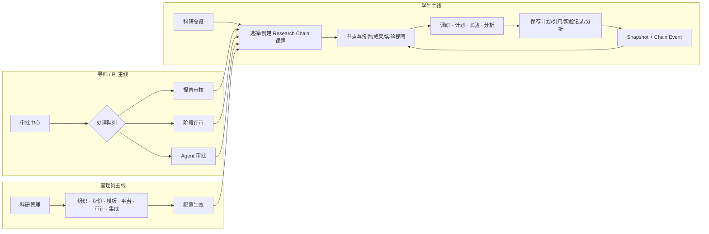
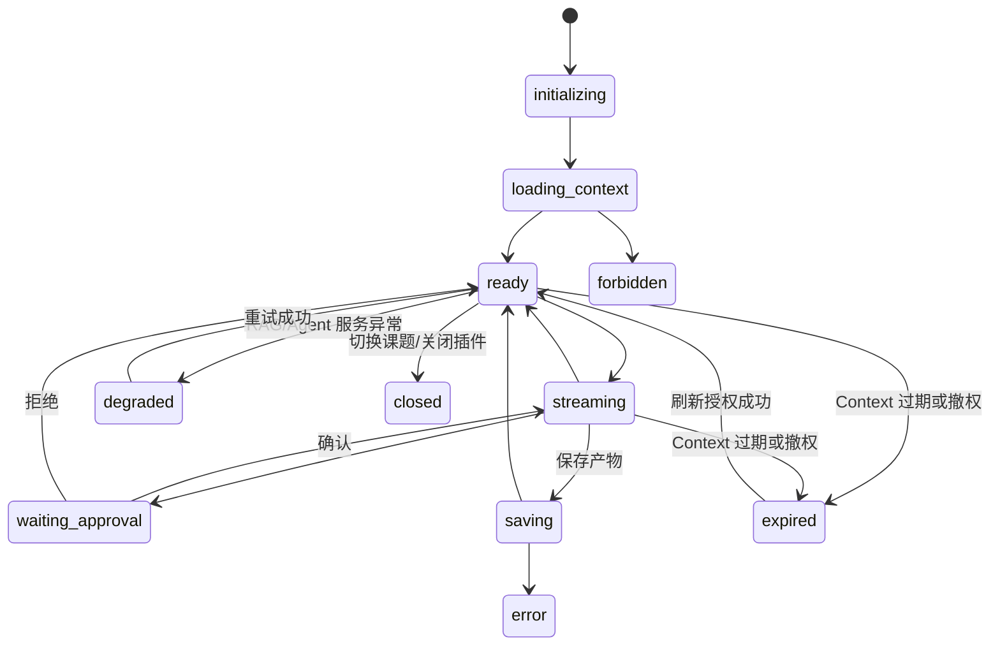

# 科研智能体平台 UX 交互原型确认稿

| 项目     | 内容                                                                             |
| -------- | -------------------------------------------------------------------------------- |
| 文档版本 | v1.3                                                                             |
| 关联 PRD | [`research-intelligent-platform-prd.md`](./research-intelligent-platform-prd.md) |
| 适用阶段 | Phase 1 MVP，兼容 Phase 2/3 扩展                                                 |
| 文档状态 | 产品设计确认稿                                                                   |
| 原型形式 | Mermaid 交互流程 + 文本线框                                                      |

## 1. 设计原则

- Plane 保持统一门户；用户不需要先理解多个后端系统的边界。
- 当前课题和当前节点始终固定显示，所有 Agent、文件、知识库和待办操作都继承该上下文。
- AI 输出先进入草稿或待确认状态，用户确认后才写入 Research Chain 正式快照。
- 过程信息比最终结果更重要：工具调用、验证、导师意见、审批和数据变化都能回放。
- Plane 根据课题、节点和角色自动装配 Agent 能力；用户不手动安装、勾选或注册 Synlora 插件。
- RAGPortal 是资料入库入口；WeKnora 作为已部署的内网知识服务由 RAGPortal 使用，用户不直接接触 WeKnora。
- 外部服务异常时保留人工记录路径，界面明确显示降级原因。

## 2. 科研信息架构收敛与 Research Chain 位置

Research Chain 是“科研”模块的核心过程入口。开启 `research_ia_v2` 后，旧科研业务入口不再平铺展示，而是收敛为四个一级入口；权威对象、既有 API、导航能力 key 和对象 ACL 不因入口收敛而改变。开关关闭时，现有导航和页面行为完整保留。

```text
Plane 门户
├─ 首页                         （保留，仅紧凑科研摘要卡）
├─ 草稿                         （保留）
├─ 我的工作                     （保留）
├─ 便签                         （保留）
├─ 工作区
│  ├─ 项目                      （保留，普通 Plane 项目管理）
│  ├─ 添加项目                  （保留，普通项目创建入口）
│  └─ More                      （保留，其他通用入口）
└─ 科研
   ├─ 科研总览                  （跨课题工作台）
   ├─ Research Chain             （课题与科研过程主线）
   ├─ 审批中心                  （评审、审核、Agent 与办公审批）
   └─ 科研管理                  （管理域聚合入口）
```

信息架构规则：

- **科研总览**负责跨课题统计、提交汇总、最近活动和待办索引；不复制 Chain 时间线。
- **Research Chain**负责课题、成员、节点、快照、事件、报告与成果、实验记录、外部引用、Agent 协作和过程回放。
- **审批中心**统一承载阶段评审、报告审核、Agent 审批和办公审批；与课题关联的审批可跳回节点上下文。
- **科研管理**聚合组织与人员、账号与系统、模板、身份与账号绑定、平台配置、审计记录和系统集成；Tab 按既有管理能力逐项显示。
- 普通 Plane 的首页、草稿、我的工作、便签、工作区项目、添加项目和 More 保持原路由、权限和行为不变。

科研导航的最终显示仍由现有“工作区子开关 × 用户能力 × 对象 ACL”三层规则决定；四入口只是前端呈现分组，不改变已有 `overview`、`reports`、`projects`、`approvals`、`system`、`platform`、`audit`、`integrations` 和 `research_chain` 的语义。

### 2.1 目标路由与旧入口兼容

下表省略 workspace slug；当前公共科研空间对应 `/public/research/...`。报告详情、项目详情等对象级深链保留，不在本轮强制改址。

| 目标入口       | 目标路由               | 说明                                                            |
| -------------- | ---------------------- | --------------------------------------------------------------- |
| Plane 首页     | `/`                    | 仅展示紧凑科研摘要卡，完整工作台进入科研总览                    |
| 科研总览       | `/research/`           | 跨课题统计、`report_submission` 保存视图、最近活动和待办索引    |
| Research Chain | `/research/chains/`    | 课题、成员、节点、报告与成果、实验记录、外部引用和过程回放      |
| 审批中心       | `/research/approvals/` | `stage_review`、`report_review`、`agent_approval`、办公审批队列 |
| 科研管理       | `/research/settings/`  | 组织、系统、模板、身份、平台、审计、集成 Tab                    |

具体课题使用 `/research/chains/{chain_id}/`，节点使用 `/research/chains/{chain_id}/nodes/{node_id}/`。开启 `research_ia_v2` 后，旧列表路由按以下规则兼容：

| 旧路由                      | 目标路由                               |
| --------------------------- | -------------------------------------- |
| `/research/projects`        | `/research/chains?view=projects`       |
| `/research/reports`         | `/research/chains?view=reports`        |
| `/research/reports/summary` | `/research?view=report_submission`     |
| `/research/reviews`         | `/research/approvals?tab=stage_review` |
| 管理配置旧路由              | `/research/settings/{tab}`             |

## 3. 核心用户流程



## 4. Plane 首页与科研总览原型

```text
┌──────────────────────────────────────────────────────────────────────┐
│ Plane · 科研智能体平台                          搜索  通知  个人菜单 │
├───────────────┬──────────────────────────────────────────────────────┤
│ 导航          │ 欢迎回来，研究成员                                  │
│               │                                                      │
│ 科研总览      │ ┌──────────── Research Chain ────────────┐          │
│ Research Chain│ │ 进行中 3     待确认 4     最近更新 12  │          │
│ 审批中心      │ │ [课题 A] 调研 → 选题 → 计划 → 实验     │          │
│ 科研管理      │ │ [课题 B] 分析节点等待导师确认           │          │
│               │ └─────────────────────────────────────────┘          │
│               │                                                      │
│               │ ┌──────── 待办与提交汇总 ───────────────┐           │
│               │ │ ! 导师确认研究计划   课题 A   去处理  │           │
│               │ │ ! 阶段评审待处理     课题 B   去处理  │           │
│               │ │ … 周报提交 46/52     管理视图   查看  │           │
│               │ └─────────────────────────────────────────┘          │
│               │                                                      │
│               │ ┌──────── 最近研究快照 ────────┐ ┌ 组件入口 ┐        │
│               │ │ 文献调研  课题 A  10分钟前   │ │ RAGPortal │        │
│               │ │ 分析结果  课题 B  昨天       │ │ Agent     │        │
│               │ │ 实验数据  课题 A  9月21日    │ │ SpecLabOS │        │
│               │ └──────────────────────────────┘ └───────────┘        │
└───────────────┴──────────────────────────────────────────────────────┘
```

交互规则：

- Plane 首页只保留该原型的紧凑摘要版；完整提交汇总、待办索引和最近活动进入科研总览。
- 点击课题进入该课题 Chain；点击待办进入审批中心对应队列，并可继续跳到节点或审批抽屉。
- 待办按“阻断 > 待确认 > 普通提醒”排序，同一事件不重复显示。
- 无权限课题不显示标题、计数或快照摘要。
- RAGPortal、Agent 或专业组件不可用时，入口保留但显示“服务暂不可用”和最近同步时间。

## 5. Research Chain 课题页原型

```text
┌──────────────────────────────────────────────────────────────────────┐
│ ← 返回总览   课题 A · Research Chain       可见范围：课题成员       │
├──────────────────────────────────────────────────────────────────────┤
│ 课题摘要：研究问题…   Owner：学生甲   导师：导师乙   [打开 Agent]    │
│ 课题 | 节点 | 报告与成果 | 实验记录 | 外部引用                       │
├──────────────────────────────────────────────────────────────────────┤
│ 调研 ── 选题 ── 评估 ── 预实验 ── 计划 ── 实验 ── 分析 ── 迭代     │
│  ✓        ✓       ●       ○        ○       ○       ○       ○       │
├───────────────────────┬──────────────────────────────────────────────┤
│ 当前节点：选题评估     │ 节点详情                                     │
│                       │ 状态：等待人工确认                            │
│ [文献调研快照]         │ 输入：3 个知识库引用、2 个研究笔记             │
│ [AI 讨论记录]          │ AI 动作：检索 + gap 摘要                      │
│ [研究计划草稿]         │ 验证：引用完整性通过                         │
│                       │ 人类决策：待导师确认                         │
│ 时间线筛选             │ [打开 Agent] [查看 Trace] [确认/退回]          │
│ 来源  阶段  时间       │                                              │
├───────────────────────┴──────────────────────────────────────────────┤
│ 最近事件：AI_ACTION → VALIDATION → HUMAN_DECISION(待处理)            │
└──────────────────────────────────────────────────────────────────────┘
```

节点详情必须同时显示输入、AI 动作、中间产物、验证、人工决策和输出；用户无需跳转多个系统才能理解节点状态。

## 6. Plane 通用 Agent 插件原型

```text
┌────────────────────────── Plane 课题页 ──────────────────────────────┐
│ 课题 A / 节点：选题评估       Context：已授权 12 项   [收起插件]     │
├───────────────────────────────┬──────────────────────────────────────┤
│ Research Chain                │ 通用 Agent                           │
│                               │ ┌──────────────────────────────────┐ │
│ 当前节点                      │ │ 当前上下文                         │ │
│ 选题评估                      │ │ 课题 A · 选题评估 · 3 个引用     │ │
│                               │ │ 自动装配：科研助理 · 2 个工具    │ │
│                               │ └──────────────────────────────────┘ │
│ 快照                          │                                      │
│ • 文献调研                    │ 你：这个方向的研究空白是什么？      │
│ • AI 讨论                     │ AI：基于 3 条引用，发现…            │
│ • 研究计划草稿                │ [来源 1] [来源 2] [待验证]           │
│                               │                                      │
│                               │ ┌ 工具调用 · knowledge.search ─────┐ │
│                               │ │ 状态：已完成  结果：8 条           │ │
│                               │ │ Scope：课题 A · 风险：低           │ │
│                               │ │ [查看来源] [查看 Trace]            │ │
│                               │ └───────────────────────────────────┘ │
│                               │                                      │
│                               │ [输入消息____________________] [发送] │
│                               │                                      │
│                               │ 产物：                               │
│                               │ [保存为计划草稿] [保存为分析摘要]     │
│                               │ [查看 Trace] [导师确认]              │
└───────────────────────────────┴──────────────────────────────────────┘
```

### 自动装配摘要

Agent 面板在消息流上方展示只读装配结果：

- 当前课题、节点和 persona。
- 自动可用插件与工具，按“已授权 / 需确认 / 不可用”分组。
- 每个工具显示 capability scope、风险等级、输入摘要、确认状态和 Trace 链接。
- 不可用能力显示具体原因：未配置、无权限、健康异常、策略阻断或需要导师/PI 审批。
- 用户不能在 Plane 插件内手动扩大 Synlora 扩展范围；需要新增能力时跳转科研管理或联系 Workspace Admin。

插件状态：



## 7. 关键交互确认点

本原型建议确认以下产品选择：

| 交互点         | 当前建议                                                         |
| -------------- | ---------------------------------------------------------------- |
| 信息架构       | 开启 `research_ia_v2` 后仅保留四入口；关闭时完整回退旧导航       |
| Agent 位置     | 课题页右侧工作台，节点详情可扩展为双栏页面                       |
| 上下文显示     | 顶部固定显示课题、节点、授权资源数量和 Context 有效期            |
| 能力装配       | Plane 自动显示 persona、插件、工具和拒绝原因，不提供手动扩大范围 |
| 工具卡         | 显示 capability scope、风险等级、确认状态和 Trace 链接           |
| AI 草稿        | 先进入产物抽屉，必须人工选择保存类型并确认                       |
| 导师参与       | 从审批中心进入报告审核、阶段评审或 Agent 审批，并可跳回节点      |
| RAG 入库       | 用户从 Plane 进入 RAGPortal 上传；WeKnora 对用户透明             |
| Research Chain | 作为科研过程主入口；主链横向展示，节点详情纵向展示事件和快照     |
| 降级体验       | 提供“刷新授权 / 人工记录 / 稍后重试”，并明确能力不可用原因       |
| 移动端         | Agent、Trace、工具和快照采用上下堆叠布局，不压缩桌面双栏         |

## 8. Phase 映射

- Phase 0：确认 `research_ia_v2`、兼容路由、插件 manifest、状态字典、课题上下文和 BFF 边界。
- Phase 1：交付四入口 IA、Plane 首页紧凑摘要、科研总览、Research Chain、Agent 自动装配工作台、六类快照、审批中心和 RAGPortal 入库闭环。
- Phase 2：扩展审批中心的 Agent 审批和 Job 状态，增加实验/分析工具卡、风险分级、科研模板库、运行回执和自动 ELN 外部段。
- Phase 3：增加治理 banner、风险审批、配额、审计跳转、写作/评审 Agent、结题/转化 gate，并评估兼容路由去留。

## 9. 确认记录

| 版本 | 日期       | 说明                                                                                                                           |
| ---- | ---------- | ------------------------------------------------------------------------------------------------------------------------------ |
| v1.3 | 2026-09-22 | 基于 Synlora 最新能力中心，确认 Plane 自动装配 persona/插件/工具、能力不可用原因、capability scope 工具卡和 Context 刷新路径。 |
| v1.2 | 2026-09-22 | 确认四入口信息架构：科研总览、Research Chain、审批中心、科研管理；同步兼容路由、核心用户流程和开关回退策略。                   |
| v1.1 | 2026-09-22 | 明确信息架构：保留既有 Plane/科研入口，Research Chain 作为科研分组核心一级功能。                                               |
| v1.0 | 2026-09-22 | 基于当前 PRD 的欢迎页、Research Chain、通用 Agent 插件和跨系统入库交互原型。                                                   |
