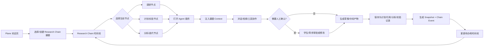
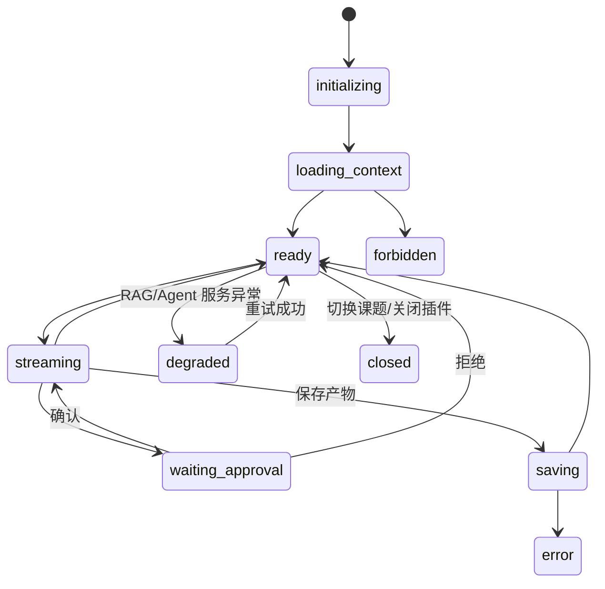

# 科研智能体平台 UX 交互原型确认稿

| 项目     | 内容                                                                             |
| -------- | -------------------------------------------------------------------------------- |
| 文档版本 | v1.1                                                                             |
| 关联 PRD | [`research-intelligent-platform-prd.md`](./research-intelligent-platform-prd.md) |
| 适用阶段 | Phase 1 MVP，兼容 Phase 2/3 扩展                                                 |
| 文档状态 | 产品设计确认稿                                                                   |
| 原型形式 | Mermaid 交互流程 + 文本线框                                                      |

## 1. 设计原则

- Plane 保持统一门户；用户不需要先理解多个后端系统的边界。
- 当前课题和当前节点始终固定显示，所有 Agent、文件、知识库和待办操作都继承该上下文。
- AI 输出先进入草稿或待确认状态，用户确认后才写入 Research Chain 正式快照。
- 过程信息比最终结果更重要：工具调用、验证、导师意见、审批和数据变化都能回放。
- RAGPortal 是资料入库入口；WeKnora 作为已部署的内网知识服务由 RAGPortal 使用，用户不直接接触 WeKnora。
- 外部服务异常时保留人工记录路径，界面明确显示降级原因。

## 2. 现有 Plane 入口保留与 Research Chain 位置

Research Chain 是“科研”模块的核心一级功能，但不替换 Plane 现有的工作区入口和科研管理入口。现有页面和能力继续保留，Research Chain 作为科研过程主线加入科研分组。

```text
Plane 门户
├─ 首页                         （保留）
├─ 草稿                         （保留）
├─ 我的工作                     （保留）
├─ 便签                         （保留）
├─ 工作区
│  ├─ 项目                      （保留，普通 Plane 项目管理）
│  ├─ 添加项目                  （保留，普通 Plane 项目创建入口）
│  └─ More                      （保留，其他通用入口）
└─ 科研
   ├─ 科研总览                  （保留，科研聚合首页）
   ├─ Research Chain             （新增/核心，科研过程主线）
   ├─ 报告                      （保留，周报/月报和正式快照）
   ├─ 科研项目                  （保留，项目列表与项目管理）
   ├─ 办公审批                  （保留）
   ├─ 系统管理                  （保留，管理员权限）
   ├─ 平台配置                  （保留，管理员权限）
   ├─ 审计记录                  （保留，管理员权限）
   └─ 系统集成                  （保留，管理员权限）
```

信息架构规则：

- **科研总览**负责聚合科研概览、跨课题待办和最近活动；不与 Research Chain 重复维护第二套时间线。
- **Research Chain**负责课题过程主线、节点、快照、事件、Agent 协作和过程回放。
- **报告**负责周期报告、提交、退回、正式版本和导师审核。
- **科研项目**负责项目列表、创建、成员和项目级资源；进入某个 Research Chain 课题后才显示 Chain 视图。
- **系统管理、平台配置、审计记录、系统集成**继续按现有科研导航能力矩阵控制，不因 Research Chain 对普通成员开放而扩大管理员入口。
- 普通 Plane 的首页、草稿、我的工作、便签、工作区项目、添加项目和 More 保持原路由、权限和行为不变。

科研导航的最终显示仍由现有“工作区子开关 × 用户能力 × 对象 ACL”三层规则决定；Research Chain 需要新增一个 `research_chain` 导航能力，但不改变已有 `overview`、`reports`、`projects`、`approvals`、`system`、`platform`、`audit` 和 `integrations` 的语义。

### 2.1 现有路由与新增入口

| 入口           | 现有路由                              | 处理方式 | 与 Research Chain 的关系                                   |
| -------------- | ------------------------------------- | -------- | ---------------------------------------------------------- |
| 首页           | `/public/`                            | 保留     | 增加 Research Chain 摘要卡和科研待办卡，不替换首页         |
| 草稿           | `/public/drafts/`                     | 保留     | AI 草稿和研究计划草稿通过受控链接进入，不改变草稿中心语义  |
| 我的工作       | `/public/profile/{user_id}/`          | 保留     | 聚合个人科研待办和最近快照入口，不复制 Chain 时间线        |
| 便签           | `/public/stickies/`                   | 保留     | 可作为普通记录入口；需要沉淀到 Chain 时由用户显式保存      |
| 工作区项目     | `/public/projects/`                   | 保留     | 普通 Plane 项目管理；科研项目仍从科研项目入口进入          |
| 添加项目       | 现有项目创建入口                      | 保留     | 新建 Research Chain 课题时增加类型选择，不改变普通项目创建 |
| 科研总览       | `/public/research/`                   | 保留     | 负责科研聚合、待办和统计，提供进入 Research Chain 的卡片   |
| Research Chain | `/public/research/chains/`（规划）    | 新增     | 科研过程主线，展示课题列表、节点、快照、事件和 Agent       |
| 报告           | `/public/research/reports/`           | 保留     | 周报/月报、正式版本和导师审核                              |
| 科研项目       | `/public/research/projects/`          | 保留     | 项目列表、成员和项目级科研资源；项目详情可进入 Chain       |
| 办公审批       | `/public/research/approvals/`         | 保留     | 通用办公审批和科研审批入口                                 |
| 系统管理       | `/public/research/settings/system/`   | 保留     | 管理员入口                                                 |
| 平台配置       | `/public/research/settings/platform/` | 保留     | 管理员入口和 Feature Flag                                  |
| 审计记录       | `/public/research/audit/`             | 保留     | 审计查询和导出                                             |
| 系统集成       | `/public/research/integrations/`      | 保留     | RAGPortal、Synlora、SpecLabOS 等连接状态和配置             |

`/public/research/chains/` 是规划中的统一入口；具体课题使用 `/public/research/chains/{chain_id}/`，节点使用 `/public/research/chains/{chain_id}/nodes/{node_id}/`。实际路由命名以 Plane 前端实现评审为准，但“科研一级入口 → 课题 Chain → 节点详情”的层级必须保持。

## 3. 核心用户流程



## 4. 欢迎页原型

```text
┌──────────────────────────────────────────────────────────────────────┐
│ Plane · 科研工作台                              搜索  通知  个人菜单 │
├───────────────┬──────────────────────────────────────────────────────┤
│ 导航          │ 欢迎回来，研究成员                                  │
│               │                                                      │
│ 总览          │ ┌──────────── Research Chain ────────────┐          │
│ Research Chain│ │ 进行中 3     待确认 4     最近更新 12  │          │
│ 科研待办      │ │ [课题 A] 调研 → 选题 → 计划 → 实验     │          │
│ 组件入口      │ │ [课题 B] 分析节点等待导师确认           │          │
│               │ └─────────────────────────────────────────┘          │
│               │                                                      │
│               │ ┌──────────── 我的科研待办 ──────────────┐          │
│               │ │ ! 导师确认研究计划      课题 A   去处理│          │
│               │ │ ! 补充实验失败原因      课题 B   去处理│          │
│               │ │ … RAGPortal 解析完成     课题 A   查看  │          │
│               │ └─────────────────────────────────────────┘          │
│               │                                                      │
│               │ ┌──────── 最近研究快照 ────────┐ ┌ 组件入口 ┐        │
│               │ │ 文献调研  课题 A  10分钟前   │ │ RAGPortal │        │
│               │ │ 分析结果  课题 B  昨天       │ │ Agent     │        │
│               │ │ 实验数据  课题 A  9月21日    │ │ SpecLabOS │        │
│               │ └──────────────────────────────┘ └───────────┘        │
└───────────────┴──────────────────────────────────────────────────────┘
```

交互规则：

- 点击课题进入该课题 Chain；点击待办直接进入对应节点或审批抽屉。
- 待办按“阻断 > 待确认 > 普通提醒”排序，同一事件不重复显示。
- 无权限课题不显示标题、计数或快照摘要。
- RAGPortal、Agent 或专业组件不可用时，入口保留但显示“服务暂不可用”和最近同步时间。

## 5. Research Chain 课题页原型

```text
┌──────────────────────────────────────────────────────────────────────┐
│ ← 返回总览   课题 A · Research Chain       可见范围：课题成员       │
├──────────────────────────────────────────────────────────────────────┤
│ 课题摘要：研究问题…   Owner：学生甲   导师：导师乙   [打开 Agent]    │
├──────────────────────────────────────────────────────────────────────┤
│ 调研 ── 选题 ── 评估 ── 预实验 ── 计划 ── 实验 ── 分析 ── 迭代     │
│  ✓        ✓       ●       ○        ○       ○       ○       ○       │
├───────────────────────┬──────────────────────────────────────────────┤
│ 当前节点：选题评估     │ 节点详情                                     │
│                       │ 状态：等待人工确认                            │
│ [文献调研快照]         │ 输入：3 个知识库引用、2 个研究笔记             │
│ [AI 讨论记录]          │ AI 动作：检索 + gap 摘要                      │
│ [研究计划草稿]         │ 验证：引用完整性通过                         │
│                       │ 人类决策：待导师确认                         │
│ 时间线筛选             │ [打开 Agent] [查看 Trace] [确认/退回]          │
│ 来源  阶段  时间       │                                              │
├───────────────────────┴──────────────────────────────────────────────┤
│ 最近事件：AI_ACTION → VALIDATION → HUMAN_DECISION(待处理)            │
└──────────────────────────────────────────────────────────────────────┘
```

节点详情必须同时显示输入、AI 动作、中间产物、验证、人工决策和输出；用户无需跳转多个系统才能理解节点状态。

## 6. Plane 通用 Agent 插件原型

```text
┌────────────────────────── Plane 课题页 ──────────────────────────────┐
│ 课题 A / 节点：选题评估       Context：已授权 12 项   [收起插件]     │
├───────────────────────────────┬──────────────────────────────────────┤
│ Research Chain                │ 通用 Agent                           │
│                               │ ┌──────────────────────────────────┐ │
│ 当前节点                      │ │ 当前上下文                         │ │
│ 选题评估                      │ │ 课题 A · 选题评估 · 3 个引用     │ │
│                               │ └──────────────────────────────────┘ │
│ 快照                          │                                      │
│ • 文献调研                    │ 你：这个方向的研究空白是什么？      │
│ • AI 讨论                     │ AI：基于 3 条引用，发现…            │
│ • 研究计划草稿                │ [来源 1] [来源 2] [待验证]           │
│                               │                                      │
│                               │ ┌ 工具调用 · knowledge.search ─────┐ │
│                               │ │ 状态：已完成  结果：8 条           │ │
│                               │ │ [查看来源]                         │ │
│                               │ └───────────────────────────────────┘ │
│                               │                                      │
│                               │ [输入消息____________________] [发送] │
│                               │                                      │
│                               │ 产物：                               │
│                               │ [保存为计划草稿] [保存为分析摘要]     │
│                               │ [查看 Trace] [导师确认]              │
└───────────────────────────────┴──────────────────────────────────────┘
```

插件状态：



## 7. 关键交互确认点

本原型建议确认以下产品选择：

| 交互点         | 当前建议                                                       |
| -------------- | -------------------------------------------------------------- |
| Agent 位置     | 课题页右侧工作台，节点详情可扩展为双栏页面                     |
| 上下文显示     | 顶部固定显示课题、节点、授权资源数量和 Context 有效期          |
| AI 草稿        | 先进入产物抽屉，必须人工选择保存类型并确认                     |
| 导师参与       | 通过待办进入审批抽屉，查看引用和 diff 后确认/退回              |
| RAG 入库       | 用户从 Plane 进入 RAGPortal 上传；WeKnora 对用户透明           |
| Research Chain | 作为科研分组一级入口；主链横向展示，节点详情纵向展示事件和快照 |
| 降级体验       | 保留历史结果和人工记录入口，明确标注服务异常                   |
| 移动端         | Agent、Trace、工具和快照采用上下堆叠布局，不压缩桌面双栏       |

## 8. Phase 映射

- Phase 0：确认导航、入口、插件 manifest、状态字典、课题上下文和 BFF 边界。
- Phase 1：交付欢迎页、Research Chain 页、Agent 工作台、六类快照、导师待办和 RAGPortal 入库闭环。
- Phase 2：在 Agent 工作台增加实验/分析工具卡、Job 面板、运行回执和自动 ELN 外部段。
- Phase 3：增加治理 banner、风险审批、配额、审计跳转、写作/评审 Agent 和结题/转化 gate。

## 9. 确认记录

| 版本 | 日期       | 说明                                                                             |
| ---- | ---------- | -------------------------------------------------------------------------------- |
| v1.1 | 2026-09-22 | 明确信息架构：保留既有 Plane/科研入口，Research Chain 作为科研分组核心一级功能。 |
| v1.0 | 2026-09-22 | 基于当前 PRD 的欢迎页、Research Chain、通用 Agent 插件和跨系统入库交互原型。     |
